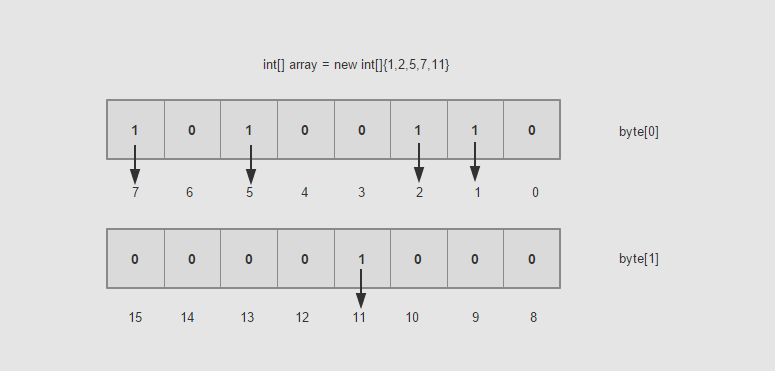

> Bitmap 位图算法，通常使用于大数据量数字需要**统计查重**等场景。

<!--more-->

## 介绍

在一个大数据量的场景中，单单存储数据本身就会消耗非常大的内存资源。

**举例**说给定20亿个数字，需要统计哪些数字未出现，怎么做？

**解决方法1：**我们新建一个int数组arr，每次通过 arr[i]=1来标记是否出现。一个 Int 需要32bit，4B，会需要消耗约8GB 内存。

**解决方法2：**替换 int 数组为 boolean 数组，一个 boolean 占用8bit，总共约占用2GB

使用Bitmap来实现可以最小化空间占用：

**当数字的值对应位置的 bit为1时，我们就标志它存在，这就是 bitmap**



使用 bitmap 来表示数字还能方便的求交集和异或运算，在 [Lucene 的倒排索引](https://miszibu.github.io/2020/04/20/后端组件/Elasticsearch/ElasticSearch-倒排索引/#more)中就有应用。

## 解题实践

[LeetCode 645 错误的合集](https://leetcode-cn.com/problems/set-mismatch/)

```java
class Solution {
    public int[] findErrorNums(int[] nums) {
        BitSet bitMap = new BitSet(nums.length);
        int repeatNum = 0;
        for (int i = 0; i < nums.length; i++) {
            if(bitMap.get(nums[i]-1)){
                repeatNum = nums[i];
            }
            bitMap.set(nums[i]-1);
        }
        for (int i = 0; i < bitMap.size(); i++) {
            if(!bitMap.get(i)){
                int[] output = new int[2];
                output[0]=repeatNum;
                output[1]=i+1;
                return output;
            }
        }
        return null;
    }
}
```


## Reference

[漫画：什么是Bitmap算法？ ](https://juejin.im/post/5c4fd2af51882525da267385)

[经典算法系列之(一) - BitMap](https://www.jianshu.com/p/6082a2f7df8e)