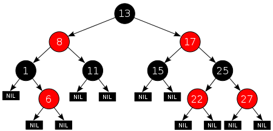

**二叉查找树，二叉平衡树（AVL），红黑树**是二叉树中三个重要的分支。

二叉查找树在极端情况下会形成一个单链表，那么时间复杂度就回退到了O(n);

而AVL树，任一节点左右子树高度相差不超过1的特性，使其性能完美的接近O(logn),然而AVL树的每一次插入删除都极大可能的要进行节点旋转，**删除插入的效率不高**。

RB-tree:红黑树利用非严格的平衡，牺牲了一定的查找效率，但更大程度上增加了插入删除的效率。从功能，性能，空间开销等方面来综合考量，红黑树的**综合表现**来讲胜于AVL树。

**应用**：在JDK集合类TreeMap和TreeSet底层就是红黑树实现的，在JAVA8中，连HashMap也用到了红黑树。

<!--more-->

栗子（引用1）：

1. 如果插入一个node引起了树的不平衡，AVL和RB-Tree都是最多只需要2次旋转操作，即两者都是O(1)；但是在删除node引起树的不平衡时，最坏情况下，AVL需要维护从被删node到root这条路径上所有node的平衡性，因此需要旋转的量级O(logN)，而RB-Tree最多只需3次旋转，只需要O(1)的复杂度。
2. 其次，AVL的结构相较RB-Tree来说更为平衡，在插入和删除node更容易引起Tree的unbalance，因此在大量数据需要插入或者删除时，AVL需要rebalance的频率会更高。因此，RB-Tree在需要大量插入和删除node的场景下，效率更高。自然，由于AVL高度平衡，因此AVL的search效率更高。
3. map的实现只是折衷了两者在search、insert以及delete下的效率。总体来说，RB-tree的统计性能是高于AVL的。 

###  红黑树的规则

1. 节点是红色或黑色。
2. 根节点是黑色
3. 所有叶子节点都是黑色的空节点（NIL节点）。
4. 每个红色节点必须有两个黑色的子节点。（从每个叶子到根的所有路径上不能有两个连续的红色节点。）
5. 从任一节点到其每个叶子的所有简单路径都包含相同数目的黑色节点。

### 红黑树的操作

详细的操作我就不在博文里赘述了，因为：WIKIPAD上写的太好了= =，没必要再画蛇添足了。

**插入**：每一个新插入的节点都标为红色（如果设为黑色，就会导致根到叶子的路径上有一条路上，多一个额外的黑节点，这个是很难调整的。但是设为红色节点后，可能会导致出现两个连续红色节点的冲突，那么可以通过颜色调换（color flips）和树旋转来调整。） 

**删除**：RB_TREE是二叉平衡树，在二叉查找树中，删除一个带有两个子节点的节点时，是将左子树中的最大元素或右子树中的最小元素节点删除，然后将其节点值放入当前节点。RB_TREE也是如此，因此**删除带有两个子节点的操作就被简化为了删除只有一个子节点的节点的操作**。

​	**在只有一个儿子的节点中。**如果他是红色，他的父亲和儿子节点必然都是黑色，因此只需要简单的将儿子节点替换到他的位置即可。如果他是黑色，而且他的子节点是红色，如果简单的删除该节点会导致，不符合RB_TREE的定义。只需要将儿子涂黑再替代即可。

​	**当要删除的节点和它的儿子两者都是黑色时**，则需要旋转重绘等操作，具体查看引用2。

### 引用

[为什么STL和linux都使用红黑树作为平衡树的实现？----Acjx的回答](https://www.zhihu.com/question/20545708)

[wikipad -RBTree](https://zh.wikipedia.org/wiki/%E7%BA%A2%E9%BB%91%E6%A0%91)