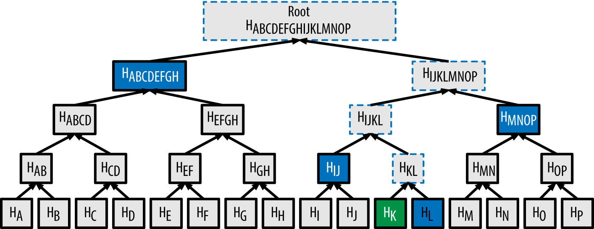
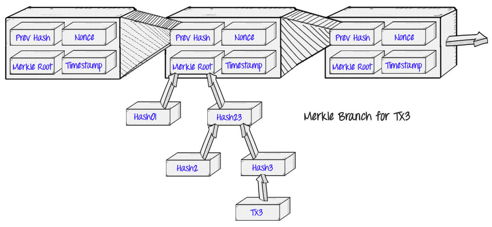

> 在密码学和CS中，Hash Tree是一种树形数据结构，每个叶节点均以数据块的Hash作为标签,而非叶子节点则以其叶子节点Hash值作为数据，继续向上Hash。Hash Tree能够高效，安全的验证大型数据结构。
>
> HashTree 由Merkle申请专利，又称Merkle Tree

<!--more-->

------

## Hash 

Hash函数的作用不再赘述了，由于Hash特性且难以反推。在互联网资源下载验证完整性场景中得到普遍应用，服务器对文件进行Hash得到Hash值。客户端对下载完的文件，进行Hash。两相比较，如果Hash值不匹配，则文件传输过程中被修改或者文件损坏。

对于多数据源场景，单一Hash校验，不太稳定。

------

## Hash List

对于较大的文件下载，单一的Hash。一但文件出错，就得重新下载，实在不方便。因此需要**切分**文件为小块。对于每个小块的数据进行Hash，生成Hash List。通过Hash List验证文件完整性。

对于Hash List，也需要一层Hash,来确保Hash List的完整性。**Hash(Hash List) = Hash Root**

首先获取Hash Root，根据Hash Root校验Hash List ，根据Hash List验证文件完整性。

------

## Hash Tree

把数据分成小块，建立一颗树，用叶子节点存放数据。计算叶子节点数据的Hash值。然后两两匹配，对Hash值继续向上Hash。如果存在单个节点，直接对单节点进行Hash。这样就可以得到最后一个**Hash Root（Merkle Root）**。

**应用**：在P2P网络中，我们可以先获得Merkle Root。拿着Merkle Root可以去任意不可信任节点获取文件。只要Merkle Root相匹配就能确保文件的完整性。

**区别**：同样验证一个文件，Hash List需要将所有文件都验证一遍才行。而**Merkle Tree只需要验证一条分支**，分支验证通过即可。

------

## Merkle Tree 详解

1. Merkle Tree是树，既然是树，就具备树的所有特点。Merkle Tree常见的是二叉树，也可以是多叉树。
2. Merkle Tree只有叶子节点，存放数据。
3. Merkle Tree的**高度为logn+1**，**时间复杂度为O(n)**

Merkle树选择Hash算法，可以按需选择，比如如果仅需要保证数据不被损坏和篡改。那么CRC循环冗余校验也是可以，效率更高。常用的是SHA-2和MD5。

### 创建Merkle Tree

### 检索Merkle Tree

从上至下检索，当文件Merkle Root不匹配时，向下匹配左右子节点，就可以很快找到错误数据节点。

### 更新，插入和删除

Merkle Tree的更新插入删除 是个 工程上的问题，不同的问题有不同的方法。在AVL，RBT等不同结构中，选择不同的方式。

### Merkle树应用

1. 数字签名
2. P2P网络下载文件
3. BTC || ETH

------

## BTC中的Merkle Tree

**简化支付验证**（Simplified Payment Verification，SPV）的概念:一个“轻客戶端”（light client）可以只下载区块头80byte的数据块，仅包含五個元素。从而使手机端的BTC钱包成为可能

- 前置区块Hash
- 时间戳
- 挖矿难度值
- 工作量证明随机数（Nonce）
- 包含该区块交易的Merkle Tree的根哈希 

当客户端需要验证一个交易状态时，它只需要发起一个Merkle Proof请求。请求包含交易所在区块和Merkle Tree中位置。全节点就可以完成查询。

------

## 相关资料

[What is the Merkle root?](https://bitcoin.stackexchange.com/questions/10479/what-is-the-merkle-root)

[Merkle tree](https://en.wikipedia.org/wiki/Merkle_tree)

[圖文詳解哈希樹-Merkle Tree（默克爾樹）算法解析](https://www.itread01.com/articles/1487247623.html)

[What is a Merkle Tree? Beginner’s Guide to this Blockchain Component](https://blockonomi.com/merkle-tree/)

