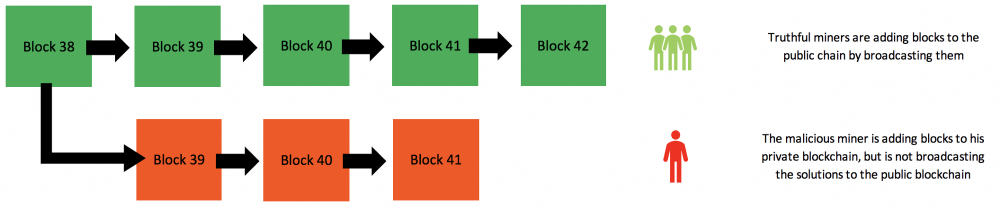
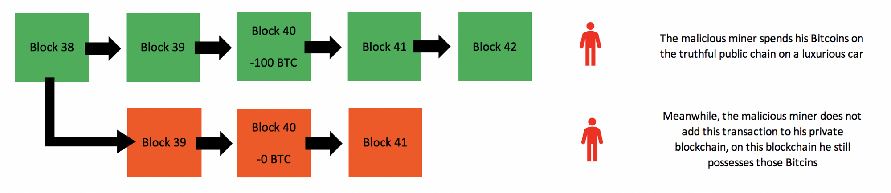
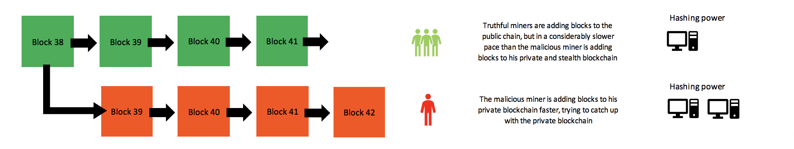
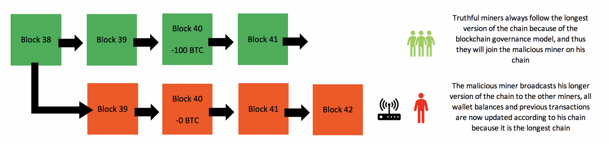

> 51%攻击或是双花攻击是指一部分矿工当他们掌握了51%的算力（PoW），通过修改区块链来重构花销，使得已经被确认的交易重新被放弃，从而实现双花甚至多花。

<!--more-->

## 双花攻击示例

1. **Race attack** : 一个人同时向网络中发送两笔交易，一笔交易发给自己（为了提高攻击成功率，他给这笔交易增加足够的小费），一笔交易发给商家。由于发送给自己的交易中含有较高的小费，会被矿工打包成区块的概率比较高。
2. **Finney attack**:一个人挖到了一个区块（这个区块中包含一个交易 ：A向B转10BTC，其中A和B都是自己的地址），他先不广播这个区块，先找一个愿意接受未确认交易的商家向他购买一个物品，向商家发一笔交易：A向C转10BTC，付款后向网络中广播刚刚挖到的区块，由于区块中包含一个向自己付款的交易，所以他实现了一次双花
3. **51% attack**:攻击者占有超过全网50%的算力，所以他可以创造一条高度大于原来链的新链。那么旧链中的交易会被回滚。攻击者可以发送一笔新的交易到新链上。
   * 在主链消费加密货币
   * 创造支链，不包含自己花费的交易记录。且不广播支链区块。
   * 加长支链，直至支链长于主链
   * 广播支链，利用`最长链共识`，使得支链替代主链

> Tips: 1,2中的攻击，只要验证一个区块就可以轻松规避。

------

## 正常交易流程

当比特币所有者在交易中签字时，它会被放入`Unconfirm Transaction Pool`中。出块节点从中选择交易（选择最多小费的交易来达到区块最大值）以形成交易块。出块节点通过计算Hash值来获取出块权利。出块节点广播打包节点，当其他节点接收新区块时，验证新区块的Hash值和TX是否都在未确认交易池中。交易必须有所有者私钥签名方可被确认。

------

## 隐形挖矿 - 创造支链

当一个矿工挖到一个区块后，

* **正常逻辑**：广播该区块给所有其他矿工，其他矿工验证区块，若成功，则继续挖下一个区块。
* **恶意矿工**：挖出区块后，不广播该区块，而是继续挖下一个区块。这样就出现了一条支链。

现在，其他的矿工们都工作在主链上，这条支链只有这个恶意矿工在挖矿。

攻击者现在在主链上花费自己的所有BTC。那么在默认7个区块后，他的交易就被确认可信，完成交易。他不在支链中花费自己的BTC。

与此同时，攻击者不断的挖矿，打包交易，出块。支链上的交易都是真实的交易，并没有问题，只是少了它花费BTC的交易。由于区块链遵循`最长链共识`，这是一场算力竞赛，拥有更大算力的人能够构建更长的区块链。

## 竞赛 - 通过广播新链来扭转现有交易

当这个支链的长度长于主链时，攻击者广播该支链。网络中的其他矿工，收到了这条支链，且发现该链长度更长。根据`最长链共识`，其余矿工将在长链上进行挖矿，

支链成为了主链，因此此链中未包含的所有交易将立即被撤销。 攻击者重新获取到了本来已经花费的BTC，这时候上次花费的btc对应商品或服务也已获得，一次双花攻击就此实现。

双花攻击。 通常被称为51％攻击，因为恶意矿工需要拥有高于网络其他矿工的散列计算能力（51%的全网算力），从而更快的打包出块，最终允许创建一条更长的支链，从而利用`最长链共识`，强行替换主链。

------

## 比特币如何防范

实际上，这些攻击非常**难以执行**。

为实现目标 ，矿工需要拥有高于全网其他矿工算力总和的算力。考虑到比特币区块链上甚至可能有成千上万的矿工，全网矿工算力总和是非常大的，几乎没有可能来组合出这么大的算力。而且即便有如此能力后，双花攻击的所获取的利益也无法Cover矿机，电费等成本的巨额开销。更何况，当一个组织获取了如此大的算力后，它也不会毁坏BTC的信誉，这是没有利益的。

但是在其他算力小的区块链中，双花攻击是普遍存在的。

------

## 相关资料

[Blockchain: how a 51% attack works (double spend attack)](https://medium.com/coinmonks/what-is-a-51-attack-or-double-spend-attack-aa108db63474)

