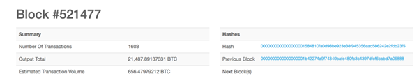

> 引言： 区块链是如何实现的，从发起一笔交易，计算Hash, 打包交易，广播区块等基础说起，讲述一个区块的生成。

<!--more-->

------

## 简介

区块链就是一个**分布式数据库**。数据被打包成区块，区块们相互连接成为一条长链，就是区块链。区块链中的的数据具有**不可更改性**，每个区块中的**数据都是可见**的（但是会越链越长，数据不断增大）。这是一个相当革命性的技术，因为我们可以跟踪记录且存储任何记录，比如说财产权限，身份证，余额，医疗记录等所有记录。

------

## Step 1---交易数据

本文以比特币举例，比特币是现存最早的区块链。比特币的区块大小是1MB，迄今为止已经累计了180G的交易数据。

------

## Step 2---使用Hash连接区块

当一笔交易发生时，收到交易的节点会验证交易合法性。是否存在对应UTXO。若验证通过，就将交易放入`Unconfirm Transaction Pool`，随后广播该交易。

每个区块限制大小为1MB，当一个区块被挖出时，出块节点打包未确认交易为区块。

如图纸Block1，若为创世区块，是没有前置区块的。通过`Merkle tree`的结构，计算出Hash值，就为这个区块的HASH。如果区块中的任意一个交易发生了些许变化，根据Hash算法的规则，最终所生成的Hash值，就会发生极大的变化。

后续区块创建后，要使用前置区块的Hash值，在计算出最终本区块Hash值。

如果区块1的交易发生改变后，其最终的Hash值也会变化。区块2所记录的前置区块Hash值和新的Hash值不匹配，这样就导致区块1和2断开连接，诚实节点一对比，就知道区块1中的交易被修改了，就会拒绝该区块。由于区块链的链式结构，这就导致改变前置区块数据的难度极大，这就是**不可更改性**的来源。

每个区块都是可见的，如果修改一个区块中的交易，就会导致Hash值的链式反应。因此这几乎时不可能的，如果想实现，则需要51%的算力来实现**双花攻击**。（详情见双花攻击一文）

------

## Step3 --- 如何创建区块签名

BTC使用加密Hash算法来计算区块的Hash签名。加密Hash算法相对复杂，可以将任意长度的输入字符串，转为一个独一无二的64位输出。比如将『Jinglebells』做Hash计算结果为

> **761A7DD9CAFE34C7CDE6C1270E17F773025A61E511A56F700D415F0D3E199868**

Hash算法具备，输入一但发生些许变化，最终的结果也会发生非常大的变化。比如将『Jinglebells』加上一个句号为『Jinglebells.』,所生成的下一个Hash值为：

> **B9B324E2F987CDE8819C051327966DD4071ED72D998E0019981040958FEC291B**

签名又是如何阻止恶意节点发布区块呢，这就是矿工挖矿的过程。只有符合特定计算的区块才能被允许加入区块链，因此杜绝了恶意节点发布区块。

------

## Step 4 --- 签名什么时候合法 和 谁签名区块

一个区块时如何被计算出来然后加入区块链中的呢？需要满足什么条件呢。简单来说是这样，

* **区块签名**：SHA_256Hash(交易数据Hash+前置区块Hash+`Nonce`)
* **条件**：所生成的签名前缀为一系列的0。这个0的数量会根据全网算力动态调整（每2016个区块调整一次难度，平均出块速度为10分钟一个）

因为Hash算法的输出是不固定的，在打包一个区块时，想要计算出特定数量前缀的0的Hash值。需要不断的去尝试，由于交易数据，前置区块Hash和其他标记信息（区块序号，时间戳等）是不可变的。这就引入了一个变量，`Nonce`。Nonce是一个完全随机的字符串，可以由数字，字母，标点等任意字符组成。

通过不断的修改Nonce来计算区块的hash值，来满足要求。这就是**挖矿**。矿工们使用大量的算力不断来计算Hash值，相对而言，算力越高就能越快挖出区块。这就是一场算力竞赛。

任何人都能参与到这场竞赛中，只需要下载挖矿软件，目前的挖矿竞争已经演变到矿池大战。大量的算力被集中到矿池中，共同参与挖矿的过程。挖出区块则分配区块奖励和交易矿工费用。虽然算力越高，速度越快，但这场游戏也是有运气成分的。只要运气够好，也是能挖到区块的。

如图所示，区块的Hash值是由一系列0的前缀开始的。简而言之，挖出区块是需要大量算力的，不容易。

------

## Step 5—什么造就了区块链的不可更改性

如果想要更改一个区块的信息，那么这个区块就会被区块链中剥离，因此需要更改该区块后的所以区块的数据。从新挖出这些区块是需要消耗大量的算力，而主链仍然在不断的延长。只有当个人修改后的区块链长度超过主链长度时，这才会利用`最长链共识`来更改区块。

这是几乎不可能实现的，因为你需要面对的全网其他节点的算力。且所获得的利润无法Cover这巨额的开销。因此区块链具有不可更改性，而且后面的子区块越多，越难以更改。

实际上很多算力较低的区块链都受到过51%算力攻击。但是btc上还未发生过。

详情请见：双花攻击一文

------

## Step 6—区块链如何被管理，谁指定规则

BTC区块链遵守的是民主法则，也就是`多数人法则`。区块链协议规定，所有节点将跟从最长链，因为最长链代表着绝大多数人（本质绝大多数算力）。节点将自动拒绝其他较短的支链。

------

## 相关资料

[**How does blockchain work in 7 steps — A clear and simple explanation.**](https://medium.com/coinmonks/blockchain-for-beginners-what-is-blockchain-519db8c6677a)