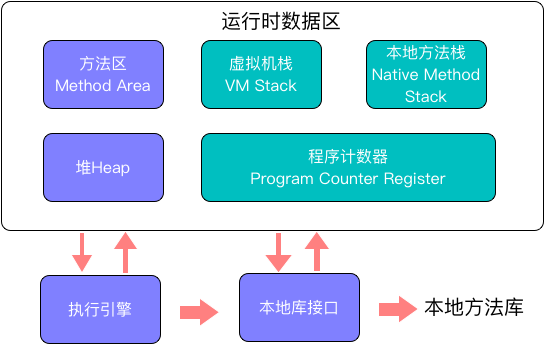

## Java内存分配方式

<!--more-->

#### 1.静态存储区

内存在程序编译的时候就已经分配好了，这块内存在程序的整个运行期间都存在。比如，**static** 、**全局变量**

#### 2.栈

在执行函数时，函数内局部变量的存储单元都可以在栈上创建，函数执行结束时这些存储单元自动被释放。栈内存分匹配运算内置于处理器的指令集中、效率很高、但是分配的内存容量非常有限。

#### 3.堆

动态内存分配。在c和c++中运行程序时用 malloc 或 new申请任意大小的内存，我们需要自己决定自己在何时何地使用使用free和delete来释放内存。

------

## 运行时数据区域

*  紫色：线程公有
*  绿色：线程私有

**1.程序计数器**：类似于指令寄存器

- **线程私有**
- 当前线程所执行的字节码的行号指示器。JVM使用字节码解释器，用于解释程序。
- Java多线程是通过在一个内核中轮流执行实现的（存疑 应该是1：1），计数器就保证了切换线程的时候可以回到原来正确的执行位置，也因此必须线程私有。
- 程序计数器是唯一一个JVM没有规范OutOfMemoryError的区域

**2.Java虚拟机栈**：

- **线程私有**
- Java方法执行的内存模型，即方法执行时会创建一个**栈帧**，保存了需要的局部变量表、操作数栈、动态链接、方法出口等信息；
- 线程请求的栈深度>JVM允许的深度时，报StackOverflowError；
- 大多数的JVM可以动态扩展内存，如果无法申请到足够的内存时，报OutOfMemoryError;

**3.本地方法栈**

本地方法栈与虚拟机栈所发挥的作用十分相似，区别就是虚拟机栈执行Java（字节码）的方法，本地栈是为虚拟机使用到Native方法。

**4.Java堆**：所有的对象实例以及数组都要被在堆上分配内存

- **线程共享**
- 唯一目的：存放对象实例
- 分类：新生代、老生代，或者Eden空间、From Survior 空间、To Survivor空间
- 分类目的：更好的回收和分配内存
- 没有内存完成实例分配，或者不能再扩展，报OutOfMemoryError异常
- 可以自己配置大小（-Xmx和-Xms）

**5.方法区**

- **线程共享**
- 目的：存储类信息、常量、静态变量、即时编译器编译后的代码等数据；
- 该区内存回收目标：主要针对常量池的回收和对类型的卸载；
- 无法满足内存分配要求时，报OutOfMemoryError异常
- 运行时常量池
  * 目的：存储编译期生成的各种字面量和符号引用
  * 特征：并非只有编译期置入Class文件中的常量池内容才能进入运行时常量池，在运行期间也可以置入新的常量，比如String的intern()方法；
  * 无法申请足够内存时，报OutOfMemoryError异常

## 对象相关

#### New对象过程

- new指令发出

- 检查new的参数是否在常量池中存在这个Class的符号引用

- 检查对应的Class是否已经初始化

- - 若没有则先执行初始化过程

- **分配内存**，检查堆是否规整（垃圾收集器是否带有压缩整理功能决定）

- - 规整：**指针碰撞**方式分配内存
  - 不规整：**空闲列表**方式分配内存

- 内存空间初始化为零值（不包括对象头）

- 对对象进行重要的配置

- 执行 < init > 方法

## OOM

- 堆溢出：举例一直new新的实例对象，往往是容器类。

- 栈溢出：举例无限循环调用执行某个方法

- 方法区和运行时常量池溢出：

- - String.intern():如果常量池已存在，则返回String对象，如果不存在，则先添加到常量池，再返回String对象。
  - 动态定义大量的Class，需要注意内存的回收情况。

## 小结

​        程序运行时，需要不停的将数据在内存中分配、计算等。

​	JVM将不同类型的数据放在不同的位置，这样分工才能够让程序有序的跑起来。

​	我们所定义的方法，以及new的对象实例都分别存在方法区和堆中，这两个区域是属于内存共享的地方，也就是说任何线程取的都是一样的。但是，因为有线程的存在。所以，我们需要给线程必要的私有空间。

​	故，在程序运行的时候，我们通过栈来保存该线程自由的局部变量、引用等，通过程序计数器保存了各个线程的执行位置。这样，在线程切换的时候，才能找到自己的上一次执行位置，继续完成未完成的工作。

​	如果，程序执行过程中没有足够的空间分配，就报对应的OOM异常。

## 相关引用

https://zhuanlan.zhihu.com/p/30388521

https://www.cnblogs.com/luanpeng/p/6964818.html