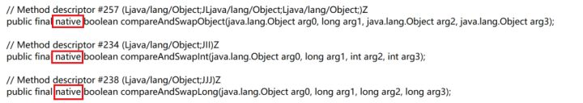

CAS(Compare and Swap) 比较和替换

1. **比较：** 读取到一个值 A，在将其更新为 B之前，再次检查原值是否为 A（未被改动）
2. **设置**：如果是，将 A 更新为 B，结束。如果不是，则什么都不做。

这两个操作是原子性的。

> 原子性: 操作不可分割，要么全部执行，要么完全不执行。不会出现执行了部分的情况

<!--more-->

```java
data = 123; // 共享数据

/* 更新数据的线程会进行如下操作 */
flag = true;
while (flag) {
    oldValue = data; // 保存原始数据
    newValue = doSomething(oldValue); 

    // 下面的部分为CAS操作，尝试更新data的值
    if (data == oldValue) { // 比较
        data = newValue; // 设置
        flag = false; // 结束
    } else {
	// 啥也不干，循环重试
    }
}
/* 
   很明显，这样的代码根本不是原子性的，
   因为真正的CAS利用了CPU指令，
   这里只是为了展示执行流程，本意是一样的。
*/
```

这是一个简单直观的乐观锁实现，它允许多个线程同时读取（因为根本没有加锁操作），但是只有一个线程可以成功更新数据，并导致其他要更新数据的线程回滚重试。 CAS利用CPU指令，从硬件层面保证了操作的原子性，以达到类似于锁的效果。



因为整个过程中并没有“加锁”和“解锁”操作，因此乐观锁策略也被称为**无锁编程**。换句话说，乐观锁其实不是“锁”，它仅仅是一个循环重试CAS的算法而已！

## Reference

[通俗易懂 悲观锁、乐观锁、可重入锁、自旋锁、偏向锁、轻量/重量级锁、读写锁、各种锁及其Java实现！](https://zhuanlan.zhihu.com/p/71156910)

