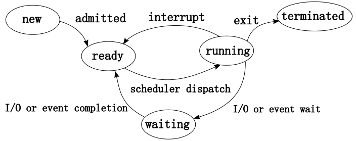
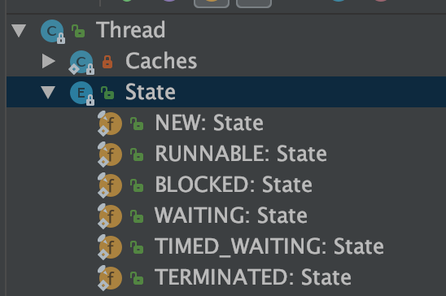
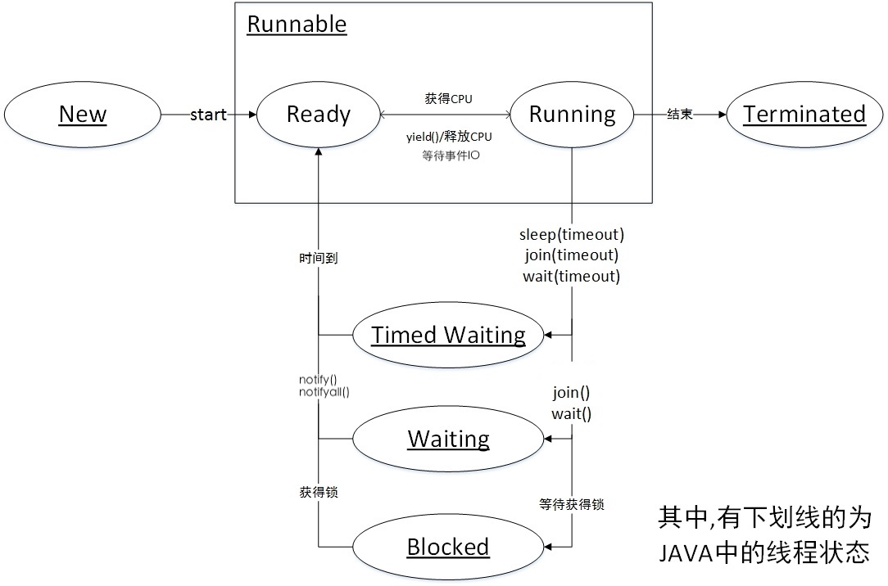

[OS_单核至多核的进程调度](https://miszibu.github.io/2016/11/13/General/OS/BaseKnowledge/OS_%E5%8D%95%E6%A0%B8%E8%87%B3%E5%A4%9A%E6%A0%B8%E7%9A%84%E8%BF%9B%E7%A8%8B%E8%B0%83%E5%BA%A6/)

关于操作系统的方面的进程线程关系，请先阅读上述博文。

<!--more-->

# 操作系统线程的状态

# Java线程的状态: Thread.State

* `NEW` (**新建**)   
  一个尚未启动的线程处于这一状态。(A thread that has not yet started is in this state.)
* `RUNNABLE` (**可运行**)   
  一个正在 Java 虚拟机中执行的线程处于这一状态。(A thread executing in the Java virtual machine is in this state.)
* `BLOCKED` (**阻塞**)   
  一个正在阻塞等待一个监视器锁的线程处于这一状态。(A thread that is blocked waiting for a monitor lock is in this state.)
* `WAITING` (**等待**)   
  一个正在无限期等待另一个线程执行一个特别的动作的线程处于这一状态。(A thread that is waiting indefinitely for another thread to perform a particular action is in this state.)
* `TIMED_WAITING` (**计时等待**)   
  一个正在限时等待另一个线程执行一个动作的线程处于这一状态。(A thread that is waiting for another thread to perform an action for up to a specified waiting time is in this state.)
* `TERMINATED` (**终止**)   
  一个已经退出的线程处于这一状态。(A thread that has exited is in this state.)

# Java线程状态 与 OS线程状态的映射

前两个标题中，我们分别介绍了OS线程的5种状态和 Java线程状态的定义，**JVM将 Java线程一一映射到操作系统底层的线程上，由CPU调度管理线程的生命周期**。不同的操作系统有不同的线程状态的定义，而我们开发 Java 程序时，不需要关注到系统的线程定义，而是关注由 JVM 统一的线程状态。

>These states are **virtual machine states** which **do not reflect** any operating system thread states。
>这些状态是**虚拟机状态**，它**不反映**任何操作系统的线程状态。

比如操作系统中的 `ready`,` running`被统一成了 java 线程中的`runnable`.

比如操作系统中的`waiting`状态则被更细分为了`block`,`waiting`,`timed_waiting`.

## New

当使用new Thread()创建一个新的线程，又还没有开始执行，就处于NEW状态。

当使用 start()方法后，线程进入 Runnable 状态。

> 这里所谓“开始执行”具体指调用线程类中的start方法，start方法会开启新的执行线程，run 方法还在原线程上执行。

## Runnable：正在 JVM中运行

**Runnable 状态: 既包含了 Ready , Running 也包含了部分的因为 IO操作所导致的 Waiting 状态。**

实际上，Java 的线程状态都是与自身显式引入的机制有关，Blocked(锁机制)，waiting, timed_waiting(线程间交互)

> 处于 runnable 状态下的线程正在 Java 虚拟机中执行，但它**可能正在等待**来自于操作系统的其它资源，比如处理器。
>
> A thread in the runnable state is executing in the Java virtual machine but **it may be waiting for** other resources from the operating system such as processor.

### 为什么 Runnable 状态要不区分 Ready 和 Running?

现在的**时分多任务**操作系统架构通常都是使用的“**时间分片**”方式进行**抢占式**轮转调度（round-robin）。

每个线程只能使用10ms-20ms的时间片，随后CPU会记录当前线程的执行状态并将其放回线程就绪队列，并唤醒等待的下一个线程，这就是 CPU上下文切换。实际上由于线程自身的 IO 操作，每次线程往往没用满时间片，就切换了。因此线程状态在running和ready间不断切换。

通常，Java的线程状态是服务于监控的，如果线程切换得是如此之快，那么区分 ready 与 running 就没什么太大意义了。

> 当你看到监控上显示是 running 时，对应的线程可能早就被切换下去了，甚至又再次地切换了上来，也许你只能看到 ready 与 running 两个状态在快速地闪烁。
>
> 当然，对于精确的性能评估而言，获得准确的 running 时间是有必要的。

### 发生I/O阻塞，线程状态如何切换？

#### 操作系统层面

在操作系统层面，当线程发生IO操作时，就会将线程切换到Waiting 状态，等待其 IO 操作完成，则使用`中断`(interrupt)机制来通知 CPU.

> IO操作时间长，为了让 CPU资源利用最大化，则使用阻塞式 IO, CPU不会等待线程，而是调用下一个线程。
>
> “**中断驱动**（interrupt-driven）”，现代操作系统基本都采用这一机制。
>
> 某种意义上，这也是**控制反转**（IoC）机制的一种体现，cpu不用反复去询问硬盘，而是由硬盘主动发出中断信号，CPU 不断去检查中断信号。包括时间片轮转机制，本质上也是一个定时的中断信号，用于切换线程。

举例说，CPU收到一个来自硬盘的中断信号，就进入中断处理例程，将当前线程放入就绪队列，先前因 I/O 而waiting 的线程随着 I/O 的完成也再次回到 ready 队列，这时 cpu 可能会选择它来执行。

#### JVM 层面

了解了操作系统层面后，那么在 Java中线程遇到 IO 操作后，会切换到什么状态呢？Blocked 还是 Waiting 呢?

**答案是：仍然为 Runnable.**

我们先来看下 runnable 状态的定义，处于 runnable 状态下的线程正在 Java 虚拟机中执行，但它**可能正在等待**来自于操作系统的其它资源，比如处理器。对于 JVM而言，它并不关心底层的实现细节，只要线程正在运行中，正在由某个硬件资源为其服务，那么它就是 Runnable 状态。

因此 IO 阻塞时，网卡，硬盘等IO设备仍然在为线程工作，那么该线程就应该是 Runnable 状态。

操作系统的线程状态是围绕 CPU 为核心去叙事的，而JVM 则是抹去了底层的细节，关注于线程本身的锁和交互状态。

因此细分出了 Blocked(锁阻塞)，Waiting, Timed_Waiting(线程交互)等状态。

> “Java 线程状态的改变通常只与自身显式引入的机制有关”，现在应该对这句话更有了解了。

## Waiting：无限期等待其他线程

这里所谓的动作通常即是指“notify或是notifyAll”。

## Timed_waiting：有限期等待其他线程

如果没有等到如“notify”之类的动作，时间到了也会自动退出这一状态。

## Block：等待监视器锁

这是一种特殊的waiting，实际上就是被synchronized方法或者块阻塞。

monitor有些书上通常叫”**管程**“，我也不太确定要怎么叫它。这里叫成”监视器“也是取字面的意思。

## Terminated

终止状态，在线程执行完毕后或退出时，线程则标志为终止。

# Reference

[java线程运行怎么有第六种状态？](https://www.zhihu.com/question/56494969/answer/154053599)

[Java 线程状态之 RUNNABLE](https://my.oschina.net/goldenshaw/blog/705397)

[关于Java的线程状态](https://my.oschina.net/goldenshaw/blog/386788)

