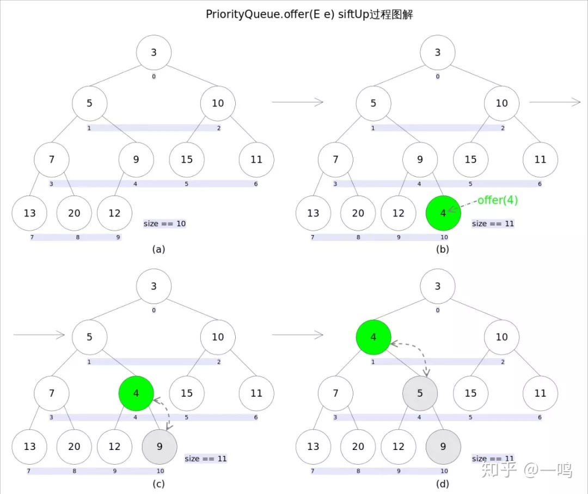

Java 中的优先级队列，是使用**数组表示的完全二叉树的小顶堆模式**.

每次取出的元素都是队列中权值最小的，队列中的元素都经过了排序处理，默认按照自然顺序，也可以通过 Comparator 接口进行自定义排序。

<!--more-->

## How to use

PriorityQueue 继承AbstractQueue ，因此可以是用Queue 接口定义的方法来使用。

| Queue 接口方法 | 说明                                |
| -------------- | ----------------------------------- |
| add(E e)       | 向队尾插入元素，失败则抛异常        |
| offer(E e)     | 向队尾插入元素，成功则返回 true     |
| remove()       | 获取并删除队首元素，失败则跑出异常  |
| poll()         | 获取并删除队首元素，失败则返回 null |
| element()      | 获取队首元素，失败则抛出异常        |
| peek()         | 获取队首元素，失败则返回 null       |


```java
package Container;

import java.util.Comparator;
import java.util.PriorityQueue;
import java.util.Queue;
import java.util.Random;

public class PriorityQueueTest {


    public static void main(String[] args) {
				// 大顶堆
        Queue<Integer> priorityQueue = new PriorityQueue(new Comparator<Integer>() {
            @Override
            public int compare(Integer o1, Integer o2) {
                return o2.compareTo(o1);
            }
        });
        // 小顶堆
        //Queue<Integer> priorityQueue = new PriorityQueue()
      
        int count =0;
        System.out.print("Add value into priority queue: ");
        while(count++!=20){
            Random random = new Random();
            int tmp = random.nextInt(100);
            System.out.print(tmp + " ");
            priorityQueue.add(tmp);
        }
        System.out.println("");
        System.out.print("Pop elements in the queue: ");
        while (true){
            Integer tmp = (Integer) priorityQueue.poll();
            if (tmp==null)
                break;
            System.out.print(tmp+" ");
        }

    }

}

Add value into priority queue: 94 70 83 94 50 28 31 29 70 67 60 97 36 5 65 52 69 48 14 75 
小顶堆: 5 14 28 29 31 36 48 50 52 60 65 67 69 70 70 75 83 94 94 97
大顶堆：93 85 83 83 83 80 66 56 42 40 35 34 33 33 30 22 18 12 4 3
```


## PriorityQueue 原理


Priority Queue是基于数组实现的**完全二叉树**，因此可以从当前节点推出**左右子节点和父节点的下标位置。**


## 源码解析

### 数据结构

```java
public class PriorityQueue<E> extends AbstractQueue<E>
    implements java.io.Serializable {
	
	/**默认容量为11*/
	  private static final int DEFAULT_INITIAL_CAPACITY = 11;

	/**队列容器*/
    transient Object[] queue;

	/**队列长度*/
    private int size = 0;

	/**比较器,为null使用自然排序*/
    private final Comparator<? super E> comparator;

	......
}
```

### Add/Offer



```java
public boolean add(E e) {
    if (offer(e))
        return true;
    else
        throw new IllegalStateException("Queue full");
}

public boolean offer(E e) {
	//不允许放入null元素
    if (e == null)
        throw new NullPointerException();
    modCount++;
    int i = size;
    if (i >= queue.length)
				//自动扩容
        grow(i + 1);
    size = i + 1;
	  // 队列为空时，设置为第一个元素
    if (i == 0)
        queue[0] = e;
    else
	   		//调整元素在树中的位置
        siftUp(i, e);
    return true;
}

private void grow(int minCapacity) {
    int oldCapacity = queue.length;
	  //如果旧数组容量小于64，新容量为 oldCapacity *2 +2
	  //如果大于64，1.5倍扩容
    int newCapacity = oldCapacity + ((oldCapacity < 64) ?
                                     (oldCapacity + 2) :
                                     (oldCapacity >> 1));
    //判断是否超过最大容量值，设置最高容量值
    if (newCapacity - MAX_ARRAY_SIZE > 0)
        newCapacity = hugeCapacity(minCapacity);
	  //复制数组元素
    queue = Arrays.copyOf(queue, newCapacity);
}

private void siftUp(int k, E x) {
	  //如果使用比较器，采用比较器进行比较
    if (comparator != null)
        siftUpUsingComparator(k, x);
    else
		//没有比较器，采用自然排序
        siftUpComparable(k, x);
}

private void siftUpComparable(int k, E x) {
    Comparable<? super E> key = (Comparable<? super E>) x;
    while (k > 0) {
		//parentNo = (nodeNo-1)/2
        int parent = (k - 1) >>> 1;
        Object e = queue[parent];
		//默认自然排序，从小到大
        if (key.compareTo((E) e) >= 0)
            break;
        queue[k] = e;
        k = parent;
    }
    queue[k] = key;
}

private void siftUpUsingComparator(int k, E x) {
    while (k > 0) {
		    //parentNo = (nodeNo-1)/2
        int parent = (k - 1) >>> 1;
        Object e = queue[parent];
		    //调用比较器的比较方法
        if (comparator.compare(x, (E) e) >= 0)
            break;
        queue[k] = e;
        k = parent;
    }
    queue[k] = x;
}
```

插入新数据后，会破坏小顶堆的性质，通过将插入的元素与父节点比较交换，直到满足**父节点的值都小于子节点的值。**


### Poll & Remove


```java
public E poll() {
    if (size == 0)
        return null;
    int s = --size;
    modCount++;
	  //0下标处的那个元素就是最小的那个
    E result = (E) queue[0];
    E x = (E) queue[s];
    queue[s] = null;
    if (s != 0)
	    	//调整
        siftDown(0, x);
    return result;
}

private void siftDown(int k, E x) {
	  //判断是否有自定义比较器
    if (comparator != null)
        siftDownUsingComparator(k, x);
    else
        siftDownComparable(k, x);
}

private void siftDownComparable(int k, E x) {
    Comparable<? super E> key = (Comparable<? super E>)x;
    int half = size >>> 1;        // loop while a non-leaf
    while (k < half) {
		//首先找到左右孩子中较小的那个，记录到c里，并用child记录其下标
        int child = (k << 1) + 1;
        Object c = queue[child];
        int right = child + 1;
        if (right < size &&
            ((Comparable<? super E>) c).compareTo((E) queue[right]) > 0)
            c = queue[child = right];
        if (key.compareTo((E) c) <= 0)
            break;
        queue[k] = c;//然后用c取代原来的值
        k = child;
    }
    queue[k] = key;
}

private void siftDownUsingComparator(int k, E x) {
    int half = size >>> 1;
    while (k < half) {
		//首先找到左右孩子中较小的那个，记录到c里，并用child记录其下标
        int child = (k << 1) + 1;
        Object c = queue[child];
        int right = child + 1;
        if (right < size &&
            comparator.compare((E) c, (E) queue[right]) > 0)
            c = queue[child = right];
        if (comparator.compare(x, (E) c) <= 0)
            break;
        queue[k] = c;//然后用c取代原来的值
        k = child;
    }
    queue[k] = x;
}

```

**默认的删除调整中，首先获取顶部下标和最尾部的元素内容，从顶部的位置开始，将尾部元素的内容逐层向下与当前点的左右子节点中较小的那个交换，直到判断元素内容小于或等于左右子节点中的任何一个为止。**


### element && peek

```java
public E peek() {
    return (size == 0) ? null : (E) queue[0];
}

public E element() {
    E x = peek();
    if (x != null)
        return x;
    else
		    //返回空值，抛异常
        throw new NoSuchElementException();
}
```


## Reference

[你应该知道的 PriorityQueue ——深入浅出分析 PriorityQueue](https://zhuanlan.zhihu.com/p/94943012)

