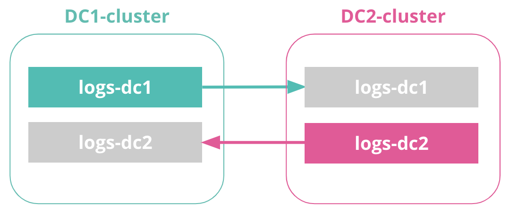
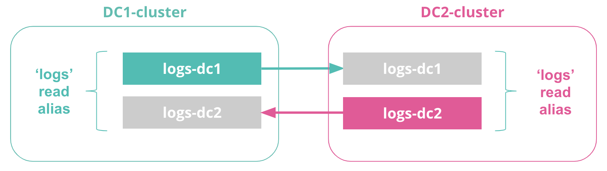
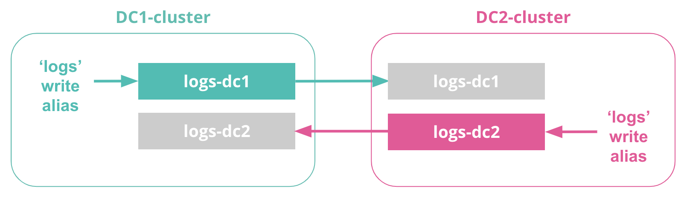
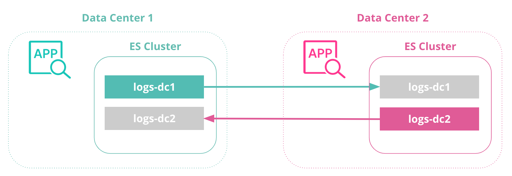

## Introduction

Elasticsearch cross-cluster replication (CCR) 在 ES6.7版本正式发布，ccr允许 **index 跨集群复制**，复制Index 数据到其他 ES Cluster，有助于实现例如high availability (HA) across datacenters, disaster recovery (DR)和 CDN-like architectures等用户场景。

CCR是基于 Leader/Follower  架构。

**Leader Index**用于接收操作，并复制数据到N 个 Follower Index 中。

**Follower Index**则无法接收写请求（除了来自于 Leader Index 的数据）。

CCR无法处理Conflict Resolutin（我理解为数据同时写入多个 Index 中），这意味着数据只会被写入到 Leader Index, 并被复制到 Follower Index 上。*我们可以将一个 Follower Index 升级为 Regular Index（Leader Index 其实就是一个 Regualr Index），但我们无法将一个存在数据的 Leader Index 转为 Follower Index。*

<!-- more -->

## Tutorial: Optimizing CCR for index

### 1. Setup

在本教程中，我们将会使用两个集群来模拟 CCR 的场景。



<center>Replicated (read-only) indices are in gray</center>
### 2. License

CCR 是一个 Platinum License Featuer, 请自行购买 License。在测试环境直接激活Trial License 即可。可以通过 Kibana或者 API 激活。

### 3. Define Remote Cluster

两个 ES Clusters 都需要设置对方 集群的TCP链接地址，使集群可互相感知，访问。

请自行选择Kibana dev tools console( Kibana> Dev tools > Console) 或者 API 来激活配置。

```json
// 在DC1-cluster 集群中，配置 DC2-cluster 的连接信息
PUT /_cluster/settings 
{ 
  "persistent" : { 
    "cluster" : { 
      "remote" : { 
        "DC2-cluster" : { 
          "seeds" : [ 
            "127.0.0.1:9301" 
          ] 
        } 
      } 
    } 
  } 
}
// 同理，在 DC2-cluster 中，配置 DC1-cluster 的连接信息
PUT /_cluster/settings 
{ 
  "persistent" : { 
    "cluster" : { 
      "remote" : { 
        "DC1-cluster" : { 
          "seeds" : [ 
            "127.0.0.1:9300" 
          ] 
        } 
      } 
    } 
  } 
}
```


在设置完成后，可以通过以下 API 来获取当前 Cluster 所配置的 Remote Cluster 信息。

```json
GET /_remote/info?pretty
```


### 4. Create Indices for bi-directional replication

在 DC1-cluster 上创建 logs-dc1 index

```json
// Create a logs index in DC1 
PUT /logs-dc1
```

在 DC2-cluster 上创建 logs-dc2 index

```json
// Create a logs index in DC2 
PUT /logs-dc2
```

Note: 在这一步我们只创建了 Leader Index，现在它还是个Regular index。Follower Index 则是通过设置 CCR，来自动生成的。


### 5. Initiate replication

在 DC2-cluster 中我们通过以下方式，来在当前集群中创建，DC1-cluster 的 logs-dc1 index 的 follower index.

```json
PUT /logs-dc1/_ccr/follow 
{ 
  "remote_cluster" : "DC1-cluster", 
  "leader_index" : "logs-dc1" 
}
```

同理，在 DC1-cluster 中，创建 DC2-cluster 的 logs-dc2 index 的 follower index.

```json
PUT /logs-dc2/_ccr/follow 
{ 
  "remote_cluster" : "DC2-cluster", 
  "leader_index" : "logs-dc2" 
}
```

**Note**: 在上述案例中我们使用的是单个index 的设置，在日志分析的场景中，我们则可以通过 [auto-follow patterns](https://www.elastic.co/guide/en/elasticsearch/reference/7.5/ccr-put-auto-follow-pattern.html) ，来批量匹配时序型index. 集群将在 Remote cluster 中自动检测符合 Pattern 的索引，然后在当前集群中创建对应的 Follower Index.

**Note：**再次提示 Follower Index 是只读的，不接受写请求。

### 6. Define read aliases



现在，每个集群都有了两个 index,一个是自己的 Leader Index，另外一个则是另外集群的 Follower index.

为了在多个 indices 上同时查询，且简化查询语句。我们可以通过设置别名的方式，既查询"logs"别名时，同时查询 logs-dc1 和 logs-dc2。

**Note:** **别名是设置在 Index 上的，可以被follower index复制**，也就是说当我们为 logs-dc1设置别名为 logs 时，那么在 DC2-cluster 上对应的 follower index也可以由该别名访问到。

DC1-cluster

```json
POST /_aliases 
{ 
    "actions" : [ 
        { "add" : { "index" : "logs-dc1", "alias" : "logs" } } 
    ] 
}
```

DC2-cluster

```json
POST /_aliases 
{ 
    "actions" : [ 
        { "add" : { "index" : "logs-dc2", "alias" : "logs" } } 
    ] 
}
```

### 7. Define write aliases



同第6步，为了简化Application setup，我们可以通过创建 write alias，通过指定 logs alias 到指定的 index 中，比如 logs-dc1 index on DC1-cluster, logs-dc2 index on DC2-clutser.

那么对应 Application 而言，只需要简单的将数据发送到当前 data center 的 logs index即可。

DC1-clusetr

```json
POST /_aliases 
{ 
    "actions" : [ 
        { 
            "add" : { 
                 "index" : "logs-dc1", 
                 "alias" : "logs", 
                 "is_write_index" : true 
            } 
        } 
    ] 
}
```

DC2-clusetr

```json
POST /_aliases 
{ 
    "actions" : [ 
        { 
            "add" : { 
                 "index" : "logs-dc2", 
                 "alias" : "logs", 
                 "is_write_index" : true 
            } 
        } 
    ] 
}
```

### 8. Test replication setup



```json
POST /logs/_doc  {   "test" : "log message in DC1"  }
```

```json
GET /logs/_search
```


## Reference

[Bi-directional replication with Elasticsearch cross-cluster replication (CCR)](https://www.elastic.co/blog/bi-directional-replication-with-elasticsearch-cross-cluster-replication-ccr)

[Follow the Leader: An Introduction to Cross-Cluster Replication in Elasticsearch](https://www.elastic.co/blog/follow-the-leader-an-introduction-to-cross-cluster-replication-in-elasticsearch)
