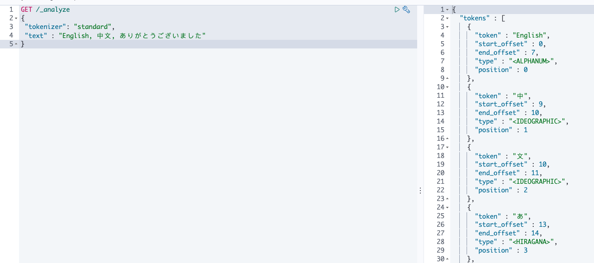

涉及知识点：

* ES 分词器工作原理
* ES 内置分词器
* IK 中文分词器
* 在Template Mapping中对不同field 配置分词器

<!--more-->


# 相关背景介绍

## Analysis

**Analysis（文本分析）**: 将一段文本通过Analyzer划分为一系列term/token的过程称为Analysis，也叫**分词**。 简单说Analysis是通过Analyzer来实现的。

### Index time analysis

当文档插入索引时，ES会对`text`类型的字段建立**反向索引**，反向索引通过Analyzer将文本拆分为tokens/terms,再将其指向包含对应数据的文档。

```shell
# String被转为tokens, tokens又被转为小写并被简化为基础词根比如 (foxes → fox, jumped → jump, lazy → lazi)
# 原句
The QUICK brown foxes jumped over the lazy dog!
# Tokens
[ quick, brown, fox, jump, over, lazi, dog ]

```

### Search time analysis

Analysis同样也会应用到查询过程中，当我们使用`full text queries(全文查询)`时，比如`match query`。查询语句也会被分词，从而去匹配反向索引中的tokens/terms，并计算相关性得分。

**指定查询时分词器**： 优先使用查询语句配置的分词器，其次使用template filed中配置的分词器, 然后使用template index setting中配置的`defautl`,`default_search`分词器，最后是`standard` 分词器，最后是`standard`分词器。

* An analyzer specified in the query itself.
* The search_analyzer mapping parameter.
* The analyzer mapping parameter.

* An analyzer in the index settings called default_search.
* An analyzer in the index settings called default.
* The standard analyzer.

## Analyzer的构成

Analyzer是由三个模块构成的： `character filters`, `tokenizers`, `tokern filters`。

用户可以使用内置的Analyzer，也可以自己**自定义Analyzer**。

* character filters(字符过滤器)： 在对文本进行分词之前，先进行预处理，比如说过滤html标签。

* tokenizers(分词器)： 将原有的语句切分为一系列的tokens/terms，并记录其起始位置和字符长度。 比如 `whitespace分词器`就会以空&#26684;来划分tokens

* token filters(Token过滤器)： 对切分后tokens进行处理，删除，添加或者修改token，如`lowercase token filter`就会小写化tokens,`stop token filter`就会删除无意义的助词（a, an, the, and等），`synonym token filter`则会添加同义词token。

执行顺序: Character filters(0或N个) --> Tokenizer（有且只有一个） --> Token filters(0或N个)

# 常见分词器及其使用

ES内置了许多分词器，这里简单常见的两种`Standard Analyzer`, `Whitespace Anylyzer`. 更多分词器和分词器细节配置，使用时再去了解即可，

## Standard Analyzer（默认）

Standard是**默认**的分析器。它提供了基于语法的token划分（基于Unicode文本分割算法），适用于大部分语言**（事实上中文日文就不行，别的语言没测）**。



## Whitespace Analyzer

`Whitespace analyzer`就是简单的将文本以空&#26684;进行划分。

# 如何自定义分词器
使用自定义分词器来满足一些客制化的需求。直接上例子

```json
# 我们创建了一个自定义分词器取名为my_custom_analyzer
# 自定义分词器的type需要设置为custom
# tokenizer选择到了standard，当然也可以是任意内置或后续安装的其他tokenizer
# character filter 和 filter选择了内置
PUT my_index
{
  "settings": {
    "analysis": {
      "analyzer": {
        "my_custom_analyzer": {
          "type":      "custom", 
          "tokenizer": "standard",
          "char_filter": [
            "html_strip"
          ],
          "filter": [
            "lowercase",
            "asciifolding"
          ]
        }
      }
    }
  }
}

POST my_index/_analyze
{
  "analyzer": "my_custom_analyzer",
  "text": "Is this <b>déjà vu</b>?"
}

# 这个例子中，我们的三个组件都使用了自定义的设置。
PUT my_index
{
  "settings": {
    "analysis": {
      "analyzer": {
        "my_custom_analyzer": { 
          "type": "custom",
          "char_filter": [
            "emoticons"
          ],
          "tokenizer": "punctuation",
          "filter": [
            "lowercase",
            "english_stop"
          ]
        }
      },
      "tokenizer": {
        "punctuation": { 
          "type": "pattern",
          "pattern": "[ .,!?]"
        }
      },
      "char_filter": {
        "emoticons": { 
          "type": "mapping",
          "mappings": [
            ":) => _happy_",
            ":( => _sad_"
          ]
        }
      },
      "filter": {
        "english_stop": { 
          "type": "stop",
          "stopwords": "_english_"
        }
      }
    }
  }
}

POST my_index/_analyze
{
  "analyzer": "my_custom_analyzer",
  "text":     "I'm a :) person, and you?"
}
```

# 如何设置和测试分词器

## 如何在template中设置分词器
```json
# 在这里例子中，我们为title字段声明了`analyzer`(数据插入时使用),但并未context字段声明任何analyzer，而是在setting中配置了默认的analyzer，因此context字段将使用simple analyzer。若没有配置默认analyzer,text类型字段将默认使用standard analyzer.
PUT my_index
{
   "settings":{
      "analysis":{
         "analyzer":{
			"default": {
				"type": "simple"
			}
            "my_analyzer":{ 
               "type":"custom",
               "tokenizer":"standard",
               "filter":[
                  "lowercase"
               ]
            },
            "my_stop_analyzer":{ 
               "type":"custom",
               "tokenizer":"standard",
               "filter":[
                  "lowercase",
                  "english_stop"
               ]
            }
         },
         "filter":{
            "english_stop":{
               "type":"stop",
               "stopwords":"_english_"
            }
         }
      }
   },
   "mappings":{
      "_doc":{
         "properties":{
            "title": {
               "type":"text",
               "analyzer":"my_analyzer", 
               "search_analyzer":"my_stop_analyzer", 
               "search_quote_analyzer":"my_analyzer" 
            }
			"context": {
               "type":"text"
            }
         }
      }
   }
}

PUT my_index/_doc/1
{
   "title":"The Quick Brown Fox"
}

PUT my_index/_doc/2
{
   "title":"A Quick Brown Fox"
}

# 当前查询中"the quick brown fox"被引号框起，所以这个短语将会`search_quote_analyzer`所分析，如果没有引号，则会调用`search_analyzer`进行分析。
# 查询分析器的匹配顺序，见上文Analyzer。
GET my_index/_search
{
   "query":{
      "query_string":{
         "query":"\"the quick brown fox\"" 
      }
   }
}
```
## 测试分词器

```json
GET _analyze
{
  "tokenizer" : "keyword",
  "filter" : ["lowercase"],
  "char_filter" : ["html_strip"],
  "text" : "this is a <b>test</b>"
}
```

# IK分词器

在涉及到中文分词时，ES默认提供的分词器会将中文按照每个字来划分，不能正常使用。通常情况下我们会使用IK分词器，来对中文数据进行分词。

## 如何安装IK分词器

直接查看官方Readme
https://github.com/medcl/elasticsearch-analysis-ik

## 如何使用

IK支持两种颗粒度的拆分
* `ik_smart`:会做最粗粒度的划分
* `ik_max_word`： 做最细粒度的划分

```shell
# 通过例子，直观了解

GET /_analyze
{
  "text":"中华人民共和国国徽",
  "analyzer":"ik_smart"
}

#TODO

GET /_analyze
{
  "text":"中华人民共和国国徽",
  "analyzer":"ik_max_word"
}
#TODO
```

