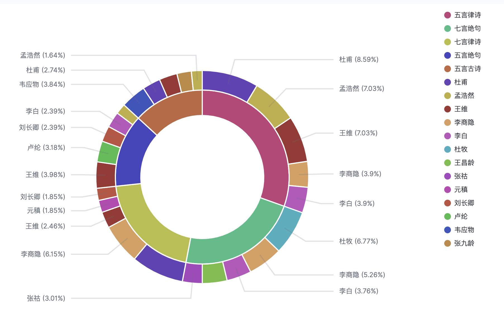

> 本文思路来自于博主铭毅天下的博文 [项目实战 01：将唐诗三百首写入 Elasticsearch 会发生什么？](https://blog.csdn.net/wojiushiwo987/article/details/108373311)

本文将唐诗三百首索引进入ES，并针对分词进行可视化处理，从这个实战项目可以了解以下一系列知识点和整体数据处理流程。

* Elasticsearch 数据建模
* Elasticsearch bulk批量写入
* Elasticsearch 预处理
* Elasticsearch检索
* Elasticsearch聚合
* kibana Visualize 使用
* kibana Dashboard 使用

<!--more-->

# 项目介绍

数据来源：https://github.com/xuchunyang/300
注意数据源bug： 第1753行中的"id":253 需要手动改成  "id": 252。


整体data flow 如上图所示，具体而言分为以下步骤

1. 根据数据结构和分词设置，预先创建 `Template` 和`Mapping`
2. 创建 Ingest Pipeline 并绑定到 template 上
3. 通过 Bulk Request 批量导入数据
4. 数据 可视化

# 测试环境准备

基于 Docker Container 创建一个 ES 单节点和对应 Kibana。
```shell
# Create ES/Kibana Contaienr
docker run -itd --privileged --name es_single_node -p 9200:9200 -p 9300:9300 -e "discovery.type=single-node" elasticsearch:7.6.2
docker run -itd --name kibana --privileged -p 5601:5601 kibana:7.6.2 /bin/bash
# Build a docker network to connect container kibana and es
docker network create myNetwork
docker network connect myNetwork kibana
docker network connect myNetwork es_single_node

# Do some configuration changes 

# download IK analyzer paclage: lasticsearch-analysis-ik-7.6.2.zip
docker cp ~/Downloads/elasticsearch-analysis-ik-7.6.2.zip es_single_node:/usr/share/elasticsearch/
# Instal IK Package
./bin/elasticsearch-plugin install https://github.com/medcl/elasticsearch-analysis-ik/releases/download/v7.6.2/elasticsearch-analysis-ik-7.6.2.zip
#  Recycle es container to take effect plugins
```

# 数据导入及其准备

## 创建 Templates

创建 template poem_tpl,这里需要注意的是`Mapping`设置和绑定`ingest pipeline`.

Mapping的设置非常重要，基于如下的数据结构
```json
    "id": 251,
    "contents": "打起黄莺儿，莫教枝上啼。啼时惊妾梦，不得到辽西。",
    "type": "五言绝句",
    "author": "金昌绪",
    "title": "春怨"
```
我们的建模逻辑如下：

| 字段名称    | 字段类型       | 备注说明                            |
| :---------- | :------------- | :---------------------------------- |
| _id         |                | 对应自增id                          |
| contents    | text & keyword | 涉及分词，注意开启：fielddata：true |
| type        | text & keyword |                                     |
| author      | text & keyword |                                     |
| title       | text & keyword |                                     |
| timestamp   | date           | 代表插入时间                        |
| cont_length | long           | contents长度， 排序用               |

在分词器的选择方面，我们使用了 `IK分词器`，ES原生的分词器对中文支持都是对字分词，起不到预期的作用
Ik词典的选择建议：自带词典不完备，网上搜索互联网的一些常用语词典、行业词典如（诗词相关词典）作为补充完善。

```json
PUT _template/poem_tpl
{
  "index_patterns": [
    "poem*"
  ],
  "aliases": {
    "poem_index_alias": {}
  },
  "settings": {
    "index.default_pipeline": "add_timestamp",
    "number_of_replicas": 1,
    "refresh_interval": "30s"
  },
  "mappings": {
    "properties": {
      "cont_length":{
        "type":"long"
      },
      "author": {
        "type": "text",
        "fields": {
          "field": {
            "type": "keyword"
          }
        },
        "analyzer": "ik_max_word"
      },
      "contents": {
        "type": "text",
        "fields": {
          "field": {
            "type": "keyword"
          }
        },
        "analyzer": "ik_max_word",
        "fielddata": true
      },
      "timestamp": {
        "type": "date"
      },
      "title": {
        "type": "text",
        "fields": {
          "field": {
            "type": "keyword"
          }
        },
        "analyzer": "ik_max_word"
      },
      "type": {
        "type": "text",
        "fields": {
          "field": {
            "type": "keyword"
          }
        },
        "analyzer": "ik_max_word"
      }
    }
  }
}
```

## Ingest Pipeline

我们希望在每个文档中，新增 timestamp 和 cont_length 字段，这就依赖于 ingest pipeline 了，当然也可以通过 Logstash 等数据 ETL 工具实现。

```json

PUT _ingest/pipeline/add_timestamp
{
  "description": "Adds timestamp  to documents",
  "processors": [
    {
      "set": {
        "field": "_source.timestamp", 
        "value": "{{_ingest.timestamp}}"
      }
    },
    {
      "script": {
        "source": "ctx.cont_length = ctx.contents.length();"
      }
    }
  ]
}
```

## 批量导入数据

使用 Python ES Bulk API 批量导入数据，批量导入在数据量大的时候能有效提高导入性能。因为相比于一条请求携带一个文档，一条请求携带大量文档，大大提高了网络利用率。
```python
import json
from elasticsearch import Elasticsearch
from elasticsearch import helpers

def read_and_write_index():
	# define an empty list for the Elasticsearch docs
	doc_list = []
	es = Elasticsearch(hosts='http://localhost',port=9200)

	# use Python's enumerate() function to iterate over list of doc strings
	input_file = open('/Users/ligaofeng/Java/Resource/300/300.json',  encoding="utf8", errors='ignore')
	json_array = json.load(input_file)


	for item in json_array:
		try:
			# convert the string to a dict object
			# add a new field to the Elasticsearch doc
			dict_doc = {}
			# add a dict key called "_id" if you'd like to specify an ID for the doc
			dict_doc["_id"] = item['id']
			dict_doc["contents"] = item['contents']
			dict_doc["type"] = item['type']
			dict_doc["author"] = item['author']
			dict_doc["title"] = item['title']


			# append the dict object to the list []
			doc_list += [dict_doc]

		except json.decoder.JSONDecodeError as err:
			# print the errors
			print("ERROR for num:", item['id'], "-- JSONDecodeError:", err, "for doc:", dict_doc)
			print("Dict docs length:", len(doc_list))


	try:
		print ("\nAttempting to index the list of docs using helpers.bulk()")

		# use the helpers library's Bulk API to index list of Elasticsearch docs
		resp = helpers.bulk(
			es,
			doc_list,
			index = "poem_index",
			doc_type = "_doc"
		)

		# print the response returned by Elasticsearch
		print ("helpers.bulk() RESPONSE:", resp)
		print ("helpers.bulk() RESPONSE:", json.dumps(resp, indent=4))
	except Exception as err:
		# print any errors returned w
		## Prerequisiteshile making the helpers.bulk() API call
		print("Elasticsearch helpers.bulk() ERROR:", err)
		quit()

read_and_write_index()
```

# 数据可视化

## 谁的作品最多：TOP10


## 五言绝句和七言律诗占比，以及对应作者占比统计



## 同名诗排行统计


## 三百首诗分词形成什么样的词云

由于我们使用 `ik_max_word`分词器，他会最大化分词，那么也就导致了词云都是单个字的现象。使用 `ik_smart`可以解决。


## 全局视图

