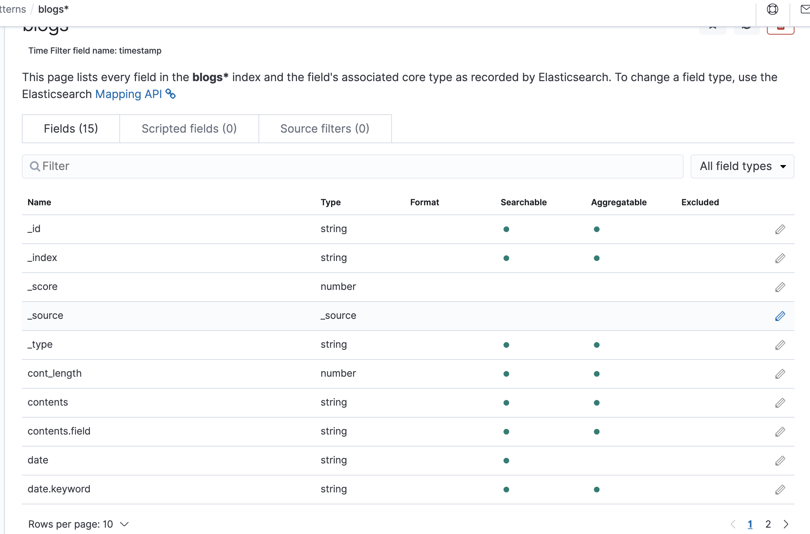
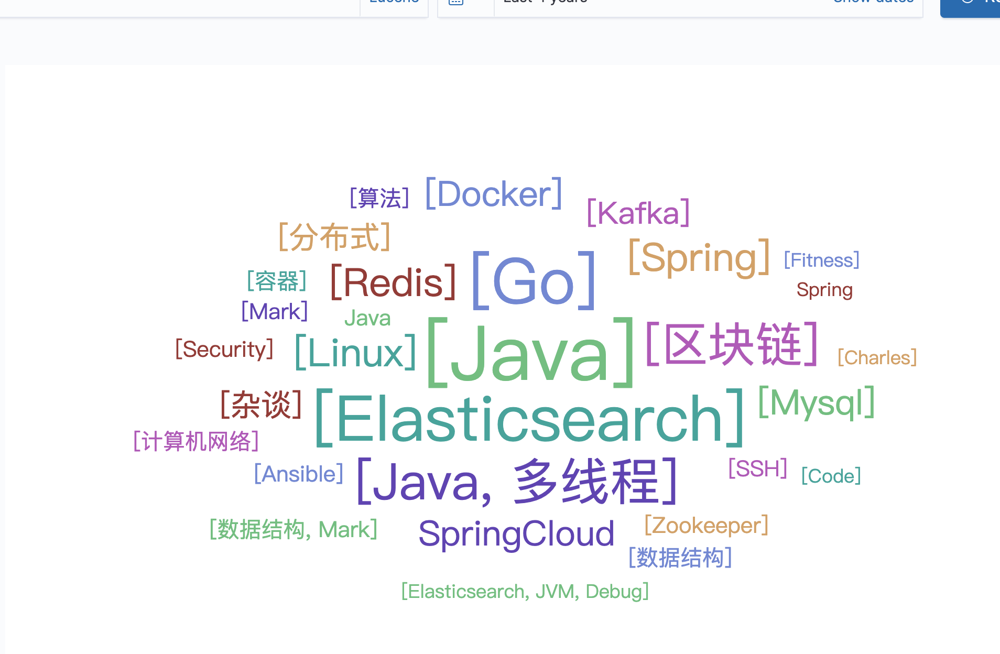
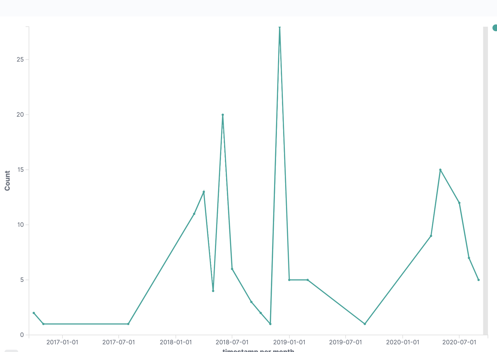

这篇是上一篇[ES-项目实战1-唐诗300首](https://miszibu.github.io/2020/09/10/Components/Elasticsearch/ES-%E9%A1%B9%E7%9B%AE%E5%AE%9E%E6%88%981-%E5%94%90%E8%AF%97300%E9%A6%96/#more)的姊妹篇，从本地磁盘读取个人博客内容，转化格式后，基于 `Java High-Level Restful API `导入到 ES 集群中，并做数据分析和可视化相关的内容。

<!--more-->

# 数据预备阶段

## 准备测试环境
[见上篇测试环境准备](https://miszibu.github.io/2020/09/10/Components/Elasticsearch/ES-%E9%A1%B9%E7%9B%AE%E5%AE%9E%E6%88%981-%E5%94%90%E8%AF%97300%E9%A6%96/#more)。

## 数据导入及其准备

实验数据来自于本地个人博客的Markdown文件，文件格式如下：

```
---
title: ElasticSearch Snapshot
date: 2020-04-16 16:43:42
tags: [Elasticsearch]
---

Content
```

基于文件内容，我们的设置了如下建模结构：

| 字段名称    | 字段类型       | 备注说明                            |
| :---------- | :------------- | :---------------------------------- |
| _id         |                | 对应自增id                          |
| contents    | text & keyword | 涉及分词，注意开启：fielddata：true |
| tags        | text & keyword |                                     |
| title       | text & keyword |                                     |
| timestamp   | date           | 代表blog创建时间                    |
| date        | text & keyword | 文件创建时间（String）格式          |
| cont_length | long           | contents长度， 排序用               |

### 创建template 

将设计好的Index Mapping 转换为 Templates。 并绑定了默认的 pipeline。

```shell
PUT _template/blog_tpl
{
  "index_patterns": [
    "blog*"
  ],
  "settings": {
    "index.default_pipeline": "add_content_length",
    "number_of_replicas": 1,
    "refresh_interval": "30s"
  },
  "mappings": {
    "properties": {
      "cont_length":{
        "type":"long"
      },
      "contents": {
        "type": "text",
        "fields": {
          "field": {
            "type": "keyword"
          }
        },
        "analyzer": "ik_smart",
        "fielddata": true
      },
      "timestamp": {
        "type": "date"
      },
      "title": {
        "type": "text",
        "fields": {
          "field": {
            "type": "keyword"
          }
        },
        "analyzer": "ik_smart"
      },
      "tags": {
        "type": "text",
        "fields": {
          "field": {
            "type": "keyword"
          }
        },
        "analyzer": "ik_smart"
      },
      "date" : {
          "type" : "text",
          "fields" : {
            "keyword" : {
              "type" : "keyword",
              "ignore_above" : 256
            }
          }
       }
    }
  }
}
```


### 创建Ingest Pipeline

Pipeline 主要实现两个功能

1. 将 String 类型的博客创建日期转为 Date类型
2. 统计博客正文长度，并添加到字段 cont_length 中

由于Blog 的 date 字段，没有在个位数前补0，我们在 timestamp 转化处，同时声明了多个 format，来支持多种不同的日期格式。

```yml
PUT _ingest/pipeline/add_content_length
{
  "description": "Add parameter the length of content",
  "processors": [
  {
      "date" : {
        "field" : "date",
        "target_field" : "timestamp",
        "formats" : ["yyyy-MM-dd HH:mm:ss","yyyy-MM-dd H:mm:ss","yyyy-M-dd HH:mm:ss","yyyy-M-dd H:mm:ss","yyyy-M-d HH:mm:ss","yyyy-M-d H:mm:ss","yyyy-MM-d HH:mm:ss","yyyy-MM-d H:mm:ss"]
      }
    },
    {
      "script": {
        "source": "ctx.cont_length = ctx.contents.length();"
      }
    }
  ]
}
```

### 批量导入数据

代码主要分为以下几个部分：

* 获取 Blog 文件夹下所有 Markdown 文件的路径
* 读取 Markdown 文件内容，将其转为 String[]
* 基于 String 数组，转为 Json并由如下几个字段组成（date，content，title，tags）
* 将 Json数组通过 BulkAPI 发往 ES

```java
package ES;

import org.apache.http.HttpHost;
import org.elasticsearch.action.bulk.BulkItemResponse;
import org.elasticsearch.action.bulk.BulkRequest;
import org.elasticsearch.action.bulk.BulkResponse;
import org.elasticsearch.action.index.IndexRequest;
import org.elasticsearch.client.RequestOptions;
import org.elasticsearch.client.RestClient;
import org.elasticsearch.client.RestHighLevelClient;
import org.elasticsearch.common.xcontent.XContentType;
import org.json.JSONObject;

import java.io.File;
import java.io.FileInputStream;
import java.io.FileNotFoundException;
import java.io.IOException;
import java.util.ArrayList;
import java.util.LinkedList;


public class CovertMdToJson {
    // Dos \r\n
    // *nix \n
    public  static String newLineChar = "\n";

    public static void main(String[] args) {

        CovertMdToJson covertMdToJson = new CovertMdToJson();
        covertMdToJson.covertMarkdownToJson();
    }

    public void covertMarkdownToJson() {
        String blogPwd = "/Users/ligaofeng/blog/source/_posts/";
        // 递归获取 所有文件夹下 Markdown 文件路径
        ArrayList<String> fileList = getAllAvailableFilePath(blogPwd);

        LinkedList<JSONObject> blogJsonList = new LinkedList<>();
        // 将 Blog String List --> Blog Json List
        fileList.stream().forEach(i -> {
            // 将 Blog String --> Blog Json
            blogJsonList.add(coverStrToJson(readToString(i)));
        });

        // 将blogJsonList 通过 Bulk API 导入ES集群中
        bulkIndexDataToES(blogJsonList);

        System.out.println("Done!");

    }

    /**
     * 将 Blog Json List 通过 Bulk API 导入ES集群中
     * @param blogJsonList  输入博客Json列表
     */
    private void bulkIndexDataToES(LinkedList<JSONObject> blogJsonList) {
        RestHighLevelClient client = new RestHighLevelClient(
                RestClient.builder(
                        new HttpHost("localhost", 9200, "http")));
        try {
            BulkRequest request = new BulkRequest();
            blogJsonList.stream().forEach(i->{
                request.add(new IndexRequest("blogs")
                        .source(i.toString().trim(),XContentType.JSON));
            });

            BulkResponse bulkResponse = client.bulk(request, RequestOptions.DEFAULT);
            for (BulkItemResponse bulkItemResponse : bulkResponse) {
                if (bulkItemResponse.isFailed()) {
                    BulkItemResponse.Failure failure =
                            bulkItemResponse.getFailure();
                    System.out.println("Bulk Request failed on id "+failure.getCause());
                }
            }
        }catch (Exception e){
            e.printStackTrace();
        }finally {
            try {
                client.close();
            } catch (IOException e) {
                System.out.println("Error: Can't close es connection");
                e.printStackTrace();
            }
        }

    }

    /**
     * 递归获取目标目录下的所有Markdown文件路径列表
     *
     * @param blogPwd 初始文件夹目录
     * @return 输入文件夹下所有 Markdown 文件的路径
     */
    public static ArrayList<String> getAllAvailableFilePath(String blogPwd) {
        ArrayList<String> filePathList = new ArrayList<String>();
        File file = new File(blogPwd);
        if (file.isDirectory()) {
            File[] tempList = file.listFiles();
            for (int i = 0; i < tempList.length; i++) {
                if (tempList[i].getName().startsWith(".")) {
                    continue;
                }
                if (tempList[i].isFile() && tempList[i].getName().endsWith("md")) {
                    //System.out.println("文     件：" + tempList[i]);
                    filePathList.add(tempList[i].toString());
                }
                if (tempList[i].isDirectory()) {
                    //System.out.println("文件夹：" + tempList[i]);
                    filePathList.addAll(getAllAvailableFilePath(blogPwd + "/" + tempList[i].getName()));
                }
            }
        } else if (file.isFile() && file.getName().endsWith("md")) {
            filePathList.add(file.toString());
        }
        return filePathList;
    }

    /**
     * 读取filePath的文件，将文件中的数据按照行读取到String数组中
     *
     * @param filePath 文件的路径
     * @return 文件中一行一行的数据
     */
    public static String[] readToString(String filePath) {
        File file = new File(filePath);
        Long fileLength = file.length(); // 获取文件长度
        byte[] fileContent = new byte[fileLength.intValue()];
        try {
            FileInputStream in = new FileInputStream(file);
            in.read(fileContent);
            in.close();
        } catch (FileNotFoundException e) {
            e.printStackTrace();
        } catch (IOException e) {
            e.printStackTrace();
        }

        String[] fileContentArr = new String(fileContent).split(newLineChar);

        return fileContentArr;// 返回文件内容,默认编码
    }

    /**
     * @param markdownContent String[]Markdown 博客正文
     * @return                BlogContent 转换后的 JsonObject
     */
    public JSONObject coverStrToJson(String[] markdownContent) {
        JSONObject currBlogCont = new JSONObject();
        boolean isHeader = true;
        int headerLineCount = 0;
        StringBuffer blogContent = new StringBuffer();
        for (int i = 0; i < markdownContent.length; i++) {

            String j = markdownContent[i].trim();
            if (j.length()<1){
                continue;
            }
            if (isHeader){
                if (markdownContent[i].equals("---") ){
                    headerLineCount++;
                    if (headerLineCount==2){
                        isHeader=false;
                    }
                    continue;
                }
                switch (j.substring(0,j.indexOf(':'))){
                    case "title":
                        currBlogCont.put("title", j.substring(j.indexOf(":")+1).trim());
                        break;
                    case "tags":
                        currBlogCont.put("tags", j.substring(j.indexOf(":")+1).trim());
                        break;
                    case "date":
                        currBlogCont.put("date", j.substring(j.indexOf(":")+1).trim());
                        break;
                    default:
                        continue;
                }
            }else{
                blogContent.append(j+"\n");
            }

        }
        currBlogCont.put("contents", blogContent.toString());
        return currBlogCont;
    }
}
 
```

# 数据可视化阶段

## 创建 Index-Pattern

以 `timestamp`字段作为日期创建 index-pattern.

> Note: 在创建 template Mapping环节，我们为 date的 keyword 类型命名为 keyword，而其他字段的 keyword 类型则为 field。因此在Fields 中，存在 date.keyword 和 contents.field这两种不同的 Keyword 类型，本质上是在 Mapping multiple fields 中命名不同产生的。



## 制作 Visualization

### Tags-词云

Golang 好久没碰了，居然之前写了这么多 Blog。

Mark 果然不少，打了好多 TODO没写。

有几个 Tags 黏在一起了，IK-Smart 分词器没有分开吗？可以基于 analyze API去解决下这个问题。




### 每月博客数量折线图

18年底-19年初是相当高产的时间段：正处在离职找工作的状态，博客更新很频繁。

19年初-20年中更新频率一般，工作繁忙，比较投入。

