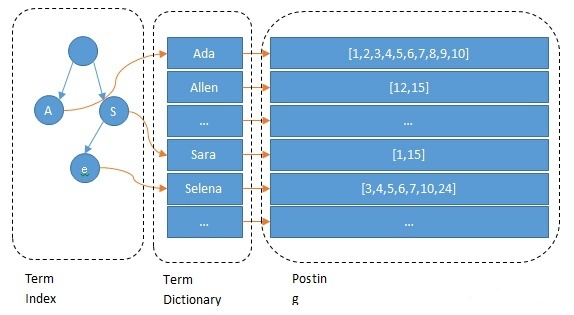
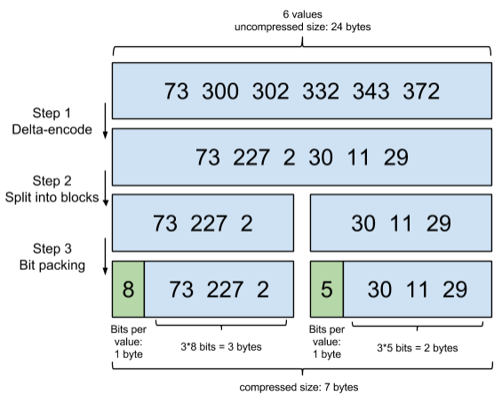
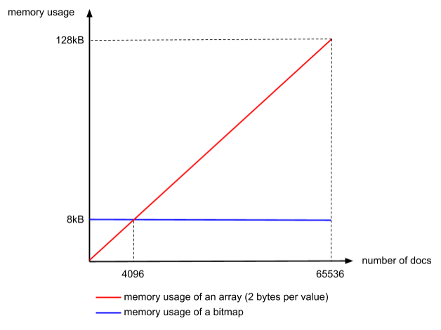

**Inverted Index**，反向索引，又名倒排索引，用于实现全文搜索。在本文中，我们会深入介绍ES的反向索引机制。

索引数据流程: 在数据进入ES 中时，我们会对数据进行分词，将其划分出多个**Terms**，然后建立 Terms 到 Document ID 的映射，然后将 Terms加入了**字典树Term index**中。

查询数据: 先从字典树 Term index 中找到对应 terms，从而获取对应的 document id，最后获取真实的数据。

> Term Index -> Term Dictionary -> IDs (Posting List)->Docs

<!--more-->

# 入门倒排索引

## Mysql的模糊查询

举个例子: 在外卖软件上搜索鸡排饭，给我找出附近几KM内的所有售卖鸡排饭的商家，如果没有，则展示高度相关联的店家如盖浇饭和鸡排等。

本文主要目标在倒排搜索，涉及空间区域查找则略过，在 Mysql中我们对附近商家的商品记录中的商品名称进行查找，我们需要使用模糊查询来匹配任一存在'鸡排饭'字符串的记录，而**前置模糊查询的存在使得查询无法利用索引，必须走全表查询。**这无疑极大的影响了查询性能。

而且我们更需要对'鸡排','饭'等关键词进行二次查询，来满足不存在'鸡排饭'的场景。相当的冗余，对于全文查找的场景，传统的索引场景并不适合。

```sql
select * from goods where goods_name like '%鸡排饭%'
```

## ES中的全文查询(基于倒排索引)

还是上面的'鸡排饭'场景，ES会怎么做呢？

首先在使用了`Full-text queries`的场景下，首先会根据预设的分词器将输入分词为多个 `terms`(中文分词器默认不支持，这个场景中可以自定义餐饮分词器)。分词后，我们得到了'鸡排'，'饭'，'鸡排饭'这三个分词，对其在 `terms index`(内存查找)中进行查询获取到对应 terms在 terms dictionary 中的位置，经过一次磁盘IO，获取到 terms 对 documents id 的映射，接下来就是正常索引的查找过程了。

对于查找出的所有数据集，根据所匹配的分词内容进行打分计算，然后根据评分的高低进行降序排序，展示给用户。

> 查找过程: Terms Index -> Terms dictionary -> Documents Id -> Documents

## ES vs Mysql

很显然在这个例子中，Mysql的**全表查询**和 ES的高效**反向索引查询**在查询的速度上有了巨大的差距。其实不仅仅是查询性能的差距，更多的在于ES所能对复杂的联合查询，自定义的分词器，自定义的打分算法所能实现的高度客制化的查询需求和能力上，更是 Mysql普通索引所远不能及的。

> Mysql也有全文查找索引，这里以Mysql普通索引为例，只是想比较普通索引和反向索引的区别。

初步了解了反向索引后，我们继续深入 ES 的反向索引实现。


------


# 实践：ES中的反向索引实现



## Term Index & Term Dictionary

**查询流程:** Term  Index 是一棵字典树，**存储了terms的前缀**，通过前缀匹配找到对应前缀在 Term Dictionary中的块，将整个块加载到内存中，对其进行**二分查找**，找到对应的term，再找到对应的 Posting List(IDs)。

**Term Index优化:** 通过只存储前缀和 Lucene的 FST(Finite State Transducers)机制进一步对Term Index进行压缩，使得方便将其维持在内存中，以提高查询效率。

**Term Dictionary优化:** Term Dictionary将相同前缀Term组成一个块进行存储且省去了公有前缀，进一步减少了磁盘占用。

**总结：**与 Mysql B+Tree 相比，只需要一次内存IO(Term Index)，一次磁盘IO(Term Dictionary)，就获取了 Posting List. Mysql 则需要多次磁盘IO(B+Tree)才能获取到对应 Term的数据，在存储介质的读取上，取得极大的优势。

## Posting List

对于一些低区分度的，高频率的Term而言，比如性别，它所对应的 documents ids数量是非常庞大的，可以百万千万级别。而在联合查询中我们又需要对所有Terms的 posting list 进行高效的交并集查询和计算，因此原生的 Posting List出现了两个痛点：

- **如何压缩以节省磁盘空间**:Frame Of Reference
- **如何快速求交并集（intersections and unions）**: Roaring bitmaps

### **Frame Of Reference**

首先我们在**更新Posting List是有序的**，这是为了后续方便求多个 Posting List 的交并集，有序性也带来了一个好的副作用，**增量编码(delta-encoding)**，举个例子，如果原先的 Posting list为`[73, 300, 302, 332, 343, 372]`在增量编码后就变成了 `[73, 227, 2, 30, 11, 29]`，原来列表中的最大值为372，现在变成了227，一个字节就能存储。

Lucene又将 Posting List 分为最大为256个元素的块进行存储，将每一个块通过增量编码(delta-encoding)和 **Bit Packing**进行压缩，然后更新当前块的单个元素所需的 bits长度到块头中，最后以新的最小 bits重写块。

**Bit packing:** Lucene计算出存储每一个块中最大的元素的值所需要的位，比如上面例子中，在分块后(实际是256个元素的块，为展示我们以三个元素进行分块)变成了`[73, 227, 2]`,`30, 11, 29]`，对于第二块言，最大值仅仅为30，只需要5个 bits 就能存储，因此我们将5bits 作为该块数据读取的步长，记录在块头中。

最后我们总结下：

1. **Delta-encode —— 增量编码**：只记录Posting List(有序)中各元素的增量
2. **Split into blocks —— 分割成块**：将 Posting List 分割成每个最大256元素的小块，分块是为了降低各块的步长，以最小的成本存储数据。
3. **Bit packing —— 按需分配空间**：在块头上记录最小的步长，读取时以该步长读取数据。

以上三个步骤，共同组成了一项编码技术，Frame Of Reference(FOR)，看到这里，我也不由的感叹 ，对于一个底层的存储引擎而言，对存储大小的极致压缩，真的是不留余力。



### **Roaring bitmaps**

接着来聊聊 Posting List 的第二个痛点 —— 如何快速求交并集（intersections and unions）。

在真实的场景中，我们会创建复杂的多条件查询（比如 boolean query），lucene收到请求后，会从 Frame Of Reference 压缩的数据中，还原出可读的 posting list，再将其根据原先的逻辑进行交并集查询，这里就需要一个能高速查询交并集的方式，而且 lucene会缓存高频率的 filter query，将其对应 posting list 直接存储在内存中，方便下次查询直接返回，因此我们对 posting list的存储方式也提出了一定的要求。

> Note: ES的单个 shard中将数据存储在多个segments中，每个shard就是一个 lucene index，因此即使没有多条件查询， Lucene 也需要频繁求并集，因为数据本身就是分片存储的。

#### **Option 1: Integer 数组**

最简单的方式了，直接遍历多个数组来求交集，但是空间上是极其的不友好，让我们简单计算一下，ES是Java 应用，一个int需要占用4个 bytes，假设一个segment中有100M个文档，那就是 400 MB的空间占用。毫无疑问，对于大数据量的集合，我们需要更高效的方式。

#### **Option 2: Bitmap**

大数据量的Integers 天生就适合 **bitmap** 进行存储，同样100M个文档，我们只需要12.5MB 来存储，很明显在大数据量存储时，极大减少了空间占用，但是对于数据量较小的情况，bitmap需要固定的大小的空间来存储，并不适合，

> Bitmap: 以 bit 进行操作的数据结构，在存储 integer时，将对应数字位数的 bit 置为1，表示该数字存在。比如01000000则表示7存在。

#### **Option 3: Roaring Bitmaps**

Roaring bitmaps则是为了同时利用以上两种方式在不同数据量下的优势而设计的机制，它的机制如下：

首先还是分块机制，将posting list 中的 documents id根据高16位分块，这样就分出了65536个块，每个块最多有65536个元素，比如第一个块只有0-65535的值，第二块只有65536-131071的值，以此类推。分块完成后，根据各个块中数据量不同，选用不同的策略，如果元素个数少于4096个，则使用 integer array，否则使用 bitmap。

> Note: 由于分块了，单个块中只有16位，因此我们将 integer的值也同步使用了2个字节来存储.


至于为什么选择4096作为不同策略切换的阈值呢，很简单，integer数组单个元素2Bytes，4096个元素则是8kb。Bitmap 存储65536则需要65536个 bits，即8kb。




# Reference

[Frame of Reference and Roaring Bitmaps](https://www.elastic.co/cn/blog/frame-of-reference-and-roaring-bitmaps)

[聊聊 Elasticsearch 的倒排索引 Author:柳树](https://zhuanlan.zhihu.com/p/76485252)