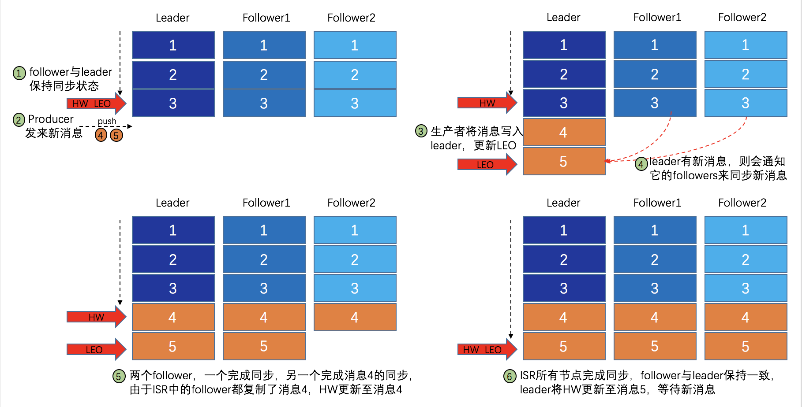
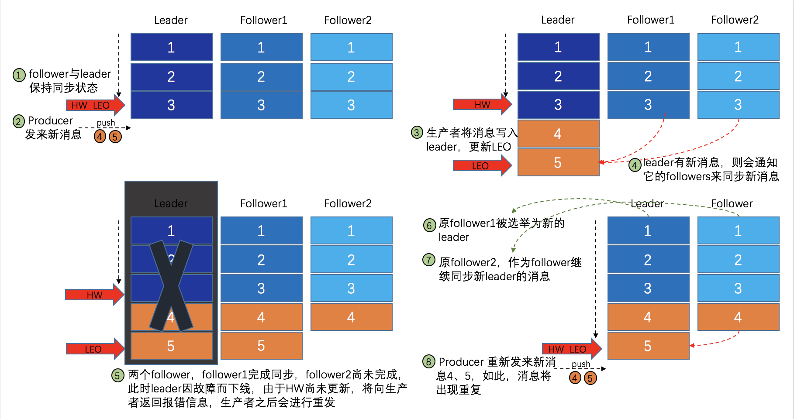

 转载自[再谈基于 Kafka 和 ZooKeeper 的分布式消息队列原理](https://gitbook.cn/books/5bc446269a9adf54c7ccb8bc/index.html)


<!--more-->

## 背景知识


* **HW(HighWatermakr)**: ISR 中的所有 Partition 中最小的 LEO 值为 HW，标识消费者能够消费的最大 Offset 的值
* **LEO(LogEndOffset)**: 所有消息中最大 Offset, 介于 （HW,LEO]之间的数据尚未完成主从同步，不可访问
* **ISR(In-Sync Replication):** 一个 Partition 的中所有能够正常通信的 Partitions组成 ISR
* AR(Assigned Replication): 所有 partition的合集称为 AR。ISR 是 AR 的一个子集。


## 数据副本机制


Replicaiton_factor 表示一个 partition 总共有多少个副本分片（Leader 和 Follower 都是一个副本分片）。上图中复制因子的值就是3，一个 Leader 和两个 Follower.

多副本机制提供了**自动故障转移**的能力，在复制因子为3的场景中，即便同时出现2个 Broker 宕机，依然不影响整体集群工作。

在所有副本分片中，选举出一个为 Leader，其他的则为 Follower.

* **leader 负责处理 partition 的所有读写请求**
* **follower 则负责被动地去复制 leader 上的数据**

**设置合适的 Replication_factore 的值：**

多副本机制提高了产品的可用性，但是同时了对 Kafka 的吞吐率产生了一定的影响。默认情况下 Kafka 的 replica 数量为 1，即每个 partition 都只有唯一的 leader，无 follower，没有容灾能力。为了确保消息的可靠性，生产环境中，通常将其值（由 broker 的参数 offsets.topic.replication.factor 指定）大小设置为大于 1，比如 3。

## ISR 机制实现 Partition HW 同步

Leader 维护 ISR 列表，follower 从 leader 同步数据有一些延迟（由参数 replica.lag.time.max.ms 设置超时阈值），超过阈值的 follower 将被剔除出 ISR， 存入 OSR（Outof-Sync Replicas）列表，新加入的 follower 也会先存放在 OSR 中。AR=ISR+OSR。

```
注：ISR中包括：leader + 与leader保持同步的followers。
```

每个 replica 都有 HW，leader 和 follower 各自负责更新自己的 HW 的状态。对于 leader 新写入的消息，consumer 不能立刻消费，leader 会等待该消息被所有 ISR 中的 replicas 同步后更新 HW，此时消息才能被 consumer 消费。这样就保证了如果 leader 所在的 broker 失效，该消息仍然可以从新选举的 leader 中获取。对于来自内部 broker 的读取请求，没有 HW 的限制。

下图详细的说明了当 producer 生产消息至 broker 后，ISR 以及 HW 和 LEO 的流转过程：




由此可见，Kafka 的复制机制既不是完全的同步复制，也不是单纯的异步复制。事实上，同步复制要求所有能工作的 follower 都复制完，这条消息才会被 commit，这种复制方式受限于复制最慢的 follower，会极大的影响吞吐率。而异步复制方式下，follower 异步的从 leader 复制数据，数据只要被 leader 写入 log 就被认为已经 commit，这种情况下如果 follower 都还没有复制完，落后于 leader 时，突然 leader 宕机，则会丢失数据，降低可靠性。而 Kafka 使用 ISR 的策略则在可靠性和吞吐率方面取得了较好的平衡。

Kafka 的 ISR 的管理最终都会反馈到 ZooKeeper 节点上，具体位置为：

```
/brokers/topics/[topic]/partitions/[partition]/state
```

目前，有两个地方会对这个 ZooKeeper 的节点进行维护。

1. Controller 来维护：Kafka 集群中的其中一个 Broker 会被选举为 Controller，主要负责 Partition 管理和副本状态管理，也会执行类似于重分配 partition 之类的管理任务。在符合某些特定条件下，Controller 下的 LeaderSelector 会选举新的 leader，ISR 和新的 `leader_epoch` 及 `controller_epoch` 写入 ZooKeeper 的相关节点中。同时发起 LeaderAndIsrRequest 通知所有的 replicas。
2. leader 来维护：leader 有单独的线程定期检测 ISR 中 follower 是否脱离 ISR，如果发现 ISR 变化，则会将新的 ISR 的信息返回到 ZooKeeper 的相关节点中。


## 数据可靠性和持久性保证

当 producer 向 leader 发送数据时，可以通过 request.required.acks 参数来设置数据可靠性的级别：

**1. request.required.acks = 1**

默认情况，即：producer 发送数据到 leader，leader 写本地日志成功，返回客户端成功；此时 ISR 中的其它副本还没有来得及拉取该消息，如果此时 leader 宕机了，那么此次发送的消息就会丢失。

**2. request.required.acks = 0**

producer 不停向leader发送数据，而不需要 leader 反馈成功消息，这种情况下数据传输效率最高，但是数据可靠性确是最低的。可能在发送过程中丢失数据，可能在 leader 宕机时丢失数据。

**3. request.required.acks = -1（all）**

producer 发送数据给 leader，leader 收到数据后要等到 ISR 列表中的所有副本都同步数据完成后（强一致性），才向生产者返回成功消息，如果一直收不到成功消息，则认为发送数据失败会自动重发数据。这是可靠性最高的方案，当然，性能也会受到一定影响。

**注意：参数 min.insync.replicas **

如果要提高数据的可靠性，在设置 request.required.acks=-1 的同时，还需参数 min.insync.replicas 配合，如此才能发挥最大的功效。min.insync.replicas 这个参数用于设定 ISR 中的最小副本数，默认值为1，当且仅当 request.required.acks 参数设置为-1时，此参数才生效。当 ISR 中的副本数少于 min.insync.replicas 配置的数量时，客户端会返回异常：`org.apache.kafka.common.errors.NotEnoughReplicasExceptoin: Messages are rejected since there are fewer in-sync replicas than required`。不难理解，如果 min.insync.replicas 设置为 2，当 ISR 中实际副本数为 1 时（只有leader），将无法保证可靠性，此时拒绝客户端的写请求以防止消息丢失。


## 深入理解 HW 机制




在上图中好像出现了 序号4的数据在 Follower Partition 上重复出现的场景，事实上并不会。

Follower 从 Leader 同步数据时，会从自身HW 位置开始同步，不会同步冗余数据。当原先的 Leader Partition回来后，它首先将自己的 log 文件截断到上次 checkpointed 时刻的 HW 的位置，之后再从 leader 中同步消息。

> 当 ISR 中的个副本的 LEO 不一致时，如果此时 leader 挂掉，选举新的 leader 时并不是按照 LEO 的高低进行选举，而是按照 ISR 中的顺序选举。


## Leader 选举策略

> 总结： 只有 ISR 中的 Partition 才能被选举成 Leader, 不使用多数派机制，只要有一个 Follower 存在就可以被选举为 Leader。当所有的 Follower 都失败时，默认会选举第一个恢复的 Partition作为新的 Leader partition。
>
> 在选举时不会参考各Partition中 LEO 和 HW 的位置。

Kafka 在 ZooKeeper 中为每一个 partition 动态的维护了一个 ISR，这个 ISR 里的所有 replica 都与 leader 保持同步，只有 ISR 里的成员才能有被选为 leader 的可能（通过参数配置：`unclean.leader.election.enable=false`）。

在这种模式下，对于 f+1 个副本，一个 Kafka topic 能在保证不丢失已经 commit 消息的前提下容忍 f 个副本的失败，在大多数使用场景下，这种模式是十分有利的。事实上，对于任意一条消息，只有它被 ISR 中的所有 follower 都从 leader 复制过去才会被认为已提交，并返回信息给 producer，从而保证可靠性。但与 “少数服从多数” 策略不同的是，Kafka ISR 列表中副本的数量不需要超过副本总数的一半，即不需要满足 “多数派” 原则，通常，ISR 列表副本数大于等于 2 即可，如此，便在可靠性和吞吐量方面取得平衡。

**当所有 Partition 都失败时如何恢复**

当 ISR 中至少有一个 follower 时（ISR 包括 leader），Kafka 可以确保已经 commit 的消息不丢失，但如果某一个 partition 的所有 replica 都挂了，自然就无法保证数据不丢失了。这种情况下如何进行 leader 选举呢？通常有两种方案：

1. 等待 ISR 中任意一个 replica 恢复过来，并且选它作为 leader；
2. 选择第一个恢复过来的 replica（并不一定是在 ISR 中）作为leader。

如何选择呢？这就需要在可用性和一致性当中作出抉择。如果一定要等待 ISR 中的 replica 恢复过来，不可用的时间就可能会相对较长。而且如果 ISR 中所有的 replica 都无法恢复了，或者数据丢失了，这个 partition 将永远不可用。

选择第一个恢复过来的 replica 作为 leader，如果这个 replica 不是 ISR 中的 replica，那么，它可能并不具备所有已经 commit 的消息，从而造成消息丢失。默认情况下，Kafka 采用第二种策略，即 `unclean.leader.election.enable=true`，也可以将此参数设置为 false 来启用第一种策略。

`unclean.leader.election.enable` 这个参数对于 leader 的选举、系统的可用性以及数据的可靠性都有至关重要的影响。生产环境中应慎重权衡。

## Reference

[再谈基于 Kafka 和 ZooKeeper 的分布式消息队列原理](https://gitbook.cn/books/5bc446269a9adf54c7ccb8bc/index.html)

