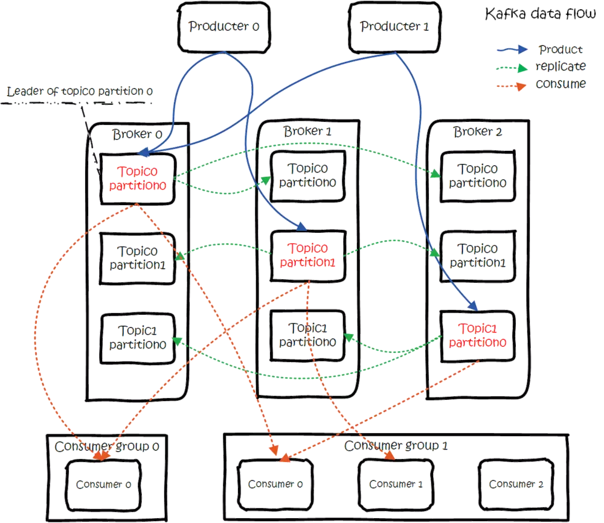

> Kafka 的扫盲篇，了解其基本模型架构和名字概念。
>
> 这篇文章讲的特别细节且深入，直接看这篇就可以[再谈基于 Kafka 和 ZooKeeper 的分布式消息队列原理](https://gitbook.cn/books/5bc446269a9adf54c7ccb8bc/index.html)

<!--more-->

## Kafka的优点

Kafka用于构造实时数据管道和流处理APP，它拥有**高性能，数据持久化，容错性，横向扩展**等特性。

* **解耦和拓展性**：消息中间件都具有解耦的特性。原本耦合的服务之间，繁杂的相互调用，可以通过消息中间件来实现生产消息，消费消息。服务之间的关系，清晰明了。服务之间，遵循共同的topic，内部实现逻辑可以自由更改。
* **容错性**：当Kafka集群中，部分服务宕机，在存在N个备份情况下，支持N-1的服务容错。当然zk不能挂，我们也需要一个ZK集群，避免服务正常，zk挂了的现象。
* **削峰：**当上游服务接受到大量请求时，可以直接推入Kafka中，慢慢消费。避免了下游服务，因为过高流量宕机。
* **顺序保障**：Kakfa是Pub/Sub Group模型，支持每个partition内消息有序。
* **数据持久化**：Kafka会保存已消费的数据一段时间，一定程度上避免数据丢失的现象。Kafka的记录是直接append到文件中去的，效率高。

在Kafka中，Client和Server之间是以简单，高效，语言无关的TCP协议进行沟通的，支持多种语言。

------

## 基础概念总览

* **Topic :** 消息类别，根据 topic 来分类消息
* **Partition** ：一个topic可以有1-N个分区，每个分区存储topic的不同记录，通过划分分区，减少一台服务器的访问压力。可以通过增加分区，分散压力，实现**横向扩展**。
* **Producer  /  Consumer**
* **Broker** ：kafka 服务器，负责消息的存储和转发。
* **Record** ：每一条记录，**Key，Value**和**Timestamp**组成。只有value是必填的。
* **Consumer Group**: 消费者分组，每个 consumer 必须属于一个分组，分组共享 offset
* **ZK:** Kafka 需要 ZK 来做一致性选举且保存broker, topic, partition 等 meta 数据。

有了基础概念的铺垫，我们可以看懂这幅图片。描述了Kafka的data flow。

1. 首先，图中存在3个Broker，也就是3个Kafka实例。
2. 存在两个Topic，Topic0跟Topic1。Topic0具有两个分区，因此只有两个Broker中的分区会被使用。另外一个Broker的数据，相当于backup。此时，如果Broker0,1接连宕机，也有Broker2来顶替。
3. Pub/Sub Group模型：每一个Partition都会被所有订阅的Counsumer Group消费，只有Consumer Group中的一个会消费该数据。

------

## Topic And Logs

对于每一个Topic，Kafka集群维持了一个如下所示的分区日志。一个 Topic被划分为多个分区。

**每个分区**都是一串**有序的**（Kafka提供的分区 记录有序性），不可变的记录队列，不断附加到结构化提交日志中（append到文件中，效率高）。分区中的每一个记录都有一个**Offset**，偏移量作为UUID，来保证每条记录主键不同。

Kafka集群通过使用**可配置的保存时长**，持久化保存所有数据，无论他们是否被消费。举例而言，当配置了数据保存时长为2天时，当发布记录后的两天后，这条记录将会被丢弃，来释放内存空间。

**Cousumer获取Topic中的数据是通过Offset**。实际上消费者所持有的仅有的元数据就是这个偏移量，也就是消费者在这个log中的位置。 这个偏移量由消费者控制：正常情况当消费者消费消息的时候，偏移量也线性的的增加。但是实际偏移量由消费者控制，消费者可以将偏移量重置为更老的一个偏移量，重新读取消息。 可以看到这种设计对消费者来说操作自如， 一个消费者的操作不会影响其它消费者对此log的处理。 

再说说分区。Kafka中采用分区的设计有几个目的。

1. 一个Topic的数据 ，分散到多个Broker中，负载均衡。通过增加partition，来提高集群性能。
2. 分区可以作为并行处理的单元，稍后会谈到这一点。

------

## 分布式 | Distribution

Topic的分区被分布到集群中的多个服务器上。每个服务器处理它分到的分区。 根据配置每个分区还可以复制到其它服务器作为备份容错。 

每个**分区**有一个leader，零或多个follower。（Tips：partition leader）

Leader处理此分区的所有的读写请求，而follower被动的复制数据。如果leader宕机，其它的一个follower会被推举为新的leader。 一台服务器可能同时是一个分区的leader，另一个分区的follower。 这样可以实现负载均衡，避免所有的请求都只让一台或者某几台服务器处理。

------

## 生产者(Producers)

生产者往某个Topic发布数据时。生产者有责任选择这条记录发布到该Topic的任意分区。这可以通过`round-robin`来简单轮询分区列表，也可以对某些具体的Key设置权重，来选择分区。

步骤流程：

1. 创建一条记录，Topic+Value（必填），Key+Partition(可选)，并将记录序列化，
2. 判断所属分区：如果没有key，则使用Round-Robin来选择分区。如果有Key，则Hash(Key)，选择分区。
3. 根据分区，放到对应分区发送队列中，等到（数量达标||等待一定时间 ）进行**批量发送**。

------

## 消费者(Consumers) | Pub/Sub Group

通常而言，消息模型可以分为Queue和Pub-Sub模式。

* **Queue**：一组消费者从消息队列中获取消息，一条消息只能被一个消费者获取。
* **Pub-Sub**：一条消息被推送后，所有订阅该类消息的消费者都会获取该消息。

Kafka提出了Consumers Group的概念。一个Consumer Group包含多个Consumer Instance，一个发布在Topic上的消息被分发给此消费者组中的一个消费者。当所有Consumer Instance在一个组中，这就是Queue。当每一个Cousumer自己一个组时，这就是Pub-Sub模型。之所以提出Cousumer Group的概念，有两个优点：

* **Fault-tolerance** ：当一组内，部分机器挂掉时，不影响整体服务。
* **Scalability**：良好的伸缩性，有利于性能拓展

> 可以简单的理解为，Kafka的模式Pub-Group Sub，每组订阅Topic。

一个Topic具有多个分区的时候，记录被分别送往不同的分区，在某个分区内，消费者在消费记录时是有序消费的。但是总体而言，各个分区的记录消费顺序不一定有序。如果我们想实现记录被按序消费，那么就只能设置一个分区。

## 相关资源文档

[Kafka官方文档](https://kafka.apache.org/intro)

[半兽人的Kafka Blog](http://orchome.com/5)

[Kafka CSDN](https://blog.csdn.net/lizhitao/article/details/39499283)

[震惊了！原来这才是kafka！](https://www.jianshu.com/p/d3e963ff8b70)

