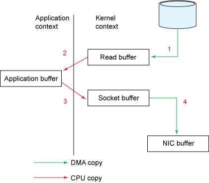
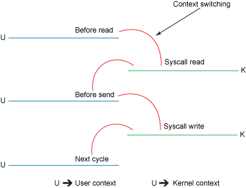
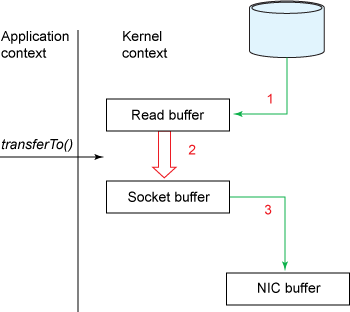
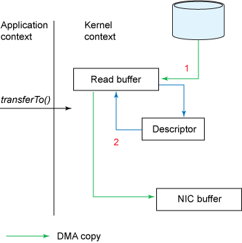
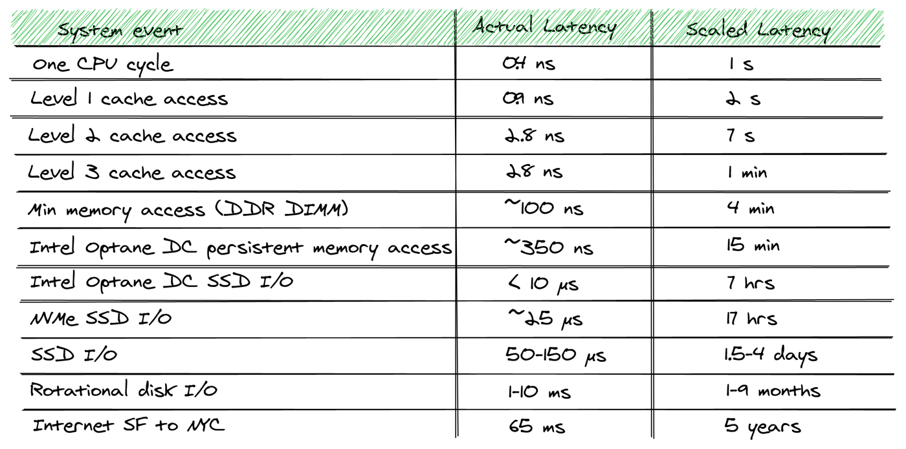

在提起 Kafka 的时候，我们都会说 Kafka 很快，那快是一个抽象的形容词，对于快的定义是多方面的，吞吐量，延迟，抖动等等都是形容和描述快的指标。这也受限于，人们对于一个产品的使用期望。

**Apache Kafka 以抖动和延迟为代价，针对吞吐量进行了优化。**同时具备了耐用性，严格的记录顺序和**最少一次的**传递语义。

因此人们说 Kafka 很快，指的是 Kafka 在短时间内能安全地积累和分发大量消息的能力。

> 从历史上说，Kafka 诞生之初是 LinkedInd的需求，即有效地传输大量消息地能力，每小时的数据总量达到数TB。单个消息传播延迟被认为是次要的。毕竟，LinkedIn不是从事高频交易的金融机构，也不是在确定的期限内运行的工业控制系统。 Kafka可用于实现近实时（也称为软实时）系统。
>
> Real-Time 实时系统是什么意思：每一个操作，每一个请求都能在指定的时间内完成并返回，也就是我们常说的 Deadline，那么这个系统就是实时系统。
>
> Near-Real-Time 近实时系统：系统能在一定范围地时间内给予返回，那就是NRT。举例而言，ES 就是 NRT 搜索系统，在默认配置下， 新插入的数据能在一秒钟后被搜索到。
>
> 通常而言，NRT系统吞吐量远大于 RT 系统。

<!--more-->

## 写在前面的总结

1. 从 CS 架构的角度而言，Kafka Client 提前做了很多工作，如数据压缩，寻找正确的 Broker 发送请求，减少了 Server 转发请求的压力。
2. 所有的消息都被**压缩**，极大的提高了网络的利用率，kafka broker 不解压数据，数据最终会被 Consumer 解压。
3. Cilent 选择**批量发送**数据，从而摊薄请求头所占总网络带宽的比例，进一步提高了传输效率，但是也带来了一定量的延迟。
4. 在存储方面，Kafka 使用**顺序写文件**的方式持久化数据，顺序写效率是随机写效率的3-4倍。
5. **PageCache** 的引入，为数据的查询和插入提供了**预读和后写**的优化，给予了近乎内存操作的性能。
6. 在数据读取方面，kafka 引入了 **Zero-Copy**,极大的**减少了上下文切换所带来的资源损耗。**

## 基于顺序写的数据持久化

Kafka将 Partition 中的数据拆分为多个 `Segments` 进行**分段存储**，每个 Segment 就是一个文件。**对文件的存储基本可以称之为顺序写**。由于机械硬盘的物理构造，**顺序写的效率数倍于随机写**。

### **对文件的读写是顺序的吗**

```shell
-bash-4.1$ filefrag -v websocket.log.4

Filesystem type is: ef53
File size of websocket.log.4 is 52105959 (12722 blocks, blocksize 4096)
 ext logical physical expected length flags
   0       0 15951872            4096
   1    4096 64972800 15955968   2048
   2    6144 65099776 64974848   2048
   3    8192 65116160 65101824   2048
   4   10240 65314816 65118208   2048
   5   12288 65307136 65316864    434 eof
```

答案是肯定的，通过`filefrag`命令我们可以看出，一个文件是由许多ext组成，ext是[extent](https://en.wikipedia.org/wiki/Extent_(file_systems))的缩写，在操作系统中它表示一系列Block的合集，每个文件都是由extents组成。对 extent 的读写顺序的。

那么基本可以说一个对一个大的文件进行读写基本是顺序的。

### **顺序IO VS 随机 IO**

人们普遍认为磁盘速度很慢，但是其实这取决于**对数据的访问模式**。顺序 I/O 省去了磁盘寻道的时间，极大的提高了效率。与随机I / O相比，典型的7,200 RPM SATA磁盘上的顺序I / O的性能要**快三到四个数量级**

### **Page Cache 页缓存**

引入Cache层提高了Linux操作系统对磁盘访问的性能。Cache层在内存中**缓存了磁盘上的部分数据**。当数据的请求到达时，如果在Cache中存在该数据且是最新的，则直接将数据传递给用户程序，免除了对底层磁盘的操作，提高了性能。

磁盘Cache有两大功能：**预读和回写**。

**预读**其实就是利用了**局部性原理**，具体过程是：对于每个文件的第一个读请求，系统读入所请求的页面并读入紧随其后的少数几个页面（通常是三个页面），这时的预读称为同步预读。对于第二次读请求，如果所读页面不在Cache中，即不在前次预读的页中，则表明文件访问不是顺序访问，系统继续采用同步预读；如果所读页面在Cache中，则表明前次预读命中，操作系统把预读页的大小扩大一倍，此时预读过程是异步的，应用程序可以不等预读完成即可返回，只要后台慢慢读页面即可，这时的预读称为异步预读。任何接下来的读请求都会处于两种情况之一：第一种情况是所请求的页面处于预读的页面中，这时继续进行异步预读；第二种情况是所请求的页面处于预读页面之外，这时系统就要进行同步预读。

**回写**是通过暂时将数据存在Cache里，然后**统一异步写到磁盘中**。通过这种异步的数据I/O模式解决了程序中的计算速度和数据存储速度不匹配的鸿沟，减少了访问底层存储介质的次数，使存储系统的性能大大提高。Linux 2.6.32内核之前，采用pdflush机制来将脏页真正写到磁盘中，什么时候开始回写呢？下面两种情况下，脏页会被写回到磁盘：

1. 在空闲内存低于一个特定的阈值时，内核必须将脏页写回磁盘，以便释放内存。
2. 当脏页在内存中驻留超过一定的阈值时，内核必须将超时的脏页写会磁盘，以确保脏页不会无限期地驻留在内存中。

回写开始后，pdflush会持续写数据，直到满足以下两个条件：

1. 已经有指定的最小数目的页被写回到磁盘。
2. 空闲内存页已经回升，超过了阈值。

Linux 2.6.32内核之后，放弃了原有的pdflush机制，改成了bdi_writeback机制。bdi_writeback机制主要解决了原有fdflush机制存在的一个问题：在多磁盘的系统中，pdflush管理了所有磁盘的Cache，从而导致一定程度的I/O瓶颈。bdi_writeback机制为每个磁盘都创建了一个线程，专门负责这个磁盘的Page Cache的刷新工作，从而实现了每个磁盘的数据刷新在线程级的分离，提高了I/O性能。

**回写机制存在的问题是回写不及时引发数据丢失（可由sync|fsync解决**），回写期间读I/O性能很差。


## Zero-Copy

Kafka通过使用**Java的NIO**框架（特别是`java.nio.channels.FileChannel的transferTo()`方法）在Linux和UNIX系统上解决了此问题。 此方法允许将字节从源通道传输到目标通道，而无需将应用程序作为传输中介。 要了解NIO的不同，请先知道传统的数据拷贝过程，数据从源通道读取到字节缓冲区，然后作为两个单独的操作写入到接收器通道：

### 普通的Copy 流程

```java
// 这两行代码，会从文件中读取数据到内存，然后再将数据发往 Socket
File.read(fileDesc, buf, len);
Socket.send(socket, buf, len);
```





上图分别展示了代码背后实际的数据拷贝的过程和四次上下文切换的时间，从中我们可以看到，复制操作总共发生了四次数据拷贝，也产生了四次上下文切换（内核态和用户态之间的切换）。

让我们具体来看下这四次上下文切换:

1. read()操作需要从用户模式切换到内核模式来读取文件，然后将其内容通过DMA（直接内存访问）引擎复制到内核地址空间中的缓冲区中。 
2. 然后数据将从**内核缓冲区**复制到**用户空间**缓冲区中，read()操作返回。 此时，我们的应用程序可以读取文件的内容。
3. 随后的send()将切换回内核模式，将用户空间缓冲区复制到内核地址空间中与**目标套接字关联的另一个缓冲区**。 在幕后，DMA引擎接管了工作，将数据从内核缓冲区异步复制到协议堆栈。 
4. send()调用返回，切换回用户空间

正常来说这个流程是没有问题的，应用程序往往需要在用户态对数据进行修改。然而在 Kafka 中不涉及到数据改动，那么数据额外的拷贝就变成了冗余的操作。这里，我们就需要引入零拷贝来解决这个问题。 先前示例中的代码段可以重写为单行代码：

### Zero-Copy 流程

```java
// 从参数中可以看出，数据从磁盘直接到 socket
fileDesc.transferTo(offset, len, socket);
```



**在此模型下，数据拷贝的次数从四减少到三，上下文切换的数量减少到两个。**

具体而言，transferTo（）方法指示块设备通过DMA引擎将数据读取到读取缓冲区中。 然后，将该缓冲区复制到另一个内核缓冲区以暂存到套接字。 最后，套接字缓冲区通过DMA复制到NIC缓冲区。
这是一个很大的改进，但是还没有查询零副本。 后者可以在运行Linux内核2.4及更高版本以及支持收集操作的网络接口卡上作为进一步的优化来实现。 如下所示。



根据前面的示例，调用transferTo（）方法会使设备通过DMA引擎将数据读入内核读取缓冲区。 但是，使用聚集操作时，读取缓冲区和套接字缓冲区之间没有复制。 取而代之的是，**给NIC一个指向读取缓冲区的指针以及偏移量和长度**，该指针由DMA清除。 复制缓冲区决不涉及CPU。
对传统文件副本和零拷贝文件大小从几兆字节到千兆字节的比较，表明使用零拷贝的性能提高了2到3倍。 但是更令人印象深刻的是，Kafka使用了一个没有本地库或JNI代码的普通JVM来实现了这一目标。

## 记录批处理



在计算机中的众多 IO 中，网络 IO 其实是最慢的一部分。顺序 IO 的速度可以与网络I / O的最高性能相比。

实际应用中，kafka 的瓶颈往往不是磁盘而是网络。Kafka 通过**客户端/服务端批量发送记录**的方式，使用较大的数据包提高了带宽效率，摊薄了网络往返的开销。

网络请求由请求体和请求头组成，在网络 IO 达到峰值时，批处理减少了请求头，增加了请求体占总数据传输的比例，提高了网络 IO 的性能。

## 批量压缩

客户端将消息进行批量压缩，即利用了客户端的硬件资源，又对网络 IO 和服务端的磁盘 IO 产生了积极的影响。

Kafka 会使用一种共享二进制格式来存储数据，Broker 并不会对数据进行解压而是由消费者来解压数据。因此数据块在不同组件中端对端的流通，并不会涉及消息内容的修改。


## Unflushed Buffer Write

Kafka 在执行写入请求时并没有调用 `fsync`,**ACK 的唯一要求就是数据写入I/O Buffer.** 这使得 Kafka 获得了近乎内存队列的速度，可以说 Kafka 是磁盘支持的内存队列。

这在带来效率的同时也带来了数据可能丢失的问题，Kafka 是通过运行多个同步副本来解决这个问题，即便一台 Kafka宕机未落盘的数据丢失，kafka仍然能从其他副本中获取数据。

**因此 Kafka 通过 Unflushed Buffer Write 和冗余的数据副本来达到可用性和持久性的一个结合。**


## 客户端优化

绝大多数的中间件产品都是简单的把客户端涉及成为一个简单的连接器，通过协议与服务器集群进行连接，作为业务代码和服务器之间的接口。
客户端会对记录上执行大量工作。包括对记录键进行哈希处理以得出正确的分区索引，对记录进行校验和以及对记录进行批量压缩。

客户端也知道集群元数据，并定期刷新此元数据以了解对Brokers Servers List的任何更改。这使客户端可以做出转发决定；生产者客户端不是将记录盲目地发送到集群，而是依靠后者将其转发到适当的Broker节点，而是将写操作直接转发给分区主服务器。

同样，消费者客户在采购记录时可以做出明智的决定，有可能使用在发出读取查询时在地理位置上更接近客户的副本。 （此功能是Kafka的更新功能，自2.4.0版开始可用。）


## Reference 

[Why Kafka Is so Fast](https://medium.com/swlh/why-kafka-is-so-fast-bde0d987cd03)

[磁盘I/O那些事](https://tech.meituan.com/2017/05/19/about-desk-io.html)