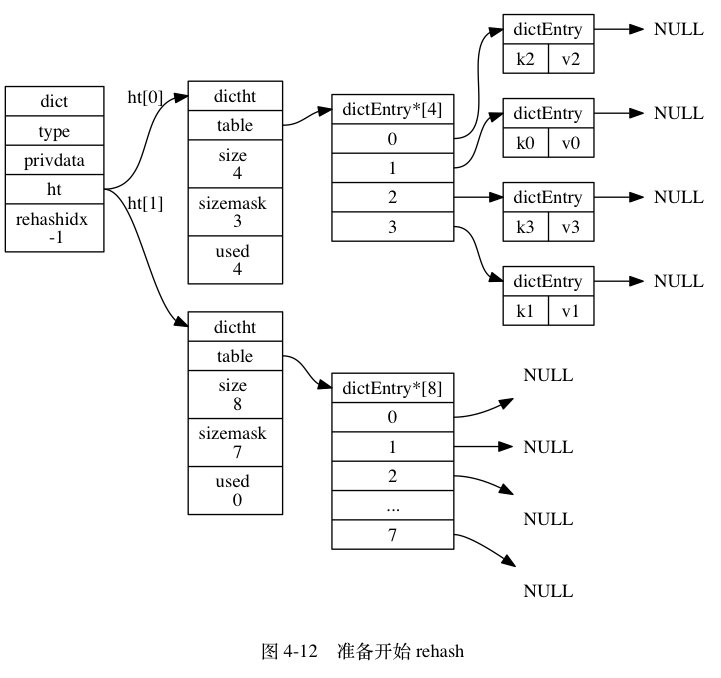
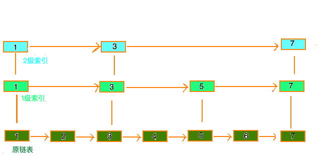
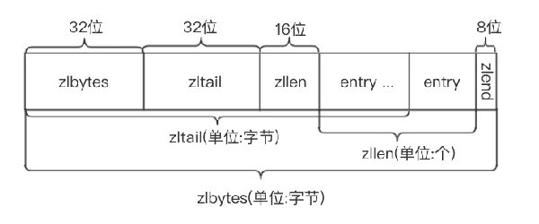
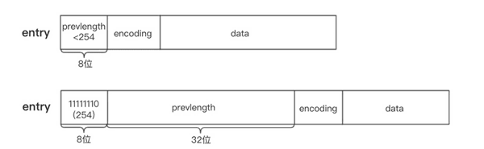

Redis 具备如下多种数据结构，对于不同的数据结构又有具体不同的底层实现，本文将具体深入到各个数据结构中，给予更深入的了解。

<!--more-->

# String 

Redis 是基于 C 语言开发的，C 语言在分配字符串和数组时成本较高，如果没有数据结构支撑，将会出现如下等问题：

1. 在String变长时，容易造成缓存区溢出
2. 在获取String 长度时，需要遍历，时间复杂度为O(n)
3. 在数组扩大缩小时，需要重新分配数组，因此可能造成内存泄露（即原内存空间未得到释放且失去指针，无法再访问）

因此Redis 在底层定义了 **SDS(Simple Dynamic String)**的数据结构来解决这些问题：

SDS 不仅仅在 String 中被使用，在其他数据结构中的 String 也是基于 SDS实现的。

```c
struct sdshdr{  
     //记录buf数组中已使用字节的数量  
     //等于 SDS 保存字符串的长度  
     int len;  
     //记录 buf 数组中未使用字节的数量  
     int free;  
     //字节数组，用于保存字符串  
     char buf[];  
} 
```

## 空间预分配策略

在字符串扩容之前，会为 free属性分配一个合适的参数，然后在扩容时，额外分配这部分 free 的空间给 buf[]。

那如何设定 free 的大小呢，

* 当字符串的长度**小于**1MB，**free 空间大小就等于字符长度**
* 当字符串的长度**大于**1MB，**free 空间大小固定为1MB**

优点：空间预分配策略通过牺牲一部分空间，降低了SDS 在扩容时内存重分配的频率。而内存重分配需要系统参与，是一个 heavy 的操作。

## 惰性空间释放

在字符串缩短时，不会立即释放额外的空间，从而避免内存重分配。


# List 

```c
typedef  struct listNode{  
       //前置节点  
       struct listNode *prev;  
       //后置节点  
       struct listNode *next;  
       //节点的值  
       void *value;    
}listNode 
  
typedef struct list{  
     //表头节点  
     listNode *head;  
     //表尾节点  
     listNode *tail;  
     //链表所包含的节点数量  
     unsigned long len;  
     //节点值复制函数  
     void (*free) (void *ptr);  
     //节点值释放函数  
     void (*free) (void *ptr);  
     //节点值对比函数  
     int (*match) (void *ptr,void *key);  
}list; 
```

List 为双向链表，与常规的双向链表不同，Redis 提供了一个管理 List 的数据结构，记录了链表的头尾指针和节点的数量。

* 双向链表
* 记录了头尾节点指针
* 记录了节点数量

# Hash



```c
typedef struct dict {  
    // 类型特定函数  
    dictType *type;  
    // 私有数据  
    void *privdata;  
    // 哈希表  
    dictht ht[2];  
    // rehash 索引  当 rehash 不在进行时，值为 -1  
    int rehashidx; /* rehashing not in progress if rehashidx == -1 */  
} dict; 

typedef struct dictht {  
    // 哈希表数组  
    dictEntry **table;  
    // 哈希表大小  
    unsigned long size;  
    // 哈希表大小掩码，用于计算索引, sizemask=size-1  
    unsigned long sizemask;  
    // 该哈希表已有节点的数量  
    unsigned long used;  
} dictht; 

typedef struct dictEntry {  
    void *key;  
    union {  
        void *val;  
        uint64_t u64;  
        int64_t s64;  
    } v;  
    // 指向下个哈希表节点，形成单链表  
    struct dictEntry *next;  
} dictEntry; 

```

Redis 使用拉链法来解决 Hash 冲突，没有使用红黑树优化，且链表为单链表


## 渐进式Rehash

在上图中和源码中，我们可以看到一个 `dict`结构中维护两个 hash 表，这就是为**渐进式 Rehash** 所准备的。

**为什么不直接 Rehash**: 为了避免当为一个巨大的 Hash 结构进行 Rehash 时，导致的暂时性CPU 繁忙，服务不可用的状况。

以下是哈希表渐进式 rehash 的详细步骤：

1. 为 `ht[1]` 分配空间， 让字典同时持有 `ht[0]` 和 `ht[1]` 两个哈希表。
2. 在字典中维持一个索引计数器变量 `rehashidx` ， 并将它的值设置为 `0` ， 表示 rehash 工作正式开始。
3. 在 rehash 进行期间， 每次对字典执行添加、删除、查找或者更新操作时， 程序除了执行指定的操作以外， 还会顺带将 `ht[0]` 哈希表在 `rehashidx` 索引上的所有键值对 rehash 到 `ht[1]` ， 当 rehash 工作完成之后， 程序将 `rehashidx` 属性的值增一。
4. 随着字典操作的不断执行， 最终在某个时间点上， `ht[0]` 的所有键值对都会被 rehash 至 `ht[1]` ， 这时程序将 `rehashidx` 属性的值设为 `-1` ， 表示 rehash 操作已完成。

**渐进式 Rehash 的优点**：才用了分而治之的思想，将 rehash 键值对所需的计算工作均滩到对字典的每个添加、删除、查找和更新操作上， 从而避免了集中式 rehash 而带来的庞大计算量。

> 在 Rehash 过程中，除了插入操作在新表上外，其他操作都会在两个表上执行，并在执行完后更新该值到新表中。
>
> 在 Rehash 过程中，如果Rehash 尚未完成，新表却已经满了，不会立即又一次扩容，而是等待上一次 Rehash 完成。
>
> Rehash 的触发除了 CRUD 操作外，也会主动根据 `rehashidx`的值来 Rehash。


# Intset

Reids对整数存储专门作了优化，intset就是redis用于保存整数值的集合数据结构。当一个结合中只包含整数元素，redis就会用这个来存储。

**升级策略**： 为了最大化利用内存空间，会尽量使用最小的 encoding，当更大的值进入时就会需要升级，重新扩容。

**降级策略：**不存在降级策略

```c
typedef struct intset {  
    // 编码方式  int16 int32 int64
    uint32_t encoding;  
    // 集合包含的元素数量  
    uint32_t length;  
    // 保存元素的数组  
    int8_t contents[];  
} intset; 
```


# SkipList



```c
typedef struct zskiplist {  
    // 表头节点和表尾节点  
    struct zskiplistNode *header, *tail;  
    // 表中节点的数量  
    unsigned long length;  
    // 表中层数最大的节点的层数  
    int level;  
} zskiplist; 

typedef struct zskiplistNode {  
    // 后退指针  
    struct zskiplistNode *backward;  
    // 分值  
    double score;  
    // 成员对象  
    robj *obj;  
    // 层  
    struct zskiplistLevel {  
        // 前进指针  
        struct zskiplistNode *forward;  
        // 跨度  
        unsigned int span;  
    } level[];  
} zskiplistNode; 
```

从跳表的结构中我们可以看到，存在头尾两种遍历方式。

**跳表与平衡二叉树之间的比较**

1.  从算法实现难度上来比较，skiplist比平衡树要简单得多。
2.  平衡树的插入和删除操作可能引发子树的调整，逻辑复杂，而skiplist的插入和删除只需要修改相邻节点的指针，操作简单又快速。
3.  查找单个key，skiplist和平衡树的时间复杂度都为O(log n)，大体相当。
4.  在做范围查找的时候，平衡树比skiplist操作要复杂。
5.  skiplist和各种平衡树（如AVL、红黑树等）的元素是有序排列的。


# ZipList

ziplist是redis为了节约内存而开发的顺序型数据结构。它被用在列表键和哈希键中。一般用于小数据存储。

```c
typedef struct entry {  
     /*前一个元素长度需要空间和前一个元素长度*/  
    unsigned int prevlengh;  
     /*元素内容编码*/  
    unsigned char encoding;  
     /*元素实际内容*/  
    unsigned char *data;  
}zlentry;  

typedef struct ziplist{  
     /*ziplist分配的内存大小*/  
     uint32_t zlbytes;  
     /*达到尾部的偏移量*/  
     uint32_t zltail;  
     /*存储元素实体个数*/  
     uint16_t zllen;  
     /*存储内容实体元素*/  
     unsigned char* entry[];  
     /*尾部标识*/  
     unsigned char zlend;  
}ziplist; 
```






## 如何访问元素

基于 ZipList 的ziptail 值获取到最后一个 ZipEntry 的地址，然后根据它的 prevlength 获取到前一个entry 的值，如此迭代。

这里存在一个 prevlength 大小的问题，

* 当前面的元素长度小于254时，prevlength 为1个字节
* 当前面的元素长度大于等于254时，prevlength 为4个字节


## 连锁更新

当往 ZipList 中插入或删除节点，都有可能导致后续 entry 的 prevlength 值的变化，从而引起后续所有节点的位置都需要重新分配，这就是连锁更新。


# Reference

[渐进式 rehash](http://redisbook.com/preview/dict/incremental_rehashing.html)

[ Hacking Strings](https://redis.io/topics/internals-sds)

[图解redis五种数据结构底层实现](https://i6448038.github.io/2019/12/01/redis-data-struct/)

[你看过Redis数据结构底层实现吗？](https://database.51cto.com/art/201906/598234.htm)

