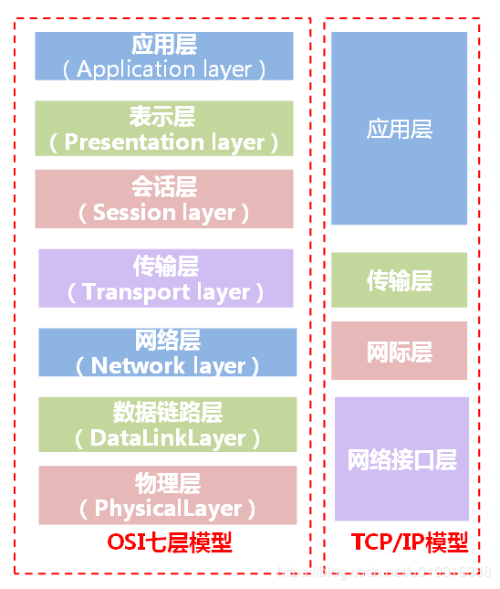

TLS和HTTPS协议为我们实现了节点之间的加密通信，这是通过证书Certification 实现的。

本文针对证书中出现的常见概念，进行解释。

<!--more-->

# TSL/HTTPS #



## TLS(SSL)

**TCP: Transport Layer Security**

SSL: Secure Sockets Layer

**TLS协议直接在TCP协议的基础上运行**，提供支持证书加密验证等功能。SSL则是TLS的前身，SSL在3.0版本后直接更名为TLS。目前SSL协议已经不被广泛支持，普遍使用TLS协议。

## **HTTPS**

全称: Hyper-text transport protocal secure

HTTP协议负责处理数据报文，数据则由TLS协议进行加解密处理，加密后的数据则由TCP协议负责传输。这就是计算机网络分层的优点，下层的细节对上层屏蔽，因此HTTPS加密传输时，对于应用程序而言相比于HTTP协议，应用程序感受不到区别。

# 证书 Certification

**证书标准 X.509**:  密码学中公钥证书的格式标准, TLS使用的就是这种证书标准, 详情可以参考RFC5280和[wikipedia](https://zh.wikipedia.org/wiki/X.509).

**定义**：由CA中心或其子机构签发的，存储相关信息，如有效期，有效域名，签发机构等重要信息的，可以通过RSA和Hash算法确认合法性的一种数据结构。具体可看[CA 验证原理](https://gitprod.statestr.com/E662491/blog/blob/master/Technology_Stack/https/Https%E5%8E%9F%E7%90%86.md#ca-%E9%AA%8C%E8%AF%81%E5%8E%9F%E7%90%86)

# 工作机制

TLS 和 HTTPS 本质相同，下文就以HTTPS为例，解释其工作原理。

[Https 原理](https://gitprod.statestr.com/E662491/blog/blob/master/Technology_Stack/https/Https%E5%8E%9F%E7%90%86.md#https-%E5%8E%9F%E7%90%86)

---


# 证书常见编码格式及其后缀名 #

证书有**PEM, DER两种格式**和由**JDK生成的JKS格式**，由于证书文件后缀名可任意修改，无法单纯的从后缀名得出证书编码格式。

### 如何识别编码格式

1. 直接查看证书，来判断是否为PEM格式。

   ~~~flow
   st=>;start: Start
   op0=>;operation: 查看你的证书(cat xxx)
   cond0=>;condition: 是否能直接查看证书
   cond1=>;condition: 是否由.jks .keystore .truststore 结尾
   
   e1=>;end: PEM格式
   e2=>;end: DER(P12)格式
   e3=>;end: JKS格式
   
   st->;op0->;cond0(yes)
   cond0(yes)->;e1
   cond0(no)->;cond1
   cond1(yes)->;e3
   cond1(no)->;e2
   
   ~~~

### 详情与命令

* **PEM**：通常由**openssl**生成，常见于***nix**系统，**后缀名任意**。通常命名为.cer, .key, .csr等来区分内容。

  * **特点**：直接查看证书，并符合以下格式，内容为BASE64编码则为PEM格式证书。

    ```
    -----BEGIN CERTIFICATE-----
    ***********************
    -----END CERTIFICATE-----
    ```

  * **命令**：

    * 查看KEY信息:  openssl rsa -noout -text -in myserver.key 
    * 查看CSR信息:  openssl req -noout -text -in myserver.csr 
    * 查看证书信息: openssl x509 -noout -text -in ca.crt
    * 由根证书验证证书: openssl verify -CAfile ca.crt myserver.crt 
    * 去除证书密码: openssl rsa -in myserver.key -out server.key.insecure 

* **DER**: 该编码常出现于**Winodws和Macos**系统中, 但通常不以DER作为后缀名。

  * **特点**：无法直接查看读取，
  * **命令:**
    * 查看证书：openssl x509 -in certificate.der -inform der -text -noout
    * 查看Key: openssl rsa -in mykey.key -text -noout -inform der
    * 查看Csr: openssl req -noout -text -in my.csr -inform der
  * **PKCS#12(.pfx .p12) **: 常见于**Mac OS**系统，P12证书同时存放了证书和对应的私钥。P12证书实际是DER编码格式。

* **JKS**: **JAVA keytool**工具生成的证书文件格式，通常命名为***.truststore.jks|*.keystore.jks**

  * **特点**: 后缀名普遍带有.truststore.jks|*.keystore.jks
  * 命令：[JKS相关命令](https://gitprod.statestr.com/E662491/blog/blob/master/Technology_Stack/https/JKS.md)

---


# 证书编码的转换 #

证书 从PEM转为DER **openssl x509 -in cert.crt -outform der -out cert.der**

证书 从DER转为PEM **openssl x509 -in cert.crt -inform der -outform pem -out cert.pem**

(提示:要转换KEY文件也类似,只不过把x509换成rsa,要转CSR的话,把x509换成req)


---


# 生成证书 # 

### **向权威证书颁发机构申请证书**

生成CSR，将CSR交给证书生成机构

&gt; **openssl req -newkey rsa:2048 -new -nodes -keyout my.key -out my.csr**

### 自签名生成证书

&gt; **openssl req -newkey rsa:2048 -new -nodes -x509 -days 3650 -keyout key.pem -out cert.pem**

[查看完整流程](https://gitprod.statestr.com/E662491/blog/blob/master/Technology_Stack/https/OpenSSL%E4%BD%BF%E7%94%A8%E6%8C%87%E5%8D%97.md)


---


# Reference #

[那些证书相关的玩意儿(SSL,X.509,PEM,DER,CRT,CER,KEY,CSR,P12等)](https://webcache.googleusercontent.com/search?q=cache:iUUhh5njQbkJ:https://www.cnblogs.com/guogangj/p/4118605.html+&cd=1&hl=zh-CN&ct=clnk&gl=hk)

[HTTPS与HTTP区别 -- TLS/SSL](https://www.jianshu.com/p/6c981b44293d)

[openssl 查看证书](https://www.jianshu.com/p/f5f93c89155e)