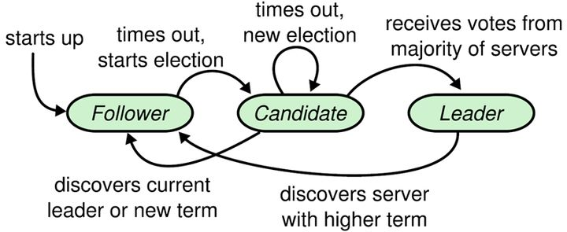

> Raft是一种便于理解和实现的一致性算法，它在容错方面的表现与Paxos相当，不同之处在于它被分解为相对独立的子问题，并且它干净的解决了实际系统中所需的主要部分。

<!-- more -->

------

# Leader Election

Raft协议中所有的节点状态分成了：**Leader**，**Follower**，**Candidate**

* Leader: 所有请求的处理者，Client对系统状态的变动都需要通过Leader，经由 Leader的处理后再同步到所有的其他节点。
* Follower：请求的被动更新者，从 Leader 接收更新请求，然后写入本地日志文件。
* Candidate：当集群不存在 Leader 时，节点就会成为 Candidate，经过选主，选出一个获得多数人投票的 Candidate 成为 Leader.

Raft算法将时间分为一个个的**任期**（term），每一个term的开始就是一次Leader选举。在成功选举 Leader 之后，Leader 会在整个 term内管理整个集群，如果当前任期内无法选举出获取多数票的 Leader，该 term就会结束，继续下一轮的选举。

term 同样起到了**逻辑时钟**的作用，节点间在进行 RequestVote RPC通信时会携带这个 term，如果节点发现消息中的 term小于自己的 term，则拒绝这个消息，如果大于本节点的 term，则更新自己的 term。如果一个 Candidate 或者 Leader 发现自己的任期号过期了，它会立即回到 Follower 状态

Raft通过心跳维持Leader与

***

# 相关资料

[GO_Raft实现](https://github.com/goraft/raft)

https://github.com/coreos/etcd

http://thesecretlivesofdata.com/raft/

https://zhuanlan.zhihu.com/p/27207160

http://www.ywnds.com/?p=8040

https://www.cnblogs.com/mindwind/p/5231986.html

raft paper