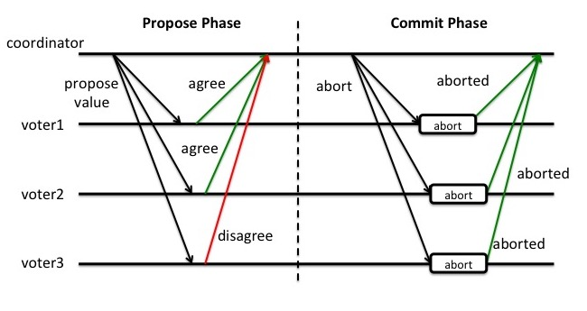
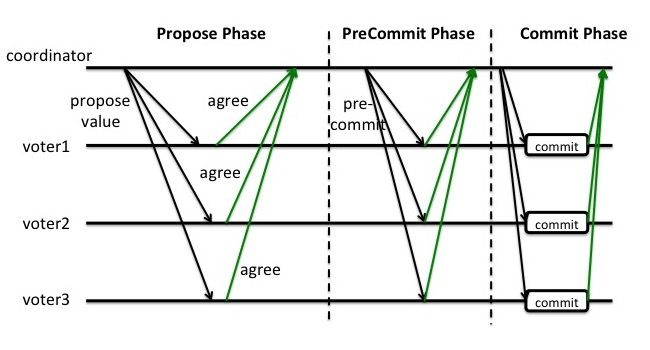

分布式一致性协议

<!--more-->

# 基础概念

从集中式到分布式：单机性能有限，且存在单点故障问题和不利于扩容。

分布式系统的定义:

> **分布式系统是一个硬件或软件组件分布在不同的网络计算机上，彼此之间仅仅通过消息传递进行通信和协调的系统：**

分布式系统的常见问题：

* **通信异常：**节点间通信依赖网络，网络存在不可用风险，即便网络可用，平均网络通信延迟（0.1 - 1ms）也**百倍于**内存平均访问延迟10ns。巨大的延时差别，也会影响消息的收发，因此消息丢失和消息延迟也非常普遍。
* **网络分区**：网络异常导致大的集群分成多个小的集群独立工作，也称为**脑裂**。
* **三态**：对分布式系统的每一次请求与相应，因为受限于网络问题，存在三个返回状态**：成功，失败，超时**
* **节点故障**：分布式系统中普遍使用**Replica(副本)**，来在多节点上做数据冗余，从而避免单点故障。

## 从ACID到CAP/BASE

### CAP定理

**一个分布式系统只能提供以下三个保证中的两个**

* Consistency: Every read receives the most recent write or an error. 
  每次都能读取到最新的数据或者错误
* Availability:   Every request receives a (non-error) response, without the guarantee that it contains the most recent write。
  请求收到非错误的返回，但不保证返回的数据是最新的。
* Partition tolerance: The system continues to operate despite an arbitrary number of messages being dropped (or delayed) by the network between nodes。
  在出现节点间网络连接问题导致的数据丢失的情况下，系统是否继续工作。
  TODO: 以实际效果而言，分区相当于对通信的时限要求。系统如果不能在时限内达成数据一致性，就意味着发生了分区的情况，必须就当前操作在C和A之间做出选择 

> 如何理解 CAP 定理：在出现网络分区或节点故障(通常为高负载失去心跳)的情况下，是否仍然继续提供服务，若不提供服务则不保证**可用性**，若继续提供服务，则不同分区内的数据不一致，不保证**一致性**。
>
> Todo: ES 到底是 CAP 的哪几个

### BASE理论

BASE理论是对CAP中一致性和可用性权衡的结果，是对互联网分布式应用实践的总结。

> Basically Availibale (基本可用) ， Soft state(软状态)， Eventually Consistent(最终一致性)

- 基本可用（**B**asically **A**vailable）：系统能够基本运行、一直提供服务。
- 软状态（**S**oft-state）：系统不要求一直保持强一致状态。
- 最终一致性（**E**ventual consistency）：系统需要在某一时刻后达到一致性要求。

### 总结

在集中式的服务中，我们通过**ACID**的特性保证了**数据的一致性**。在分布式的场景中，**CAP**定理告诉了我们在保证**分区容错性**的情况下，我们需要在**可用性**和**数据一致性**中做权衡。在互联网分布式应用的生产实践中，我们总结了**BASE理论**，来在服务基本可用的情况下，提供了**数据的最终一致性**。

# 分布式一致性协议

## 2PC Two-Phase Commit

在**分布式事务**中，我们引入**Coordinator**节点来统一调度其他所有参与节点，来保证事务同时在多个节点同步完成。

### 基本算法

将事务的提交过程分为了两个阶段，**事务提交阶段，事务执行阶段**

> 1. 协调者联系所有参与者，提交事务
> 2. 若所有参与者都同意，协调者再次通知参与者，执行事务。否则则通知所有参与者，终止事务。

**事务提交阶段：**

1. 协调者节点向所有参与者节点询问是否可以执行提交操作，并等待参与者节点的响应。
2. 参与者节点执行询问发起为止的所有事务操作，并将Undo信息和Redo信息写入日志。(基于WAL机制，实现节点内原子性和持久性)
3. 各参与者节点响应协调者节点发起的询问。如果参与者节点的事务操作实际执行成功，则它返回一个"同意"消息；如果参与者节点的事务操作实际执行失败，则它返回一个"中止"消息。

**事务执行阶段：**

成功：当协调者节点从所有参与者节点获得的响应消息都为"同意"时：

1. 协调者节点向所有参与者节点发出"正式提交"的请求。
2. 参与者节点正式完成操作，并释放在整个事务期间内占用的资源。
3. 参与者节点向协调者节点发送"完成"消息。
4. 协调者节点收到所有参与者节点反馈的"完成"消息后，完成事务。

失败：如果任一参与者节点在第一阶段返回的响应消息为"终止"，或者协调者节点在第一阶段的询问超时之前无法获取所有参与者节点的响应消息时：

1. 协调者节点向所有参与者节点发出"回滚操作"的请求。
2. 参与者节点利用之前写入的Undo信息执行回滚，并释放在整个事务期间内占用的资源。
3. 参与者节点向协调者节点发送"回滚完成"消息。
4. 协调者节点收到所有参与者节点反馈的"回滚完成"消息后，取消事务。

有时候，第二阶段也被称作**完成阶段**，因为无论结果怎样，**协调者都必须在此阶段结束当前事务。**

### 优缺点

优点：原理简单，实现方便

**缺点：同步阻塞**，单点故障，数据不一致，没有异常中断事务的机制

* **同步阻塞**：在任意阶段，所有参与者都会阻塞等待其他参与者响应。
* 单点问题：协调者在事务执行阶段挂掉，则所有参与者都会无限期等待
* 数据不一致：在事务执行阶段，任一参与者宕机或网络故障，就会导致数据不一致
* 没有异常中断事务的机制：在事务提交阶段，任一参与者宕机，协调者无法中断事务，只能超时中断。

## 3PC  Three-Phase Commit

在2PC的基础上，新增了一个中间状态**：Pre-Commite Phase 预提交状态。**

> **Note:** 在三阶段提交中，参与者接受到PreCommit消息后，哪怕后续无法收到任何消息，参与者仍然会提交事务，可能导致数据的不一致。

**阶段一：CanCommit，事务询问阶段**

协调者向所有的参与者发送包含事务的请求，参与者返回Yes/No。该阶段没有锁定资源，参与者拒绝后，回滚代价低。

**阶段二：PreCommit，事务准备阶段**

协调者根据上一轮的返回，若全同意则发送PreCommit请求，参与者接受请求，会**事务预提交**, 并将Undo和Redo写入事务日志。

若存在参与者不同意或无返回，则反送Abort请求，**中止**事务。

**阶段三：DoCommit，事务执行阶段**

协调者根据上一轮的返回，若全同意则发送DoCommit请求，参与者接受请求，**正式提交事务**，并返回ACK。

若存在参与者不同意或无返回(超时返回)，则反送Abort请求，**回滚**事务。

## Paxos

### 基础概念

Paxos将系统中的角色分为提议者 (Proposer)，决策者 (Acceptor)，和最终决策学习者 (Learner):

- **Proposer**: 提出提案 (Proposal)。Proposal信息包括提案编号 (Proposal ID) 和提议的值 (Value)。
- **Acceptor**：参与决策，回应Proposers的提案。收到Proposal后可以接受提案，若Proposal获得多数Acceptors的接受，则称该Proposal被批准。
- **Learner**：不参与决策，从Proposers/Acceptors学习最新达成一致的提案（Value）。

 协议的流程已经分为了两个阶段：

* **预提案阶段(PreProposal)**
* **提案阶段(Proposal)**

两种消息：

* **预提案**: 包含Proposal.id 和 Proposal.value
* **提案**: 包含Proposal.id 和 Proposal.value

### 实现流程

**阶段一 预提案阶段：**

提议者Proposer：向接受者Acceptor广播预提案，附带提案Proposal的proposal_id和proposal_value.

接受者Acceptor：收到预提案后更新`a_proposal_id = max(proposal_id,a_proposal_id)`，如果预提案的proposal_id>a_proposal_id，Acceptor回复记录的接受过的提案中proposal_id最大的。

**阶段二 提案阶段：** 

提议者Proposer：等待直到收到**大多数(Majority)**接受者对预提案的回复，从**所有回复的提案**组成的提案集合中挑选**proposal_id最大的提案**，以该提案的值作为本次提案的值。如果K是空集，那么可以给提案任意赋值。然后把该提案广播给接受者们，提案和预提案共享同一个proposal_id。

接受者Acceptor：如果收到的提案的proposal_id>= a.proposal_id，那么接受这个提案，更新`a_proposal_id = max(proposal_id,a_proposal_id)`，更新记录的提案。

### 举例说明

插入三张图来生动说明

https://zhuanlan.zhihu.com/p/31780743

## 小结

二段式提交协议，三段式提交协议和Paxos都是典型的分布式一致性算法。

二段式提交解决了分布式事务的原子性问题，保证了参与分布式事务的各个参与者要么都成功，要么都失败。但是存在着同步阻塞，无限期等待和脑裂等问题。

在此基础上，提出了三段式提交协议，在二段式的基础上增加了PreCommit阶段，避免了无限期等待的问题。

Paxos算法引入了多数者的概念，即当同时存在两个提案时，我们要求每个提案都需要被多数者节点同意，那么这两个提案的接受者合集之间必然出现并集。我们只需要确保并集节点只会接受一个提案就可以保证分布式一致性。

Paxos支持节点角色的轮换，避免了分布式的单点故障，同时避免了脑裂问题，是目前最优秀的分布式一致性协议之一。

# Reference

<<从PAXOS到ZOOKEEPER分布式一致性原理与实践>>

 << The Part-Time Parliament>> 

[分布式数据库](https://zh.wikipedia.org/wiki/%E5%88%86%E5%B8%83%E5%BC%8F%E6%95%B0%E6%8D%AE%E5%BA%93#%E4%BA%8B%E5%8A%A1%E6%80%A7%E8%B4%A8)

[CAP定理](https://zh.wikipedia.org/wiki/CAP%E5%AE%9A%E7%90%86)

[consensus-protocols-two-phase-commit](https://www.the-paper-trail.org/post/2008-11-27-consensus-protocols-two-phase-commit/)

[漫话分布式系统共识协议: 2PC/3PC篇](https://zhuanlan.zhihu.com/p/35298019)

[如何浅显易懂地解说 Paxos 的算法？](https://www.zhihu.com/question/19787937)

[Paxos、Raft分布式一致性最佳实践](https://www.zhihu.com/column/paxos)