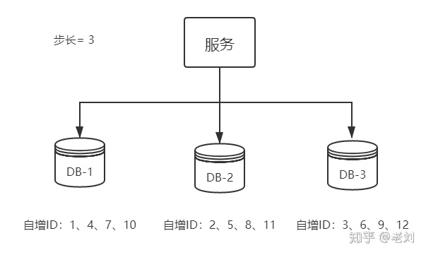
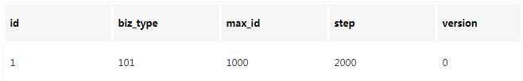
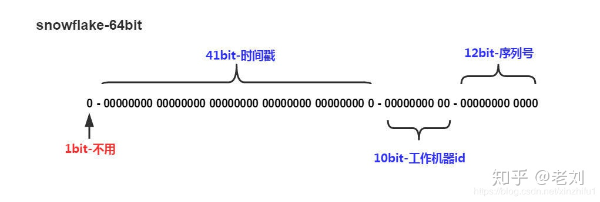

## 为什么需要分布式 ID

以 Mysql 举例，当数据量逐步上升，读写分离和主从同步也遇到性能瓶颈时，我们就需要对数据库进行分库分表，但是分库分表原来的自增表主键就不能使用了，否则就会遇到主键冲突的情况。

当然在微服务的场景下，系统以模块被划分为更细的粒度，因此有一个全局生成分布式 UUID的系统是非常有必要的。

<!--more-->

## 分布式 ID 需要满足的条件

* 全局唯一
* 高性能：若性能较差，会影响到所有系统
* 高可用：尽可能达到100%可用性
* 好接入：

## 基于 java.util.uuid 生成

```java
public static void main(String[] args) { 
       String uuid = UUID.randomUUID().toString().replaceAll("-","");
       System.out.println(uuid);
 }
```

java 默认提供 UUID 类，用以生成全球唯一的 UUID 键，但是**并不推荐！**

比如说`c2b8c2b9e46c47e3b30dca3b0d447718`就是其生成的 UUID，是由16进制表示的128位二进制数据。

首先，这样生成的 UUID不具备可读性，没有携带时间等有意义的信息；同时，在 Mysql 场景中（默认 InnoDB）我们希望**主键尽量短且自增**，这是由 InnoDB聚簇索引的特性决定，较短的主键，B+树每个节点可以存储更多的主键，从而降低树的高度，而且主键不自增，会导致数据位置变动频繁，严重影响性能。


## 基于数据库自增 ID

基于数据库的`auto_increment`自增ID完全可以充当`分布式ID`，具体实现：需要一个单独的MySQL实例用来生成ID，建表结构如下：

```java
CREATE DATABASE `SEQ_ID`;
CREATE TABLE SEQID.SEQUENCE_ID (
    id bigint(20) unsigned NOT NULL auto_increment, 
    value char(10) NOT NULL default '',
    PRIMARY KEY (id),
) ENGINE=MyISAM;
```

```java
insert into SEQUENCE_ID(value)  VALUES ('values');
```

当我们需要获取一个 UUID 时，就插入一条记录返回**主键 ID**, 但是这种方式非常依赖于 Mysql 的性能，而 Mysql 的性能本身就相当有限，在访问量较大时，就会成为系统的瓶颈。

**优点：** 实现简单，UUID 自增，ID 为数字

**缺点：** DB存在宕机风险，性能有限，无法抗住高并发的场景


## 基于数据库集群模式



基于数据库生成UUID的方式，可用性差。我们可以做一些高可用的优化，来提高Mysql的可用性，比如**主从模式集群**。使用**双主模式集群**，也就是两个Mysql实例都能单独的生产自增ID.

为了避免多个Mysql实例来生成UUID所出现ID重复的问题，我们可以为每个Mysql表，设置其**自增的步长**。

解决方案： 设置`起始值`和`自增步长`
```
MySQL_1 配置：

set @@auto_increment_offset = 1;     -- 起始值
set @@auto_increment_increment = 2;  -- 步长

MySQL_2 配置：

set @@auto_increment_offset = 2;     -- 起始值
set @@auto_increment_increment = 2;  -- 步长
```


## 基于数据库的号段模式

号段模式是当下分布式ID生成器的主流实现方式之一，号段模式可以理解为**从数据库批量的获取自增ID**，每次从数据库取出一个号段范围，例如 [1,1000] 代表1000个ID，具体的业务服务将本号段，生成1~1000的自增ID并加载到内存。

表结构如下：

```mysql
CREATE TABLE id_generator (
  id int(10) NOT NULL,
  max_id bigint(20) NOT NULL COMMENT '当前最大id',
  step int(20) NOT NULL COMMENT '号段的步长',
  biz_type	int(20) NOT NULL COMMENT '业务类型',
  version int(20) NOT NULL COMMENT '版本号',
  PRIMARY KEY (`id`)
) 
```

* biz_type ：代表不同业务类型
* max_id ：当前最大的可用id
* **step ：代表号段的长度**
* version ：是一个乐观锁，每次都更新version，保证并发时数据的正确性



当号段的ID用完，再次向数据库申请新号段，对`max_id`字段做一次`update`操作， 将max_id的值设置为max_id+step, 使用乐观锁控制更新，更新成功则获取新的号段中的所有ID.

> update id_generator set **max_id = #{max_id+step},** version = version + 1 where version = # {version} and biz_type = XXX

由于多业务端同时进行操作，所以我们需要对数据进行并发处理，这里我们采用乐观锁控制，因为号段模式决定了，是批量获取的，不会同时有大量请求。乐观锁模式更为高效。

优点： 批量获取ID，减少了对数据库的依赖，减少了对数据库的访问压力。

## 基于 Redis 模式

`Redis`可以使用`incr`命令实现ID的原子性自增。

```redis
127.0.0.1:6379> set seq_id 1     // 初始化自增ID为1
OK
127.0.0.1:6379> incr seq_id      // 增加1，并返回递增后的数值
(integer) 2
```

使用Redis来实现，需要注意Redis持久化的问题，

* RDB: 会导致数据丢失，从而引起重复ID的问题
* AOF: 取决于fsync的策略，而且要最好优化Rewrite操作的触发条件，incr命令很多，rewrite可以直接全部合并成一条，很好的优化，否则Data Recovery 会很慢。


## 基于雪花算法（Snowflake）



`Snowflake`生成Long类型的ID， 一个Long类型的ID为8个字节，64个bit. 我们将其以一定的规律进行划分

> Snowflake Id: 正数位（占1比特）+ 时间戳（占41比特）+ 机器ID（占5比特）+ 数据中心（占5比特）+ 自增值（占12比特），总共64比特组成的一个Long类型。

* 第一个bit位（1bit）：Java中long的最高位是符号位代表正负，正数是0，负数是1，一般生成ID都为正数，所以默认为0。

* 时间戳部分（41bit）：毫秒级的时间，不建议存当前时间戳，而是用（当前时间戳 - 固定开始时间戳）的差值，可以使产生的ID从更小的值开始；41位的时间戳可以使用69年，(1L << 41) / (1000L * 60 * 60 * 24 * 365) = 69年

* 工作机器id（10bit）：也被叫做workId，这个可以灵活配置，机房或者机器号组合都可以。

* 序列号部分（12bit），自增值支持同一毫秒内同一个节点可以生成4096个ID

根据这个规则，写一个工具类，来获取ID即可。 每个业务应用都可以有自己的工作ID， 不需要使用分布式ID的应用。
缺点是： 生成的ID也不是自增的，同样会产生InnoDB插入数据，频繁抖动的问题。

## Reference

[一口气说出9种分布式ID生成方式，面试官有点懵了](https://zhuanlan.zhihu.com/p/107939861)