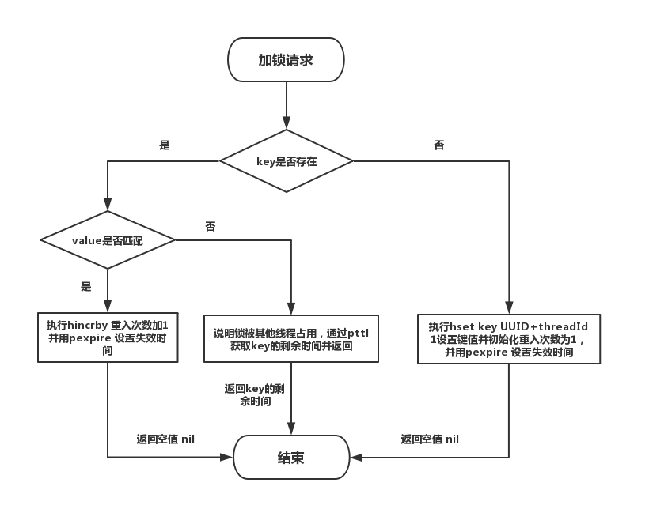
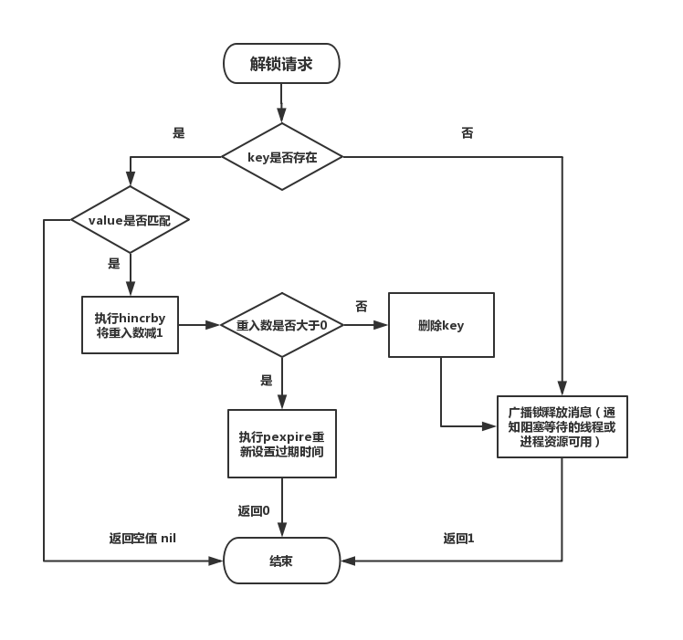

在分布式的场景中，多个实例之间访问共享资源时，我们需要**分布式锁**来控制并发。常见的有 基于 **Redis** 和 **Zookeeper** 的两种实现。

<!--more-->

## 基于Redis实现

### 背景知识

通过注册锁变量（HSet）并设置值为UUID+线程 ID 来标识锁，当线程从 Redis 中查询该变量时发现变量已存在则表示其他线程已经获取了该分布式锁。当持有锁的线程完成业务逻辑后，删除该变量。

使用 Redis 设置分布式锁需要注意以下几点：

1. 在获取锁时，通过使用 set key if not exist 命令，并且携带Key 过期时间，一个命令来实现，从而实现原子性。
2. 在删除锁时，要先判断持有该锁的线程是否是自己，如果是才删除，这 一套逻辑想要做到原子性则是依赖与 LUA 脚本，Redis 会原子性的运行 LUA 脚本。

### Redission 

Redission 是一个封装好 Redis 依赖库，提供了简单方便的 API 来操作 Redis 分布式锁。

**WatchDog:** 当未手动配置超时时间时，Redission 会启动一个后台守护线程，每隔10S（internalLockLeaseTime / 3）检查当前线程是否仍持有该锁，若还持有则延长锁过期时间为30S.

**加锁过程**：



**解锁过程：**




### 准备环境

```shell
# 启动 Redis 容器 作为测试环境
docker run -itd --name redis -p 6379:6379 redis:latest

# Maven 导入 Redission 依赖
<dependencies>
        <dependency>
            <groupId>org.redisson</groupId>
            <artifactId>redisson</artifactId>
            <version>3.13.2</version>
        </dependency>
</dependencies>
```

### Demo

```java
package redis;

public class RedissonDemo {

  public class RedisDistributedLock {


    public static void main(String[] args) {
        Config config = new Config();
        config.useSingleServer()
                .setAddress("redis://127.0.0.1:6379");

        RedissonClient redisson = Redisson.create(config);

        //new RedisDistributedLock().redissonTest(redisson);
        new RedisDistributedLock().redissonTest2(redisson);
    }

    private void redissonTest2(RedissonClient redissonClient) {
        RLock lock = redissonClient.getLock("testLock");
        lock.lock();
        lock.unlock();

        Runnable threadUseDistributedLock = () -> {
            while (true) {
                try {
                    lock.lock();
                    System.out.println(Thread.currentThread().getName() + " get distributed lock");
                    System.out.println(Thread.currentThread().getName() + " is working");
                    Thread.sleep(2000);
                } catch (InterruptedException e) {
                    e.printStackTrace();
                } finally {
                    lock.unlock();
                    System.out.println(Thread.currentThread().getName() + " release distributed lock");
                    try {
                        Thread.sleep(100);
                    } catch (InterruptedException e) {
                        e.printStackTrace();
                    }
                }
            }

        };

        new Thread(threadUseDistributedLock).start();
        new Thread(threadUseDistributedLock).start();

    }
 }

```


## 基于Zookeeper实现

### 背景知识：

ZK 基于Watcher 和 ZNode 的灵活组合，可以实现多种不同场景的应用。对于分布式锁而言，线程先判断对应锁的 ZNode 是否已经创建，如果已经创建则标识锁已经被占用，则创建一个 Watcher 监控该节点的状态变化，如果不存在，则创建一个临时 ZNode获取锁。当会话结束或节点宕机时，临时 ZNode 会自动删除。Wathcer 被触发唤醒等待该锁的 其他线程 。

### Curator

我们使用 Curator 来对 ZK 进行操作，Curator 同时提供了封装了常用 ZK 场景的方法，如分布式锁，分布式队列，选主等。

### 准备环境

```shell
# 启动 ZK 单节点容器作为测试
docker run --name some-zookeeper --restart always -d -p 2181:2181  zookeeper

# 导入 Maven依赖
<dependency>
    <groupId>org.apache.curator</groupId>
    <artifactId>curator-framework</artifactId>
    <version>5.1.0</version>
</dependency>
<dependency>
    <groupId>org.apache.curator</groupId>
    <artifactId>curator-recipes</artifactId>
    <version>5.1.0</version>
</dependency>
```

###  Demo

```java
package Zookeeper;


import java.util.List;
import java.util.concurrent.TimeUnit;

import org.apache.curator.framework.CuratorFramework;
import org.apache.curator.framework.CuratorFrameworkFactory;
import org.apache.curator.framework.recipes.locks.InterProcessMutex;
import org.apache.curator.retry.ExponentialBackoffRetry;
import org.apache.zookeeper.CreateMode;

public class ZKCuratorTest {
    public static void main(String[] args) {
        try {
            new ZKCuratorTest().ZKCuratorTest();
        } catch (Exception e) {
            e.printStackTrace();
        }
    }

    public void ZKCuratorTest() throws Exception {
        CuratorFramework client = CuratorFrameworkFactory.builder()
                .connectString("localhost:2181")
                .sessionTimeoutMs(5000)
                .connectionTimeoutMs(3000)
                .retryPolicy(new ExponentialBackoffRetry(1000, 3))
                .build();
        client.start();

        Runnable zkDistributeLock = () -> {
            try {
                while (true){
                    String lockPath = "/zibu/distributedLock";
                    InterProcessMutex lock = new InterProcessMutex(client, lockPath);
                    long maxWait = 10;
                    TimeUnit waitUnit = TimeUnit.SECONDS;
                    if ( lock.acquire(maxWait, waitUnit) )
                    {
                        try
                        {
                            System.out.println(Thread.currentThread().getName() + " 获取 ZK分布式锁成功");
                            // do some work inside of the critical section here
                            Thread.sleep(2000);
                        }
                        finally
                        {
                            System.out.println(Thread.currentThread().getName() + " 释放 ZK分布式锁");
                            lock.release();
                        }
                    }
                    System.out.println(Thread.currentThread().getName() + " 获取 ZK分布式锁失败");

                    //client.close();
                    Thread.sleep(1000);
                }

            }catch (Exception  e){
                System.err.println(e.getStackTrace());
            }
        };

        new Thread(zkDistributeLock).start();
        new Thread(zkDistributeLock).start();

    }
}

```

## Conclusion

|                  | Redis                          | Zookeeper                     |
| ---------------- | ------------------------------ | ----------------------------- |
| **性能**         | 内存DB,性能高                  | 性能一般                      |
| **分布式一致性** | 非强一致，可靠性一般           | 强一致性，可靠性强            |
| **锁的实现**     | 未获取到锁的线程会自旋，效率低 | 存在Watch，锁可用时会唤醒线程 |


追求数据的强一致性时选择ZK, 追求数据并发的场景时选用Redis。根据具体场景选用。

## Reference

[分布式锁用 Redis 还是 Zookeeper](https://zhuanlan.zhihu.com/p/163224180)

[慢谈-redis-实现分布式锁-以及-redisson-源码解析](http://ifeve.com/慢谈-redis-实现分布式锁-以及-redisson-源码解析/)