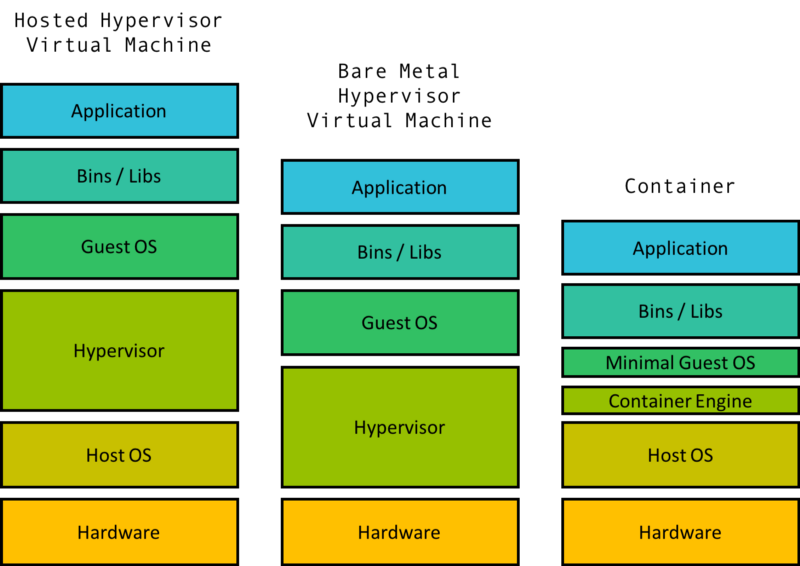

> 使用过Docker，也了解了Kubernetes，容器技术在集群服务器上应用如火如荼。
>
> 本文将深入揭露容器技术的发展和其应用。是之后的一系列容器技术应用的前置文章。
>
> 本文主要来自 [Demystifying containers 101: a deep dive into container technology for beginners](https://medium.freecodecamp.org/demystifying-containers-101-a-deep-dive-into-container-technology-for-beginners-d7b60d8511c1)

<!--more-->

------

## 操作系统和内核

现在的电脑是由一系列的硬件所组成的，如CPU，持久化的存储介质(硬盘，SSD),内存，网卡等等所组成

为了与硬件交换，操作系统中的一部分称作`内核kernel`的软件，充当了硬件和系统的其他部分沟通的桥梁。内核负责调度运行进程（程序），管理设备（从磁盘和内存中读写地址内信息）和其他操作。

操作系统的其他部分，负责引导和管理用户程序使用的用户空间并且不断与内核进行交互。

[^描述]: 内核是操作系统的一部分和对硬件接驳的接口。操作系统位于内核空间中，用户程序则在用户空间中。内核空间负责管理用户空间。

> Tips:要区分Kernel Space和Kernel。Kernel 是OS的一部分，OS整个位于KernelSpace中。

------

## 虚拟机 VM

假设MacOS需要运行一个只有在Ubuntu下才能运行的软件。我们普遍的解决方案是跑了一个Ubuntu的虚拟机，然后运行该程序。

虚拟机是由客户操作系统(案例中的Macos)的一系列硬件和内核虚拟化技术组成的。通过一种称为`hypervisor`的软件技术创建虚拟硬件，包括虚拟磁盘，虚拟网卡接口，虚拟CPU等硬件。虚拟机也包含一个内核来于虚拟硬件交流。

* The hypervisor can be hosted（管理程序可以被托管），这意味着它是一些运行在宿主OS（上例中的Macos）的软件。
* Hypervisor同样可以裸机运行，直接运行在机器硬件上（替代宿主OS）。

无论是那种方式，Hypervisor方法都是被认为是一种重量级的实现，需要虚拟化部分硬件或者全部硬件和内核。

如果在一个机器上需要运行多个独立组时，使用VM独立运行每个组是一种笨重且浪费资源的方式。

[^]: 消耗不成比例

虚拟机需要硬件虚拟化来实现机器层面的隔离，然而，容器可以在同一个操作系统中独立操作。随着独立空间数量的增加，容器和虚拟机之间的消耗资源差距会特别明显。一个普通的笔记本可以运行数十个容器却难以运行一个虚拟机。

------

## cgroups

2006，谷歌的工程师发明了Linux“控制组`(Control Group)`”，缩写为CGROUP。这是Linux内核的一个特性，用于隔离和控制用户进程的资源使用。

这些进程可以放入命名空间`namespaces`，命名空间本质上是共享相同有限资源的进程的集合。计算机可以有多个命名空间，每个命名空间都有内核所分配的资源。

可以管理每个命名空间的资源分配，用于限制一组进程可以使用的总CPU、RAM等资源。例如，可以限制后台日志收集进程所分配的资源，从而避免该进程占据过多资源，影响服务器其他程序运行。

虽然不是原始的特性，但是Linux中的cgroups最终被重新设计以包括名为命名空间隔离的特性。命名空间隔离的思想本身并不新鲜，Linux已经有很多种名称空间隔离。一个常见的例子是进程隔离，它隔壁每个单独的进程，并防止诸如共享内存之类的事情。

Cgroup隔离是一种更高级别的隔离，它确保cgroup命名空间中的进程独立于其他命名空间中的进程。下面列出了一些重要的命名空间隔离特性，为我们理想中容器特性奠定基础。

* PID(Process Identifier) Namespaces：这确保了一个命名空间内的进程不知道其他命名空间中的进程。
* Network NameSpace: 隔离网络接口控制器、IP表、路由表和其他底层网络工具。
* Mount NameSpace:挂载文件系统，因此名称空间的文件系统范围仅限于挂载的目录。
* User NameSpace:将名称空间内的用户限制为仅该名称空间，并避免跨越名称空间的用户ID冲突。

简单地说，每个命名空间内的进程都把命名空间当做一个实际运行的计算机。

## Linux容器

Linux cgroup为Linux容器（LXC）的技术铺平了道路。LXC确实是我们今天所知的第一个容器的主要实现，它利用cgroup和命名空间隔离来创建具有独立进程和网络空间的虚拟环境。

在某种意义上，这允许独立和隔离的用户空间。容器的概念直接来自LXC。事实上，早期版本的DOCKER直接构建在LXC的顶部。

### Docker

Docker是使用最广泛的容器技术，也是大多数人在提到容器时所指的技术。虽然还有其他开源容器技术（如CoreOS的rkt）和大型公司构建自己的容器引擎（如Google的lmctfy），但是Docker已经成为容器化的行业标准。它仍然基于Linux内核以及最近Windows所提供的cgroup和Namespace。

Docker容器由许多层image组成，二进制文件打包成单个包。基本映像中包含容器的OS，它可以不同于主机的操作系统。

容器的操作系统是image形式。这不是主机上的完整操作系统，不同之处在于image只是操作系统的文件系统和二进制文件，而完整操作系统包括文件系统、二进制文件和内核。

在基础镜像的顶部是多个镜像，每个镜像构建容器的一部分。 例如，在基本镜像的顶部可以是包含`apt-get`依赖性的镜像。 最重要的可能是包含应用程序二进制文件的镜像，依此类推。

很酷的部分是如果有两个带有镜像层`a，b，c`和`a，b，d`的容器，那么你只需要在本地和存储库中存储每个镜像层`a，b，c，d`的一个副本。 这是Docker的*联合文件系统*。

由散列标识的每个image只是构成容器的许多可能镜像层之一。但是，容器仅由其top image标识，该镜像具有对父镜像的引用。此处显示的两个顶级镜像（镜像1和镜像2）共享前三个图层。镜像2具有两个附加的配置相关层，但与镜像1共享相同的父镜像。

引导容器时，将从repo下载镜像及其父镜像，创建cgroup和命名空间，并使用该镜像创建虚拟环境。在容器内，镜像中指定的文件和二进制文件似乎是整个计算机中的唯一文件。然后启动容器的主进程，并将容器视为活动状态。

Docker还有其他一些非常酷的功能，例如写入时复制，卷（容器之间的共享文件系统），docker守护程序（管理机器上的容器），版本控制的存储库（如容器的Github）等等。要了解有关它们的更多信息并查看有关如何使用Docker的一些实际示例，这篇Medium上的[文章](https://medium.freecodecamp.org/a-beginner-friendly-introduction-to-containers-vms-and-docker-79a9e3e119b)非常有用。

[^]: *命令行客户端（1）告诉计算机上的名为进docker daemo的进程（2）该做什么。 守护程序从注册表/仓库中提取image（3）。 这些image在本地计算机上缓存（4），并且可以由守护程序启动以运行容器（5）。 图片来源：Docker。*

------

## 为什么使用容器

容器可作为一个独立的单元，可以在任何支持它的地方运行。在每个实例中，容器本身都是完全相同的。如果主机操作系统是CentOS，Ubuntu，MacOS，甚至是像Windows这样的非UNIX系统都无关紧要——从容器内部看操作系统将是容器指定的任何操作系统。因此，你可以确定你在笔记本电脑上构建的容器也将在公司的服务器上运行。

容器还充当标准化的工作或计算单元。一个常见的范例是每个容器运行单个Web服务器，数据库的单个分片或单个Spark工作程序等。然后，为了扩展应用程序，你只需要扩展容器的数量。

在这个范例中，每个容器都有一个固定的资源配置（CPU，RAM，线程数等），并且扩展应用程序需要只扩展容器的数量而不是单个资源原语。当应用程序需要按比例放大或缩小时，这为工程师提供了更容易的抽象。

容器也是实现微服务架构的一个很好的工具，每个微服务只是一组协作容器。例如，可以使用单个主容器和多个从容器来实现Redis微服务。

这种（微）服务导向架构具有一些非常重要的属性，使工程团队可以轻松创建和部署应用程序（有关更多详细信息，请参阅我之前的[文章](https://hackernoon.com/how-microservices-saved-the-internet-30cd4b9c6230?gi=d7bc571ea278)）。

## 编排

自从Linux容器出现以来，用户一直试图在许多虚拟机上部署大型应用程序，其中每个进程都在自己的容器中运行。这样做需要能够在数百个虚拟机中有效地部署数十到数千个容器，并管理他们的网络，文件系统，资源等。今天Docker使它更容易，因为它公开了抽象来定义容器网络，文件卷系统，资源配置等

但是仍然需要一个工具来：

- 真实地采取规范并将容器分配给机器（调度）
- 真实地通过Docker在机器上启动指定的容器
- 处理升级/回滚/系统不断变化的性质
- 应对容器崩溃等故障
- 创建集群资源，如服务发现，VM间网络，集群入口/出口等。

这组问题涉及在一组（可能是瞬态的或不断变化的）容器之上构建的分布式系统的编排，人们已经建立了一些非常奇妙的系统来解决这个问题。

详情请见下文，理解kubernetes核心概念。

## 相关资料

[Demystifying containers 101: a deep dive into container technology for beginners](https://medium.freecodecamp.org/demystifying-containers-101-a-deep-dive-into-container-technology-for-beginners-d7b60d8511c1)