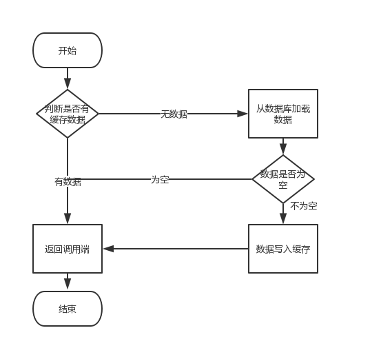

> 18年/4月份在百应的面试中遇到了这么个问题，当年不是很懂，毕竟缓存也没了解，现在了解下缓存击穿的逻辑和解决方案。
>
> 文章分为三层：缓存读取逻辑，缓存击穿原因，缓存击穿解决方案。

<!--more-->

## 常用缓存数据库介绍

### Memcached

Memcached是一个自由开源的，高性能，**分布式内存对象缓存系统**。

Memcached是一种基于**内存**的**key-value(hash-map)**存储，用来存储小块的任意数据（字符串、对象）

Memcached简洁而强大且API兼容大部分流行的开发语言。

一般的使用目的是，通过缓存数据库查询结果，减少数据库访问次数，以提高动态Web应用的速度、提高可扩展性。

### Redis

Redis 是完全开源免费的一个高性能的key-value数据库。

- **数据持久化**，可以将内存中的数据保存在磁盘中，重启的时候可以再次加载进行使用。
- **丰富的数据类型** -同时还**提供 Strings，list，set，zset，hash等数据结构**的存储。
- **数据备份**，即**master-slave**模式的数据备份。

- **性能极高** – Redis能读的速度是110000次/s,写的速度是81000次/s 。
- **原子性** – Redis的所有操作都是原子性的。多个操作也支持事务，即原子性，通过MULTI和EXEC指令包起来。
- **丰富的特性** – Redis还支持 **publish/subscribe, 通知, key 过期等**等特性。

---

## 缓存查询逻辑

在普遍的架构设计中，往往采用Redis+Mysql的数据库选择，之所以选择Redis，是因为Redis/Memcached等缓存数据库，由于使用内存作为存储介质，虽然存在易失性但是由于极高的读取写入速度，**在缓存命中的情况下可以实现很大的性能提高。而Redis支持更为丰富的数据结构和特性**。

---

## 缓存击穿原理

当**大量请求携带虚假的KEY来查询缓存时**，缓存数据不存在，就会继续请求数据库，数据库无法承受压力时，就会导致数据库连接失常或者挂掉。这就是缓存击穿。

