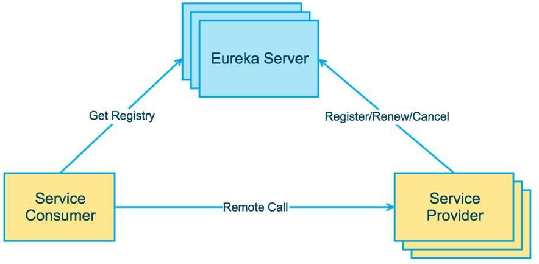
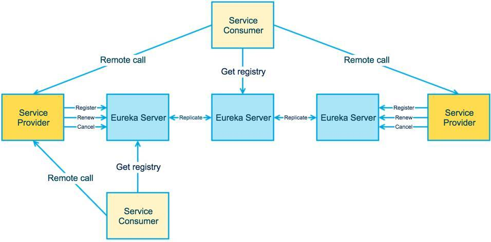
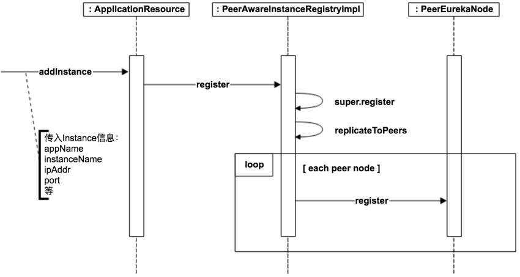
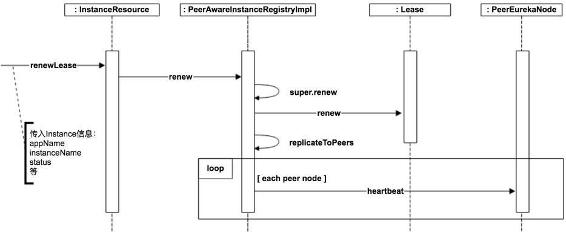
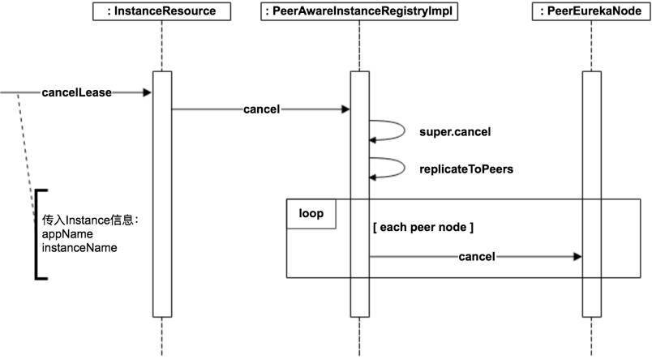
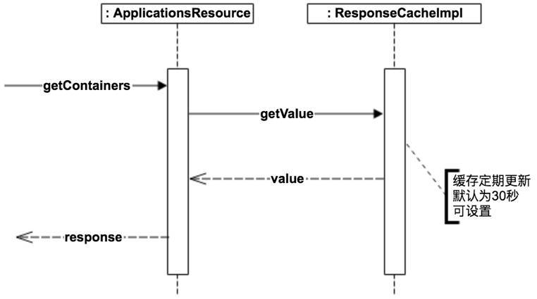
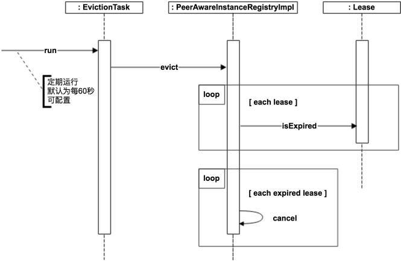
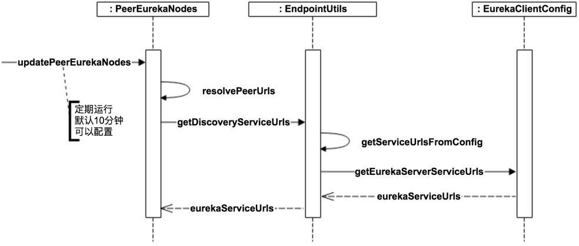
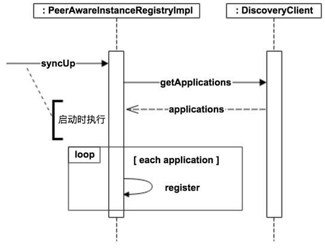

> Eureka, SpringCloud组件成员之一，负责服务注册与发现，支持服务动态扩容，缩容，失效剔除等体型。

<!--more-->

## 1. 使用篇

- 1.**Eureka server**

  - 1.1 创建运行Eureka服务器
    - 引用org.springframework.cloud的spring-cloud-starter-eureka-server
    - @EnableEurekaServer 注解运行Eureka服务器
    - 查看Eureka 运行状态 访问端口即可
  - 1.2 高可用性，区块和区域
    - Eureka服务器没有后台存储，注册表中的所有服务实例都需要发送心跳消息来更新注册信息。
    - 客户端也会有维持一个Eureka注册信息的缓存（通过心跳消息 注册 更新）
    - 多个Eureka服务器相互注册，实现高可用

- 2. **Eureka Client**

  - 2.1 创建运行Eureka客户机
    - 引入org.springframework.cloud的spring-cloud-starter-eureka
    - @EnableEurekaClient 注解运行Eureka客户端
    - 当在配置时间段没收到心跳信息，服务实例会被从注册表中移除(默认心跳 消息间隔为30S，清除无效实例间隔为90S)
    - 相关参数：EurekaInstanceConfigBean，EurekaClientConfigBean

## 2. 原理篇

### 2.1 OverView



在一整个Eureka架构中，主要分为三个角色

1. **Eureka Server**: 提供服务注册和发现
2. **Service Provider**: 服务提供方，将自身服务注册到Eureka，从而使服务消费方能够找到
3. **Service Comsumer**: 服务消费方，从Eureka获取注册服务列表，从而能够消费服务。

>  Tips:Provider 和 Comsumer 是个相对的概念，一个EurekaClient即可以是提供方也可以是消费方。
>
> ​	 甚至于说EureakServer 同样可以是EurekaClient。



上图是更为完整的架构，展示了三个角色之间的关系。

**Service Provider和EurekaServer的交互**：

* Register 服务注册:注册到Eureka Server
* Renew   服务续约: HeartBeat 心跳事件，默认30s, 可在yml文件中动态设置参数配置。
* Cancel   服务下线：默认90S未续约，则默认下线服务

### 2.2 Register



1.  `ApplicationResource`类addInstance方法接收Http服务请求，进行参数校验和对AmazonIInfo(亚马逊云服务器)进行特殊校验
2. 调用`PeerAwareInstanceRegistryImpl`的`register`方法，往注册表中添加数据
3. `PeerAwareInstanceRegistryImpl`完成服务注册后，调用`replicateToPeers`向其它Eureka Server节点（Peer）做状态同步（异步操作）

```java
// 注册表数据 存储InstanceInfo 
private final ConcurrentHashMap<String, Map<String, Lease<InstanceInfo>>> registry
            = new ConcurrentHashMap<String, Map<String, Lease<InstanceInfo>>>();
// 双层嵌套的HashMap 
// 第一层存储key 为AppName 应用名称(同一微服务节点 可能会有多个实例)
// 第二层存储Key 为InstanceName 实例名称
```

### 2.3 Renew



实现基本等同于 Register，先更新本地数据，更新成功，广播给所有节点。

### 2.4 Cancel



当Service Provider shut down时调用Cancel(服务下线)。

### 2.5 Fetch Registeries



Service Comsumer调用Fetch Registeries接口，传入对应Key，获取对应服务提供商或者返回所有实例节点。

为了提高性能，服务列表在EurekaServer维持一份缓存，每30S更新。

### 2.6 Eviction



Eviction（失效服务剔除）用来定期（默认为每60秒）在Eureka Server检测失效的服务，检测标准就是超过一定时间没有Renew的服务。

默认失效时间为90秒，也就是如果有服务超过90秒没有向Eureka Server发起Renew请求的话，就会被当做失效服务剔除掉。

失效时间可以通过`eureka.instance.leaseExpirationDurationInSeconds`进行配置，定期扫描时间可以通过`eureka.server.evictionIntervalTimerInMs`进行配置。

### 2.7 EurekaServer节点通信

在前面接口实现中，都复用了replicateToPeers函数，来做Peers之间的状态同步。

通过这个方式，每个EurekaServer在所维护的节点状态更新时，都会向所有节点广播，从而实现一致性。

该函数传入一个isReplication参数，初次调用时为False,后续调用时为True。

由于Peers之间的通信是异步的，因此不保证节点间的状态是一致的，只能保证最终一致性。

> CAP理论：一致性（Consistency),  可用性(Availability), 分区容错性(Partition tolerance), Eureka舍弃了一致性来满足AP。

### 2.8 Eureka节点启动注册



Eureka Server在启动后会调用`PeerEurekaNodes.getEurekaServerServiceUrls`来获取所有的Peer节点，并且会定期更新。定期更新频率可以通过`eureka.server.peerEurekaNodesUpdateIntervalMs`配置。

这个方法的默认实现是从配置文件读取，所以如果Eureka Server节点相对固定的话，可以通过在配置文件中配置来实现。

如果希望能更灵活的控制Eureka Server节点，比如动态扩容/缩容，那么可以override `getEurekaServerServiceUrls`方法，提供自己的实现，比如通过数据库读取Eureka Server列表。

### 2.9 EurekaServer节点发现/初始化



当一个EurekaServer初始化后或重启，本地注册服务为空。

首先调用syncUp()，从别的节点获取所有的注册服务，然后依次在这里执行Register，isReplication=true的操作，从而完成初始化，同步所有服务。

## 3. 总结

  本文主要介绍了Eureka的实现思路，通过深入了解EurekaServer，ServiceProvider,ServiceConsumer的实现，清晰深入的看见了服务注册，发现等一系列过程和实现方式。

