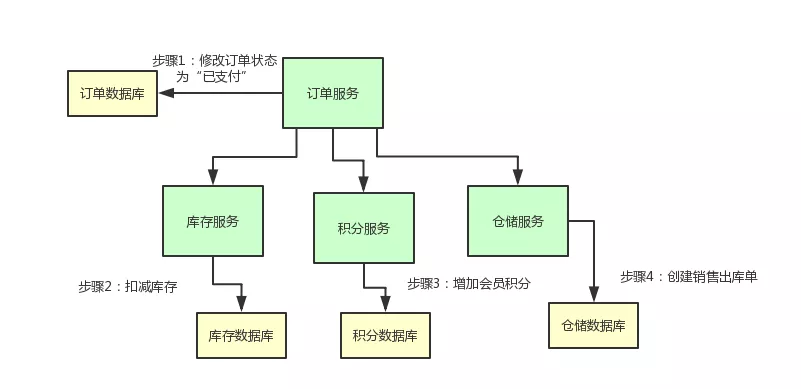

> 正在施工 敬请期待

> 分布式事务存在多种实现模式，详情可查看分布式事务解决方案一文。
>
> 本文讲述TCC分布式事务的原理及其实现。

<!--more-->

## TCC事务简介

### T(Try)  C(Comfirm) C(Cancel)

* **Try阶段：**对业务系统做检测及资源预留
* **Confrim阶段**：对业务系统做确认提交，当**Try**阶段成功后，执行**Confirm**阶段.
* **Cancel阶段**：当Try操作失败时，执行Cancel操作，**释放Try阶段的预留资源**。

### 幂等性

幂等（Idempotent）是一个数学与计算机学概念。在编程中，一个幂等操作指的是任意次执行后的影响均与一次执行的影响相同。

#### 分布式调用幂等性（UUID处理）

在分布式系统中，一次操作返回失败不一定是操作失败，也有可能是网络传输原因。

Cousumer通常会重试，因此分布式的系统中，业务逻辑中需要实现幂等性。

* Create: 插入数据，需要插入前判断该数据是否存在，从而幂等。
* Read: 查询操作，天然幂等。
* Update/Delete：设计tb_uuid表，在事务开始前插入uuid，若该表之前存在uuid（唯一索引），则该事务之前成功执行过，不能执行。否则可执行。

#### 其他方式实现幂等性（状态机）

给业务数据设置状态，通过业务数据状态判断是否需要重复执行。

------

## TCC事务简易案例演示

### 业务场景介绍

在日常常见的电商系统中，存在一个支付订单的场景。

当用户支付订单后，我们需要做下面的步骤：

- 更改订单的状态为“已支付”
- 扣减商品库存
- 给会员增加积分
- 创建销售出库单通知仓库发货

## 相关资料

[rpc调用幂等性](https://github.com/chinaccj/tcc-transaction/wiki/rpc%E8%B0%83%E7%94%A8%E5%B9%82%E7%AD%89%E6%80%A7)

[终于有人把“TCC分布式事务”实现原理讲明白了！](https://www.cnblogs.com/jajian/p/10014145.html)