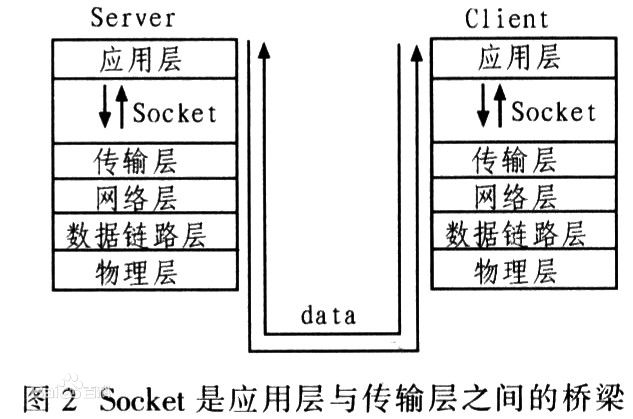

## Socket(套接字)概念

本地间进程以PID作为唯一标示，网络间进程则以**IP地址+端口号**作为唯一标示，而这个功能是由TCP/IP协议提供的，而Socket通信则是TCP/IP协议的API封装。

Socket是应用层与TCP/IP协议族通信的中间软件抽象层，它是一组接口，我们使用Socket来组织数据，以符合指定的协议

Socket起源于Unix，而Unix/Linux的基本哲学之一就是`一切皆文件`。所有文件都可以用“open->write/read->close“模式来操作。而Socket也是基于这样的思想，即一种特殊的文件。而Socket函数则提供了对Socket文件的操作能力(读/写IO、打开、关闭)。

<!--more-->

## 连接过程

根据连接启动的方式以及本地要连接的目标，Socket之间的连接过程可以分为三个步骤：服务器监听，客户端请求，连接确认。

（1）**服务器监听**：服务器端Socket时刻处于等待连接的状态，实时监控网络状态。

（2）**客户端请求**：客户端Socket向服务器Socket提出连接请求。客户端Socket以**IP地址+端口号**的形式确认服务器端Socket，然后就向服务器端套接字提出连接请求。

（3）**连接确认**：服务器端Socket接收到客户端Socket的连接请求，就响应。建立一个新的线程，把服务器端Socket的描述发给客户端，一旦客户端确认了此描述，便建立连接。而服务器端Socket继续处于监听状态，继续接收其他客户端套接字的连接请求。



## Socket函数

### Socket()

```java
int socket(int domain, int type, int protocol);
```

Socket函数对应于普通文件的打开操作。普通文件打开操作返回一个文件描述字，而Socket()函数返回一个**Socket描述符**，唯一标识一个Socket。后续操作则通过描述符来定位Socket。

参数说明：

**domain**：协议域，又称协议族（family）。常用的协议族有AF_INET、AF_INET6、AF_LOCAL（或称AF_UNIX，Unix域Socket）、AF_ROUTE等。协议族决定了socket的地址类型，在通信中必须采用对应的地址，如AF_INET决定了要用ipv4地址（32位的）与端口号（16位的）的组合、AF_UNIX决定了要用一个绝对路径名作为地址。

**type**：指定Socket类型。常用的socket类型有SOCK_STREAM、SOCK_DGRAM、SOCK_RAW、SOCK_PACKET、SOCK_SEQPACKET等。流式Socket（SOCK_STREAM）是一种面向连接的Socket，针对于面向连接的TCP服务应用。数据报式Socket（SOCK_DGRAM）是一种无连接的Socket，对应于无连接的[UDP](https://baike.baidu.com/item/UDP)服务应用。

**protocol**：指定协议。常用协议有IPPROTO_TCP、IPPROTO_UDP、IPPROTO_STCP、IPPROTO_TIPC等，分别对应TCP传输协议、UDP传输协议、STCP传输协议、TIPC传输协议。

注意：

* type和protocol不可以随意组合，如SOCK_STREAM不可以跟IPPROTO_UDP组合。当第三个参数为0时，会自动选择第二个参数类型对应的默认协议。
* WindowsSocket下protocol参数中不存在IPPROTO_STCP

返回值：

成功:返回Socket描述符。失败：返回INVALID_SOCKET(Linux下失败返回-1)。Socket描述符是一个整数型的值。以类似MAP的key-value映射。每一个Socket描述符对应一个Socket数据结构。每个进程都有一个Socket描述符表且存放在操作系统的内核中。

### Bind()

```JAva
int bind(SOCKET socket, const struct sockaddr* address, socklen_t address_len);
```

**Bind**函数，当我们调用**Socket**创建一个socket时，返回的socket没有一个具体的地址。通过**bind()**赋值一个地址。否则当调用connect(),listen()时系统会自动随机分配一个端口。

参数说明：

**socket**：由**socket**函数创建的Socket描述符。

**address** :是一个sockaddr结构指针，该结构中包含了要结合的**地址和端口号**。

**address_len**：确定address缓冲区的长度。

返回值：

如果函数执行成功，返回值为0，否则为SOCKET_ERROR。

服务器服务在创建时，需要绑定一个端口地址，因此会在socket()后执行bind()函数。而客户端就不会调用，而是在connect()时由系统随机生成一个。

### listen() connect()

```Java
int listen(int socket, int backlog);//服务器
int connect(int socket, const struct sockaddr *addr, socklen_t addrlen);//客户端
```

服务器端选择socket来启用listen()函数监听请求。客户端使用connect()函数连接服务器端。

参数说明：

**socket**：由**socket**函数创建的Socket描述符。

**backlog**: socket允许的最大连接个数

**addr**:服务器的socket地址

**addrlen** ：socket地址的长度

## accept()

```Java
int accept(int sockfd, struct sockaddr *addr, socklen_t *addrlen);
```

TCP服务器端依次调用**socket()、bind()、listen()**之后，就会监听指定的socket地址了。

TCP客户端依次调用**socket()、connect()**之后就想TCP服务器发送了一个连接请求。TCP服务器监听到这个请求之后，就会调用**accept()**函数取接收请求，这样连接就建立好了。之后就可以开始网络I/O操作了，即类同于普通文件的读写I/O操作。

参数说明：

**socket**：服务器的Socket描述符。

**addr**:客户端的Socket地址

**addrlen** ：socket地址的长度

返回值:

若建立连接成功则返回一个全新的描述字，用于描述本次Socket连接。

## read()、write()

- read()/write()
- recv()/send()
- readv()/writev()
- **recvmsg()/sendmsg()**
- recvfrom()/sendto()

read函数是负责从fd中读取内容.当读成功时，read返回实际所读的字节数，如果返回的值是0表示已经读到文件的结束了，小于0表示出现了错误。如果错误为EINTR说明读是由中断引起的，如果是ECONNREST表示网络连接出了问题。

write函数将buf中的nbytes字节内容写入文件描述符fd.成功时返回写的字节 数。失败时返回-1，并设置errno变量。在网络程序中，当我们向套接字文件描述符写时有俩种可能。1)write的返回值大于0，表示写了部分或者是 全部的数据。2)返回的值小于0，此时出现了错误。我们要根据错误类型来处理。如果错误为EINTR表示在写的时候出现了中断错误。如果为EPIPE表示 网络连接出现了问题(对方已经关闭了连接)。

## close()

```Java
int close(int fd);
```

close操作只是使相应socket描述字的引用计数-1，只有当引用计数为0的时候，才会触发TCP客户端向服务器发送终止连接请求。

**TCP/IP 三握四挥**

三次握手是因为三次，是确保一次可靠连接的最低过程。即ack与syn同时发送。而四次挥手ACK跟SYN分开发送是因为要确认应用层不在有数据需要发送，只有确认没有数据发送时，才会发送最后一个ACK。

当然四次挥手也可以改成三次挥手，即将ACK和SYN在同一报文里发送，这就是延迟确认优化。

## 参考资料

[百度百科-socket](https://baike.baidu.com/item/socket/281150?fr=aladdin)

[Socket通信原理](https://www.cnblogs.com/wangcq/p/3520400.html)

[TCP中断可以用3次挥手吗？](https://www.zhihu.com/question/50646354?sort=created)