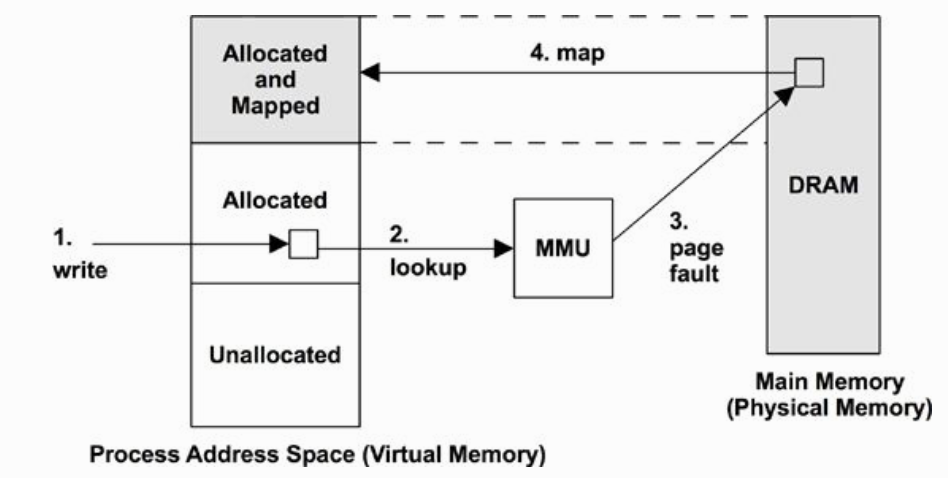

本文转载自[Linux 的 OOM Killer 机制分析](http://senlinzhan.github.io/2017/07/03/oom-killer/)

<!--more-->

# 按需分配物理页面

　　很多情况下，一个进程会申请一块很大的内存，但只是用到其中的一小部分。为了避免内存的浪费，在分配页面时，Linux 采用的是按需分配物理页面的方式。譬如说，某个进程调用`malloc()`申请了一块小内存，这时内核会分配一个虚拟页面，但这个页面不会映射到实际的物理页面。




　　从图中可以看到，当程序首次访问这个虚拟页面时，会触发一个缺页异常 (page fault)。这时内核会分配一个物理页面，让虚拟页面映射到这个物理页面，同时更新进程的页表 (page table)。


# Memory Overcommit

　　这种按需分配物理页面的方式，可以大大节省物理内存的使用，但有时会导致 Memory Overcommit。所谓 Memory Overcommit，也就是说，所有进程使用的虚拟内存超过了系统的物理内存和交换空间的总和。默认情况下，Linux 是允许 Memory Overcommit 的。并且在大多数情况下，Memory Overcommit 也是安全的，因为很多进程只是申请了很多内存，但实际使用到的内存并不多。
　　但万一很多进程都使用了申请来的大部分内存，就可能导致物理内存和交换空间不够用了，这时内核的 OOM Killer 就会出马，它会选择杀掉一个或多个进程，这样就能腾出一些内存给其它进程使用。
　　在 Linux 中，可以通过内核参数`vm.overcommit_memory`去控制是否允许 overcommit：

- 默认值是 0，在这种情况下，只允许轻微的 overcommit，而比较明显的 overcommit 将不被允许。
- 如果设置为 1，表示总是允许 overcommit。
- 如果设置为 2，则表示总是禁止 overcommit。也就是说，如果某个申请内存的操作将导致 overcommit，那么这个操作将不会得逞。

　　那么对内核来说，怎样才算 overcommit 呢？Linux 设定了一个阈值，叫做 CommitLimit，如果所有进程申请的总内存超过了 CommitLimit，那就算是 overcommit 了。在`/proc/meminfo`中可以看到 CommitLimit 的大小：

```
$ cat /proc/meminfo | grep CommitLimit
CommitLimit:     3829768 kB
```

　　CommitLimit 的值是这样计算的：

```
CommitLimit = [swap size] + [RAM size] * vm.overcommit_ratio / 100
```

　　其中的`vm.overcommit_ratio`也是内核参数，它的默认值是 50。


# OOM Killer

　　当物理内存和交换空间不够用时，OOM Killer 就会选择杀死进程，那么它是怎样知道要先杀死哪个进程呢？其实 Linux 的每个进程都有一个 oom_score (位于`/proc//oom_score`)，这个值越大，就越有可能被 OOM Killer 选中。oom_score 的值是由很多因素共同决定的，这里列举几个因素：

- 如果进程消耗的内存越大，它的 oom_score 通常也会越大。
- 如果进程运行了很长时间，并且消耗很多 CPU 时间，那么通常它的 oom_score 会偏小。
- 如果进程以 superuser 的身份运行，那么它的 oom_score 也会偏小。

　　如何才能尽量防止某个重要的进程被杀死呢？Linux 每个进程都有一个 oom_adj (位于`/proc//oom_adj`)，这个值的范围是 [-17, +15]，进程的 oom_adj 会影响 oom_score 的计算，也就是说，我们可以通过调小进程的 oom_adj 从而降低进程的 oom_score。对于一些比较重要的进程，例如 MySQL，我们想尽量避免它被 OOM Killer 杀死，这时候就可以调低它的 oom_adj 的值，例如：

```
$ sudo echo -10 > /proc/$(pidof mysqld)/oom_adj
```


# 交换空间

　　通常来说操作系统都会开启交换空间，那么交换空间有什么作用呢？

- 允许系统将一些长期没有用到的物理页面换出到交换空间，这样就能节省物理内存的使用。
- 当物理内存不够使用时，系统可以利用交换空间作为缓冲，防止一些进程因为内存不够而被 OOM Killer 杀死。

　　`vm.swppiness`可以用来配置交换空间，取值范围是 [0, 100]，在 Linux 3.5 之后，它有这些作用：

- 设置为 0 表示禁止交换空间的使用，只有当系统 OOM 时才允许使用交换空间。
- 设置为 1 不会禁止交换空间的使用，但系统会尽量不去使用交换空间。
- 设置为 100 表示系统会很喜欢使用交换空间。

　　交换空间是位于磁盘之上的，对操作系统来说，访问磁盘的速度远远慢于访问物理内存。所以我们希望，当物理内存足够使用时，系统能尽量不去使用交换空间，这样能降低页面换入换出的频率，因为频繁的页面换入换出操作会严重影响系统的性能。为了达到这种效果，我们可以把`vm.swappiness`设置为 1：

```
sudo echo 1 >  /proc/sys/vm/swappiness
```

