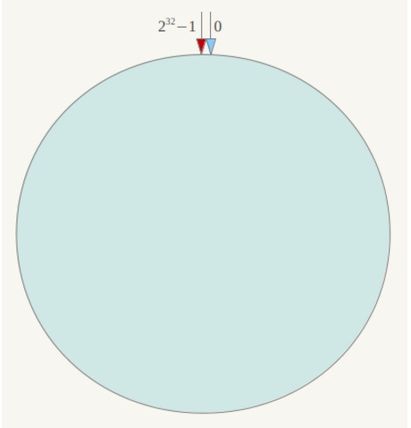
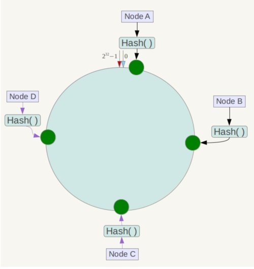
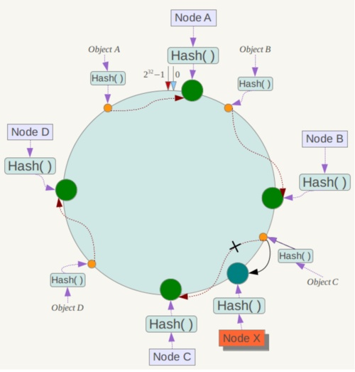
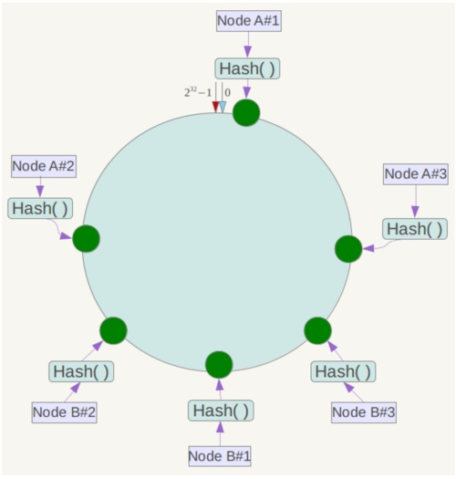

**一致性哈希算法对2^32次方进行取模，将整个 Hash 空间看做一个圆环，把服务器节点的 IP/Hostname作为关键字进行哈希，对所有的数据，进行哈希，获得它在圆环上的位置，顺时针方向寻找，遇到的第一个服务器，就是所定位的服务器。**

一致性哈希在分布式集群的场合中有广泛的应用，传统的对服务器数量取模计算，在节点数量变更时，会导致几乎所有请求的目标服务器都发生变化，大量缓存的同时失效，则将导致缓存雪崩，大量的请求直接落在数据库上。但在一致性哈希的场合中，受到影响的只有变更节点所对应的数据。

<!--more-->

## 一致性哈希性质

作者：慕课网
链接：
来源：知乎
著作权归作者所有。商业转载请联系作者获得授权，非商业转载请注明出处。

考虑到分布式系统每个节点都有可能失效，并且新的节点很可能动态的增加进来，如何保证当系统的节点数目发生变化时仍然能够对外提供良好的服务，这是值得考虑的，尤其实在设计分布式缓存系统时，如果某台服务器失效，对于整个系统来说如果不采用合适的算法来保证一致性，那么缓存于系统中的所有数据都可能会失效（即由于系统节点数目变少，客户端在请求某一对象时需要重新计算其hash值（通常与系统中的节点数目有关），由于hash值已经改变，所以很可能找不到保存该对象的服务器节点），因此一致性hash就显得至关重要，良好的分布式cahce系统中的一致性hash算法应该满足以下几个方面：

- **平衡性(Balance)**

平衡性是指哈希的结果能够尽可能分布到所有的缓冲中去，这样可以使得所有的缓冲空间都得到利用。很多哈希算法都能够满足这一条件。

- **单调性(Monotonicity)**

单调性是指如果已经有一些内容通过哈希分派到了相应的缓冲中，又有新的缓冲区加入到系统中，那么哈希的结果应能够保证原有已分配的内容可以被映射到新的缓冲区中去，而不会被映射到旧的缓冲集合中的其他缓冲区。简单的哈希算法往往不能满足单调性的要求，如最简单的线性哈希：x = (ax + b) mod (P)，在上式中，P表示全部缓冲的大小。不难看出，当缓冲大小发生变化时(从P1到P2)，原来所有的哈希结果均会发生变化，从而不满足单调性的要求。哈希结果的变化意味着当缓冲空间发生变化时，所有的映射关系需要在系统内全部更新。而在P2P系统内，缓冲的变化等价于Peer加入或退出系统，这一情况在P2P系统中会频繁发生，因此会带来极大计算和传输负荷。单调性就是要求哈希算法能够应对这种情况。

- **分散性(Spread)**

在分布式环境中，终端有可能看不到所有的缓冲，而是只能看到其中的一部分。当终端希望通过哈希过程将内容映射到缓冲上时，由于不同终端所见的缓冲范围有可能不同，从而导致哈希的结果不一致，最终的结果是相同的内容被不同的终端映射到不同的缓冲区中。这种情况显然是应该避免的，因为它导致相同内容被存储到不同缓冲中去，降低了系统存储的效率。分散性的定义就是上述情况发生的严重程度。好的哈希算法应能够尽量避免不一致的情况发生，也就是尽量降低分散性。

- **负载(Load)**

负载问题实际上是从另一个角度看待分散性问题。既然不同的终端可能将相同的内容映射到不同的缓冲区中，那么对于一个特定的缓冲区而言，也可能被不同的用户映射为不同的内容。与分散性一样，这种情况也是应当避免的，因此好的哈希算法应能够尽量降低缓冲的负荷。

- **平滑性(Smoothness)**

平滑性是指缓存服务器的数目平滑改变和缓存对象的平滑改变是一致的。

## 原理（重点）

### 正常场景

一致性哈希将整个哈希值空间组织成一个虚拟的圆环，如假设某哈希函数H的值空间为0-2^32-1（即哈希值是一个32位无符号整形），整个哈希空间环如下：

整个空间按顺时针方向组织。0和2^32-1在零点钟方向重合。

下一步计算各个服务器的 IP 或机器名的哈希值，确认它们在哈希环上的位置。

接下来，对于到来的数据，也对其进行哈希，并画出他们在图上的位置，**顺时针方向最近的服务器就是它们的定位服务器。**

### 容错性和可扩展性

**容错性：**假设 NodeC宕机，处于 NodeB 到 NodeC 区间的所有数据，将会被重定向到 NodeD。

**可扩展性**：当 NodeX 加入集群，NodeX-NodeB 区间的数据则会定位到 NodeX而非原先的 NodeC。

综上所述，一致性哈希算法对于节点的增减都只需重定位环空间中的一小部分数据，具有较好的容错性和可扩展性。

### 数据倾斜| 虚拟节点机制

**数据倾斜：**当服务器节点过少时，服务器哈希值没能平均分布时，很容易产生数据分配不均的场景。

为了解决数据倾斜的问题，让请求和数据更为均匀的分配到所有节点上去。一致性哈希算法引入了虚拟节点机制。

**虚拟节点机制**：对每一条服务器计算多个哈希值，每个计算位置都放置一个该服务器节点，称为虚拟节点。

具体做法可以通过在其 IP 或 Hostname 后面增加编号的方式来实现，如 Node A#1,Node A#2,Node A#3

在实际应用中，通常将虚拟节点个数设置为32甚至更大，因此即便很少的服务节点也能做到相对均匀的数据分布。

## Reference

[把一致性哈希算法原理讲的最清楚的一篇](https://zhuanlan.zhihu.com/p/78285304)