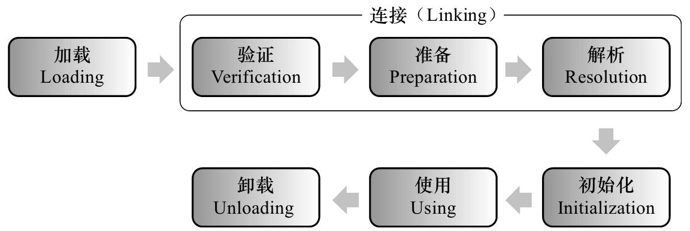
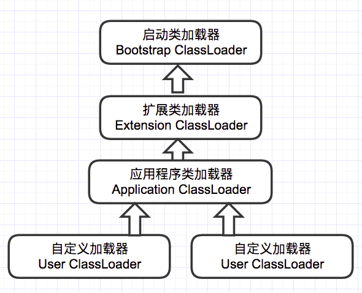

> Java类加载器是Java语言的一个创新，用于动态装载Java字节码文件，最早用于Applet从远程动态下载调用Java文件。
>
> 类加载器加载字节码文件，并转换为java.lang.Class类的一个实例。用于标识Java类，使用该示例的newInstance()方法动态创建该类的对象。
>
> 常见的是ClassNotFoundException和NoClassDefFoundError等异常。

<!--more-->

------


## 类加载过程

### 概述

JVM将类的加载分为五个部分

* 加载(Load)
* 链接(Link)
  * 验证(Verification)
  * 准备(Preparation)
  * 解析(Resoltion)
* 初始化(Initialize)
* 使用(Using)
* 卸载(Unloading)



### 加载(Load)

加载是类加载的第一个过程，在加载阶段，虚拟机需要完成以下三件事情：

1. 通过类的全限定名获取其定义的二进制字节流
2. 将这个字节流梭代表的静态存储结构转化为方法区的运行时数据结构
3. 在Java堆中生成一个代表这个类的java.lang.Class对象，作为对方法区的数据访问入口。

相对于类加载的其他阶段，加载阶段(准确的说，是加载阶段的获得类字节码)是可控性最强的阶段，既可以通过系统的类加载器来加载也可以**自定义加载器完成加载**。

> Tips：类加载器不仅可以从一个Class文件获取，这里既可以从ZIP包(Jar/War包)中读取，也可以在运行时动态代理生成，也可以由其他文件生成。(将Jsp文件转为Class类)

### 链接(Link) 

#### 验证：确保被加载的类的正确性

确保Class文件的字节流中包含的信息符合当前虚拟机的要求，并不会危害虚拟机自身安全，主要分为大致四个阶段的检验动作。

* **文件格式验证**  
* **元数据验证**
* **字节码验证**
* **符号引用验证**

验证阶段很重要，如果对所加载的类放心的话，可以考虑采用-Xverifynone参数来关闭大部分的类验证措施，以缩短虚拟机类加载时间。

#### 准备: 为静态变量分配方法区内存 并 初始化默认值

准备阶段为类变量分配方法区内存并设置累变量的初始值，初始值的概念并不是代码规定的初值，而是对应变量的默认值。

#### 解析：将符号引用转为直接引用

解析阶段是指虚拟机将常量池中的符号引用替换为直接引用的过程。符号引用就是class文件中的：

- CONSTANT_Class_info
- CONSTANT_Field_info
- CONSTANT_Method_info

等类型的常量。

下面我们解释一下符号引用和直接引用的概念：

- 符号引用与虚拟机实现的布局无关，引用的目标并不一定要已经加载到内存中。各种虚拟机实现的内存布局可以各不相同，但是它们能接受的符号引用必须是一致的，因为符号引用的字面量形式明确定义在Java虚拟机规范的Class文件格式中。
- 直接引用可以是指向目标的指针，相对偏移量或是一个能间接定位到目标的句柄。如果有了直接引用，那引用的目标必定已经在内存中存在。

### 初始化(Initialization)

#### 初始化简介

初始化，为类的静态变量赋予正确的初始值，JVM负责对类进行初始化，主要对类变量进行初始化。在Java中对类变量进行初始值设定有两种方式：

①声明类变量是指定初始值。

②使用静态代码块为类变量指定初始值。

初始化阶段是执行类构造器<client>方法的过程。**<client>方法**是由编译器自动收集类中的**类变量的赋值**操作和**静态语句块**中的语句合并而成的。虚拟机会保证<client>方法执行之前，父类的<client>方法已经执行完毕。p.s: 如果一个类中没有对静态变量赋值也没有静态语句块，那么编译器可以不为这个类生成<client>()方法。

#### 初始化时间

1. 创建类的实例，既New一个对象
2. 访问某个类或接口的静态变量
3. 调用类的静态方法
4. 反射(Class.forName)
5. 初始化一个类的子类(会首先初始化子类的父类)

#### 初始化步骤

1. 如果这个类还没有被加载和链接，那先进行加载和链接
2. 若存在父类，且父类尚未初始化则初始化父类(不适用于接口)
3. 假如类中存在初始化语句(Static变量和Static块)，依次执行初始化语句

------

## 类加载器

### 类加载器 执行顺序 双亲委派模型

JVM设计团队把加载动作放到JVM外部实现，以便让应用程序决定如何获取所需的类，JVM提供了三种类加载器。




* **启动类加载器(Bootstrap ClassLoader)**：负责加载 **JAVA_HOME\lib** 目录中的，或通过-Xbootclasspath参数指定路径中的，且被虚拟机认可（按文件名识别，如rt.jar）的类。
* **扩展类加载器(Extension ClassLoader)**：负责加载 **JAVA_HOME\lib\ext** 目录中的，或通过java.ext.dirs系统变量指定路径中的类库。
* **应用程序类加载器(Application ClassLoader)**：负责加载**用户路径（classpath）**上的类库。

JVM通过**双亲委派模型**进行类的加载，当然我们也可以通过继承java.lang.ClassLoader实现自定义的类加载器。

当一个类加载器收到类加载的任务，会先交给其父类加载器去完成，因此最终加载任务都会传递到顶层的启动类加载器，只有当父类加载器无法完成加载任务的时候，才会尝试执行加载任务。

采用**双亲委派**的一个**好处**是比如加载rt.jar包下的java.lang.Object，不管是哪个加载器加载这个类，最终都是委托给顶层的启动类加载器进行加载，这样就**保证了不同的类加载器最终的都是同样一个Object对象**。

### 类加载器实现分析

```java
protected synchronized Class<?> loadClass(String name, boolean resolve)
        throws ClassNotFoundException {
    // First, check if the class has already been loaded
    Class c = findLoadedClass(name);
    if (c == null) {
        try {
            if (parent != null) {
                c = parent.loadClass(name, false);
            } else {
                c = findBootstrapClass0(name);
            }
        } catch (ClassNotFoundException e) {
            // If still not found, then invoke findClass in order
            // to find the class.
            c = findClass(name);
        }
    }
    if (resolve) {
        resolveClass(c);
    }
    return c;
}
```

* 首先通过Class c = findLoadedClass(name);判断一个类是否已经被加载过。
* 如果没有被加载过执行if (c == null)中的程序，遵循双亲委派的模型，首先会通过递归从父加载器开始找，直到父类加载器是Bootstrap ClassLoader为止。
* 最后根据resolve的值，判断这个class是否需要解析。

```java
protected Class<?> findClass(String name) throws ClassNotFoundException {
    throw new ClassNotFoundException(name);
}
```

findClass()的实现如下，直接抛出一个异常，方法是protected，用于实现自定义加载器


