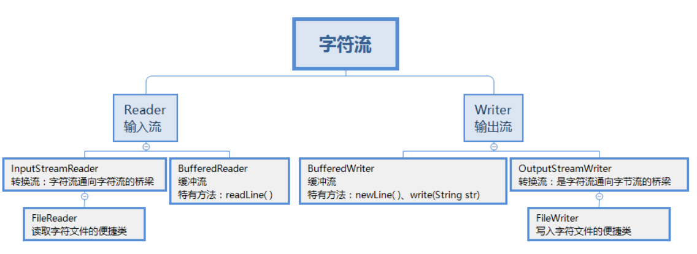
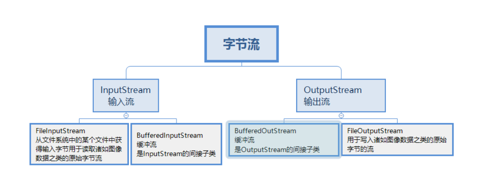

## IO综述

**“对语言设计人员来说，创建好的输入／输出系统是一项特别困难的任务。”**

​													――《Think in Java》

输入覆盖的范围太大了，文件，控制台，网络，内存等等不同的种类，而且还要处理不同的读取方式，如：顺序读取、随机读取，二进制读取、字符读取，按行读取、按字符读取……

<!--more-->

​       **Linux是第一个将设备抽象为文件的操作系统**，在Linux中所有的外部设备都可以用读取文件的方法读取，这样编程人员就可以以操作文件的方法操作任何设备。	    

​       C++则引进了流的概念，我们可以通过cin、cout读写一些对象。

​	Java语言在IO设计方面取得较大的成功，它是完全面向对象的，主要采用装饰器模式避免大量的类，包括了最大的可能性，提供了较好的扩展机制。

​       “Java库的设计者通过创建大量类来攻克这个难题。事实上，Java的IO系统采用了如此多的类，以致刚开始会产生不知从何处入手的感觉（具有讽刺意味的是，Java的IO设计初衷实际要求避免过多的类）。”Java的IO比较复杂，但如何从Java设计者的角度理解了装饰器模式（Decorator）的用意、场景及其在Java的IO包中的使用，你可能会真正领会整个IO的FrameWork。

​	HH 上面的一番话，反倒颇具喜感，人生又何不如此呢。往往我们处心积虑想要解决的一个问题，本以为轻轻松松完成，结果写出的代码确实一塌糊涂。这怕是全天下人的烦恼了。

#### Java流的类型

流的方向：**输入流**（inputStream）,**输出流**（OutputStream）

流的功能：**节点流**（可以从或向一个特定的地方读写数据：FileReader）**,处理流**（是对一个已存在的流的连接和封装，通过所封装的流的功能调用实现数据读写。如BufferReader。处理流的构造方法总是要带一个其他的流对象做参数。）

处理的数据：**字节流和字符流**。字节流继承于InputStream和OutputStream。字符流继承于InputStreamReader和OutputStreamWriter。

#### 字节流如何转为字符流

字节输入流转字符输入流通过**InputStreamReader**实现，该类的构造函数可以传如**InputStream**对象。

字节输出流转字符输出流通过**OutputStreamWriter**实现，该类的构造函数可以传入**OutputStream**对象

#### 字节流和字符流的区别

**字节流**读取的时候，读到**一个字节**就返回一个字节；

**字符流**使用了**字节流**读到一个或多个字节（中文对应的字节数是两个，在UTF\-8码表中是3个字节）时。先去查指定的编码表，将查到的字符返回。

字节流可以处理所有类型数据，如：图片，MP3，AVI视频文件，而字符流只能处理字符数据。只要是处理纯文本数据，就要优先考虑使用字符流，除此之外都用字节流。字节流主要是操作byte类型数据，以byte数组为准，主要操作类就是OutputStream、InputStream字符流处理的单元为2个字节的Unicode字符，分别操作字符、字符数组或字符串，而字节流处理单元为1个字节，操作字节和字节数组。所以字符流是由Java虚拟机将字节转化为2个字节的Unicode字符为单位的字符而成的，所以它对多国语言支持性比较好！如果是音频文件、图片、歌曲，就用字节流好点，如果是关系到中文（文本）的，用字符流好点。在程序中一个字符等于两个字节，java提供了Reader、Writer两个专门操作字符流的类

## 相关引用

<<Thinking In Java>>

https://blog.csdn.net/baobeisimple/article/details/1713797