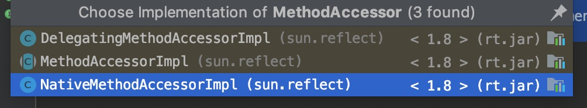

> 在Java反射机制中，获取类的方法后，使用invoke()，调用函数。
>
> 平时浏览调试代码时，很多源码都使用invoke调用函数，使我对invoke产生了好奇了，本文将深入的讲解invoke的源码。

<!--more-->

------

## 文章案例

### 创建测试代码

建立了一个A类，在Main函数中利用反射获取A类的foo函数，并对foo函数循环调用。

这里的main类并没有对A的符号依赖，因此在类加载器加载过程中，不需要加载A类，而是在TestClassLoad实例调用main方法时，对A类进行动态的装载。

```java
public class A {  
    public void foo(String name) {  
        System.out.println("Hello, " + name);  
    }  
}  


import java.lang.reflect.Method;  
  
public class TestClassLoad {  
    public static void main(String[] args) throws Exception {  
        Class<?> clz = Class.forName("A");  
        Object o = clz.newInstance();  
        Method m = clz.getMethod("foo", String.class);  
        for (int i = 0; i < 16; i++) {  
            m.invoke(o, Integer.toString(i));  
        }  
    }  
}  
```

### 执行测试代码

编译TestClassLoad类: `javac bean/TestClassLoad `

**执行并显示类加载信息**：`Java -XX:+TraceClassLoading bean.TestClassLoad    `

```java
// 省略JVM装载必备类 装载信息
[Loaded bean.A from file:/Users/ligaofeng/Java/temp/javatest/src/main/java/]
[Loaded sun.reflect.NativeMethodAccessorImpl from /Library/Java/JavaVirtualMachines/jdk1.8.0_181.jdk/Contents/Home/jre/lib/rt.jar]
[Loaded sun.reflect.DelegatingMethodAccessorImpl from /Library/Java/JavaVirtualMachines/jdk1.8.0_181.jdk/Contents/Home/jre/lib/rt.jar]
Hello, 0
Hello, 1
Hello, 2
Hello, 3
Hello, 4
Hello, 5
Hello, 6
Hello, 7
Hello, 8
Hello, 9
Hello, 10
Hello, 11
Hello, 12
Hello, 13
Hello, 14
[Loaded sun.reflect.ClassFileConstants from /Library/Java/JavaVirtualMachines/jdk1.8.0_181.jdk/Contents/Home/jre/lib/rt.jar]
[Loaded sun.reflect.AccessorGenerator from /Library/Java/JavaVirtualMachines/jdk1.8.0_181.jdk/Contents/Home/jre/lib/rt.jar]
[Loaded sun.reflect.MethodAccessorGenerator from /Library/Java/JavaVirtualMachines/jdk1.8.0_181.jdk/Contents/Home/jre/lib/rt.jar]
[Loaded sun.reflect.ByteVectorFactory from /Library/Java/JavaVirtualMachines/jdk1.8.0_181.jdk/Contents/Home/jre/lib/rt.jar]
[Loaded sun.reflect.ByteVector from /Library/Java/JavaVirtualMachines/jdk1.8.0_181.jdk/Contents/Home/jre/lib/rt.jar]
[Loaded sun.reflect.ByteVectorImpl from /Library/Java/JavaVirtualMachines/jdk1.8.0_181.jdk/Contents/Home/jre/lib/rt.jar]
[Loaded sun.reflect.ClassFileAssembler from /Library/Java/JavaVirtualMachines/jdk1.8.0_181.jdk/Contents/Home/jre/lib/rt.jar]
[Loaded sun.reflect.UTF8 from /Library/Java/JavaVirtualMachines/jdk1.8.0_181.jdk/Contents/Home/jre/lib/rt.jar]
[Loaded sun.reflect.Label from /Library/Java/JavaVirtualMachines/jdk1.8.0_181.jdk/Contents/Home/jre/lib/rt.jar]
[Loaded sun.reflect.Label$PatchInfo from /Library/Java/JavaVirtualMachines/jdk1.8.0_181.jdk/Contents/Home/jre/lib/rt.jar]
[Loaded java.util.ArrayList$Itr from /Library/Java/JavaVirtualMachines/jdk1.8.0_181.jdk/Contents/Home/jre/lib/rt.jar]
[Loaded sun.reflect.MethodAccessorGenerator$1 from /Library/Java/JavaVirtualMachines/jdk1.8.0_181.jdk/Contents/Home/jre/lib/rt.jar]
[Loaded sun.reflect.ClassDefiner from /Library/Java/JavaVirtualMachines/jdk1.8.0_181.jdk/Contents/Home/jre/lib/rt.jar]
[Loaded sun.reflect.ClassDefiner$1 from /Library/Java/JavaVirtualMachines/jdk1.8.0_181.jdk/Contents/Home/jre/lib/rt.jar]
[Loaded java.util.concurrent.ConcurrentHashMap$ForwardingNode from /Library/Java/JavaVirtualMachines/jdk1.8.0_181.jdk/Contents/Home/jre/lib/rt.jar]
[Loaded sun.reflect.GeneratedMethodAccessor1 from __JVM_DefineClass__]
Hello, 15

```

首先代码中按名反射按名查找了A类，因此加载A类，然后加载了DelegatingMethodAccessorImpl，NativeMethodAccessorImpl类，执行了代码。

在循环走过15次后，装载一大堆类，然后又执行了。

这里大家就会觉得奇怪，为什么循环输出的一模一样的函数，会突然加载这么多类。那就看接下来的分析。

------


## 实例分析

### method类invoke方法

首先来到method的invoke方法实现上。

```java
 	 private volatile MethodAccessor methodAccessor;
    // For sharing of MethodAccessors. This branching structure is
    // currently only two levels deep (i.e., one root Method and
    // potentially many Method objects pointing to it.)
    //
    // If this branching structure would ever contain cycles, deadlocks can
    // occur in annotation code.
    private Method              root;

	
	@CallerSensitive
    public Object invoke(Object obj, Object... args)
        throws IllegalAccessException, IllegalArgumentException,
           InvocationTargetException
    {
        if (!override) {
            if (!Reflection.quickCheckMemberAccess(clazz, modifiers)) {
                Class<?> caller = Reflection.getCallerClass();
                checkAccess(caller, clazz, obj, modifiers);
            }
        }
        MethodAccessor ma = methodAccessor;             // read volatile
        if (ma == null) {
            ma = acquireMethodAccessor();
        }
        return ma.invoke(obj, args);
    }
    
	// NOTE that there is no synchronization used here. It is correct
    // (though not efficient) to generate more than one MethodAccessor
    // for a given Method. However, avoiding synchronization will
    // probably make the implementation more scalable.
    private MethodAccessor acquireMethodAccessor() {
        // First check to see if one has been created yet, and take it
        // if so
        MethodAccessor tmp = null;
        if (root != null) tmp = root.getMethodAccessor();
        if (tmp != null) {
            methodAccessor = tmp;
        } else {
            // Otherwise fabricate one and propagate it up to the root
            tmp = reflectionFactory.newMethodAccessor(this);
            setMethodAccessor(tmp);
        }

        return tmp;
    }

    // Returns MethodAccessor for this Method object, not looking up
    // the chain to the root
    MethodAccessor getMethodAccessor() {
        return methodAccessor;
    }

    // Sets the MethodAccessor for this Method object and
    // (recursively) its root
    void setMethodAccessor(MethodAccessor accessor) {
        methodAccessor = accessor;
        // Propagate up
        if (root != null) {
            root.setMethodAccessor(accessor);
        }
    }
```

可以看到Method.invoke()实际上并不是自己实现的反射调用逻辑，而是委托给sun.reflect.MethodAccessor来处理。 
每个实际的Java方法只有一个对应的Method对象作为root。这个root是不会暴露给用户的，而是每次在通过反射获取Method对象时新创建Method对象把root包装起来再给用户。在第一次调用一个实际Java方法对应得Method对象的invoke()方法之前，实现调用逻辑的MethodAccessor对象还没创建；等第一次调用时才新创建MethodAccessor并更新给root，然后调用MethodAccessor.invoke()真正完成反射调用。 

### MethodAccessor是什么

MethodAccessor只是一个空接口, 声明了inovke方法同Method类的invoke方法。

```java
public interface MethodAccessor {
    Object invoke(Object var1, Object[] var2) throws IllegalArgumentException, InvocationTargetException;
}
```



总共有三个接口继承了MethodAccessot，其中MethodAccessorImpl是抽象类，NativeMethodAccessorImpl和DelegatingMethodAccessotImpl继承了MethodAccessImpl。

### MethodAccessor工厂

在Method类中，是由`reflectionFactory.newMethodAccessor(this);`来获取MethodAccessor实例的。

```java
private static boolean initted = false;  
      
//  
// "Inflation" mechanism. Loading bytecodes to implement  
// Method.invoke() and Constructor.newInstance() currently costs  
// 3-4x more than an invocation via native code for the first  
// invocation (though subsequent invocations have been benchmarked  
// to be over 20x faster). Unfortunately this cost increases  
// startup time for certain applications that use reflection  
// intensively (but only once per class) to bootstrap themselves.  
// To avoid this penalty we reuse the existing JVM entry points  
// for the first few invocations of Methods and Constructors and  
// then switch to the bytecode-based implementations.  
//  
// Package-private to be accessible to NativeMethodAccessorImpl  
// and NativeConstructorAccessorImpl  
private static boolean noInflation        = false;  
private static int     inflationThreshold = 15;  

public MethodAccessor newMethodAccessor(Method var1) {
    	// 检查初始配置是否被加载
        checkInitted();
        if (noInflation && !ReflectUtil.isVMAnonymousClass(var1.getDeclaringClass())) {
            return (new MethodAccessorGenerator()).generateMethod(var1.getDeclaringClass(), var1.getName(), var1.getParameterTypes(), var1.getReturnType(), var1.getExceptionTypes(), var1.getModifiers());
        } else {
            NativeMethodAccessorImpl var2 = new NativeMethodAccessorImpl(var1);
            DelegatingMethodAccessorImpl var3 = new DelegatingMethodAccessorImpl(var2);
            var2.setParent(var3);
            return var3;
        }
    }
private static void checkInitted() {
        if (!initted) {
            AccessController.doPrivileged(new PrivilegedAction<Void>() {
                public Void run() {
                    if (System.out == null) {
                        return null;
                    } else {
                        String var1 = System.getProperty("sun.reflect.noInflation");
                        if (var1 != null && var1.equals("true")) {
                            ReflectionFactory.noInflation = true;
                        }

                        var1 = System.getProperty("sun.reflect.inflationThreshold");
                        if (var1 != null) {
                            try {
                                ReflectionFactory.inflationThreshold = Integer.parseInt(var1);
                            } catch (NumberFormatException var3) {
                                throw new RuntimeException("Unable to parse property sun.reflect.inflationThreshold", var3);
                            }
                        }

                        ReflectionFactory.initted = true;
                        return null;
                    }
                }
            });
        }
    }
```

注释已经描述的很清楚了，MethodAccessor实现由两个版本

* java字节码版本
* Native方法版本

Java字节码版本的处理速度会更快，大概是Native方法的20倍，但是需要装载字节码。**处理快，装载慢。**

Native方法的启动速度比Java字节码快3-4倍，而且在Jvm启动阶段，有很多需要使用反射的地方。**处理慢，启动快。**

这是HotSpot的优化方式带来的性能特性，同时也是许多虚拟机的共同点：跨越native边界会对优化有阻碍作用，它就像个黑箱一样让虚拟机难以分析也将其内联，于是运行时间长了之后反而是托管版本的代码更快些。 
为了权衡两个版本的性能，Sun的JDK使用了“inflation”的技巧：让Java方法在被反射调用时，开头若干次使用native版，等反射调用次数超过阈值时则生成一个专用的MethodAccessor实现类，生成其中的invoke()方法的字节码，以后对该Java方法的反射调用就会使用Java版。 
Sun的JDK是从1.4系开始采用这种优化的，主要作者是[Ken Russell](http://blogs.sun.com/kbr/entry/brief_introduction) 

### sun.reflect.DelegatingMethodAccessorImpl

```java
/** Delegates its invocation to another MethodAccessorImpl and can 
    change its delegate at run time. */  

package sun.reflect;

import java.lang.reflect.InvocationTargetException;

class DelegatingMethodAccessorImpl extends MethodAccessorImpl {
    private MethodAccessorImpl delegate;

    DelegatingMethodAccessorImpl(MethodAccessorImpl var1) {
        this.setDelegate(var1);
    }

    public Object invoke(Object var1, Object[] var2) throws IllegalArgumentException, InvocationTargetException {
        return this.delegate.invoke(var1, var2);
    }

    void setDelegate(MethodAccessorImpl var1) {
        this.delegate = var1;
    }
}
```

### sun.reflect.NativeMethodAccessorImpl

```java
class NativeMethodAccessorImpl extends MethodAccessorImpl {
    private final Method method;
    private DelegatingMethodAccessorImpl parent;
    private int numInvocations;

    NativeMethodAccessorImpl(Method var1) {
        this.method = var1;
    }

    public Object invoke(Object var1, Object[] var2) throws IllegalArgumentException, InvocationTargetException {
        if (++this.numInvocations > ReflectionFactory.inflationThreshold() && !ReflectUtil.isVMAnonymousClass(this.method.getDeclaringClass())) {
            MethodAccessorImpl var3 = (MethodAccessorImpl)(new MethodAccessorGenerator()).generateMethod(this.method.getDeclaringClass(), this.method.getName(), this.method.getParameterTypes(), this.method.getReturnType(), this.method.getExceptionTypes(), this.method.getModifiers());
            this.parent.setDelegate(var3);
        }

        return invoke0(this.method, var1, var2);
    }

    void setParent(DelegatingMethodAccessorImpl var1) {
        this.parent = var1;
    }

    private static native Object invoke0(Method var0, Object var1, Object[] var2);
}
```

每次NativeMethodAccessorImpl.invoke()方法被调用时，都会增加一个调用次数计数器，看超过阈值没有；一旦超过，则调用**MethodAccessorGenerator.generateMethod()来生成Java版的MethodAccessor的实现类**，并且改变DelegatingMethodAccessorImpl所引用的MethodAccessor为Java版。后续经由DelegatingMethodAccessorImpl.invoke()调用到的就是Java版的实现了。

注意到关键的invoke0()方法是个native方法。它在HotSpot VM里是由JVM_InvokeMethod()函数所支持的。

### MethodAccessorGenerator

这里的代码非常多，慢慢一个个function拼装出了MethodAccessorImpl类，这里举例一个generateName类。

```java
private static synchronized String generateName(boolean isConstructor,  
                                                boolean forSerialization)  
{  
    if (isConstructor) {  
        if (forSerialization) {  
            int num = ++serializationConstructorSymnum;  
            return "sun/reflect/GeneratedSerializationConstructorAccessor" + num;  
        } else {  
            int num = ++constructorSymnum;  
            return "sun/reflect/GeneratedConstructorAccessor" + num;  
        }  
    } else {  
        int num = ++methodSymnum;  
        return "sun/reflect/GeneratedMethodAccessor" + num;  
    }  
}  
```

从名字的创建也能看出来，为什么会看到GeneratorMethodAccessor+数字的组合了

### 最终版本 

在开头的案例中，Java最终生成的MethodAccessorImpl实例大概是这样。

```java
package sun.reflect;  
  
public class GeneratedMethodAccessor1 extends MethodAccessorImpl {      
    public GeneratedMethodAccessor1() {  
        super();  
    }  
      
    public Object invoke(Object obj, Object[] args)     
        throws IllegalArgumentException, InvocationTargetException {  
        // prepare the target and parameters  
        if (obj == null) throw new NullPointerException();  
        try {  
            A target = (A) obj;  
            if (args.length != 1) throw new IllegalArgumentException(); 
            // 拆解参数为入参时的类型 而非Object[]
            String arg0 = (String) args[0];  
        } catch (ClassCastException e) {  
            throw new IllegalArgumentException(e.toString());  
        } catch (NullPointerException e) {  
            throw new IllegalArgumentException(e.toString());  
        }  
        // make the invocation  
        try {  
            target.foo(arg0);  
        } catch (Throwable t) {  
            throw new InvocationTargetException(t);  
        }  
    }  
}  
```

就反射调用而言，这个invoke()方法非常干净（然而就“正常调用”而言这额外开销还是明显的）。注意到参数数组被拆开了，把每个参数都恢复到原本没有被Object[]包装前的样子，然后对目标方法做正常的invokevirtual调用。由于在生成代码时已经循环遍历过参数类型的数组，生成出来的代码里就不再包含循环了。 

### Native方法

在默认15次调用前都是使用Native方法，这些Java 自举 C C++相关的native方法实现，暂时不去研究，等日后水平提高了再来补上。

------


## 相关资料

[关于反射调用方法的一个log](https://rednaxelafx.iteye.com/blog/548536)