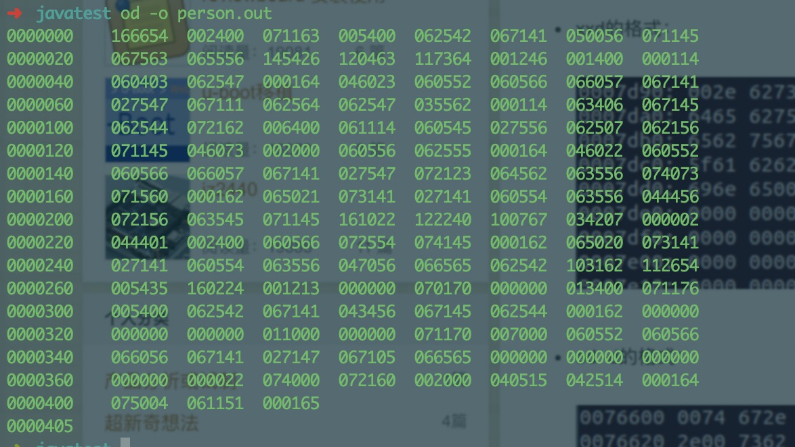

> 在Java程序运行期间，JVM运行时间长于对象存活时间，使用Java序列化机制可以将**对象序列化成二进制字节码**存储在文件之中，待下次启动时重新读取。序列化对象时保存的是对象的状态，即为他的成员变量，不会关注类中的静态变量。
>
> Java程序**RPC调用**时或通过**网络传输对象**，都需要将对象序列化进行传输，接收方再对对象反序列化。(数据在网络中只能以二进制传输)

<!--more-->

------

## Java序列化案例

```Java
package bean;

import java.io.Serializable;

// Person对象 继承Serializable对象
public class Person implements Serializable {
    private String name = null;

    private Integer age = null;

    private Gender gender = null;

    public Person() {
        System.out.println("none-arg constructor");
    }

    public Person(String name, Integer age, Gender gender) {
        System.out.println("arg constructor");
        this.name = name;
        this.age = age;
        this.gender = gender;
    }

    @Override
    public String toString() {
        return name+" "+age+" "+gender;
    }
}

```

```java
import bean.Gender;
import bean.Person;

import java.io.*;

public class main {
    public static void main(String[] args) throws Exception {
        Person person = new Person("zibu",23, Gender.MALE);
        File file = new File("person.out");
        ObjectOutputStream os = new ObjectOutputStream(new FileOutputStream(file));
        os.writeObject(person);
        os.close();

        ObjectInputStream objectInputStream = new ObjectInputStream(new FileInputStream(file));
        Object newPerson = objectInputStream.readObject();
        objectInputStream.close();
        System.out.println(newPerson);
    }
}
// arg constructor
// zibu 23 MALE
```

创建Java对象Person,使用ObjectOutputStream输出到文件中去。再使用ObjectInputStream读取文件中的参数反序列化为Person对象输出。

> Tips: 此处反序列化Person对象时，并没有调用构造函数，直接将字节码还原成对象。
>
> 字节码中存储了Java类的位置，会自动去寻找匹配反序列化，若该类文件不存在，则会报出ClassNotFoundException。



上图为：person对象输出

## 序列化知识点

### 默认序列化机制

当一个类实现了Serializable接口，而没有其他处理时，默认使用序列化机制。使用默认机制，在序列化对象时，不仅会序列化当前对象，对其**所引用的其他对象**也会**序列化**。以此类推，当序列化容器类对象时，可能会产生较大开销。

若引用对象不可序列化，则报出`java.io.NotSerializableException`异常。

### 序列化及反序列化相关知识点

1、在Java中，只要一个类实现了`java.io.Serializable`接口，那么它就可以被序列化。

2、通过`ObjectOutputStream`和`ObjectInputStream`对对象进行序列化及反序列化

3、虚拟机是否允许反序列化，不仅取决于类路径和功能代码是否一致，一个非常重要的一点是两个类的序列化 ID 是否一致（就是 `private static final long serialVersionUID`）

4、序列化并**不保存静态变量**。

5、要想将父类对象也序列化，就需要让父类也实现`Serializable` 接口。

6、Transient 关键字的作用是控制变量的序列化，在变量声明前加上该关键字，可以阻止该变量被序列化到文件中，在被反序列化后，**transient 变量的值被设为初始值**，如 int 型的是 0，对象型的是 null。

------


## 影响序列化机制

### transient关键字

```java
transient private Integer age = null;

// zibu null MALE 
```

transient关键字所标注成员变量，不可被序列化，反序列化时，会默认设置为初始值，对象为null，基本类型为默认值。

### writeObject()、readObject()方法

### 可以通过类中自定义writeObject\readObject方法来实现，自定义序列化方式的作用

```java
public class Person implements Serializable {
    //省略部分代码 
    transient private Integer age = null;
    
    //重写write/read方法
    private void writeObject(ObjectOutputStream out) throws IOException {
        out.defaultWriteObject();
        out.writeInt(age);
    }

    private void readObject(ObjectInputStream in) throws IOException, ClassNotFoundException {
        in.defaultReadObject();
        age = in.readInt();
    }
}
```

在writeObject()方法中会先调用ObjectOutputStream中的defaultWriteObject()方法，该方法会执行默认的序列化机制，会忽略掉age字段。然后再调用writeInt()方法显示地将age字段写入到ObjectOutputStream中。readObject()的作用则是针对对象的读取，其原理与writeObject()方法相同。

ObjectOutputStream中的writeSerialData方法，以及ObjectInputStream中的readSerialData方法实现了判断调用重写逻辑

```java
private void writeSerialData(Object obj, ObjectStreamClass desc)
        throws IOException
    {
        ObjectStreamClass.ClassDataSlot[] slots = desc.getClassDataLayout();
        for (int i = 0; i < slots.length; i++) {
            ObjectStreamClass slotDesc = slots[i].desc;
            // 判断是否重写writeObject方法
            if (slotDesc.hasWriteObjectMethod()) {
                PutFieldImpl oldPut = curPut;
                curPut = null;
                SerialCallbackContext oldContext = curContext;

                if (extendedDebugInfo) {
                    debugInfoStack.push(
                        "custom writeObject data (class \"" +
                        slotDesc.getName() + "\")");
                }
                try {
                    curContext = new SerialCallbackContext(obj, slotDesc);
                    bout.setBlockDataMode(true);
                    // 调用object 的writeObject方法
                    slotDesc.invokeWriteObject(obj, this);
                    bout.setBlockDataMode(false);
                    bout.writeByte(TC_ENDBLOCKDATA);
                } finally {
                    curContext.setUsed();
                    curContext = oldContext;
                    if (extendedDebugInfo) {
                        debugInfoStack.pop();
                    }
                }

                curPut = oldPut;
            } else {
                defaultWriteFields(obj, slotDesc);
            }
        }
    }
```

### Externalizable接口

若使用Externalizable接口来实现序列化，使用后基于Serializable的默认序列化机制将失效，需要手动重写下面两个方法来实现序列化。

使用该接口来实现序列化时，反序列化时，会创建对象的无参构造函数，然后往内填充数据，因此，实现Externalizable接口的类需要实现无参构造器，且访问权限为public。

```java
	@Override
    public void writeExternal(ObjectOutput out) throws IOException {

    }

    @Override
    public void readExternal(ObjectInput in) throws IOException, ClassNotFoundException {

    }
```

#### readResolve()方法

当使用单例模式时，由于反序列化的实现由JVM底层实现(不太理解，此处贴一个博客)，会绕过反射和构造器，获取的对象非单例，因此需要重写readResolve()来获取单例。

[反序列化源码解析](https://moon-walker.iteye.com/blog/2376922)

```java
public class Person implements Serializable {

    private static class InstanceHolder {
        private static final Person instatnce = new Person("John", 31, Gender.MALE);
    }

    public static Person getInstance() {
        return InstanceHolder.instatnce;
    }

    private String name = null;

    private Integer age = null;

    private Gender gender = null;

    private Person() {
        System.out.println("none-arg constructor");
    }

    private Person(String name, Integer age, Gender gender) {
        System.out.println("arg constructor");
        this.name = name;
        this.age = age;
        this.gender = gender;
    }
	private Object readResolve() throws ObjectStreamException {
    	return InstanceHolder.instatnce;
	}
}
```

实际实现上，无论Serializable接口或是Externalizable接口，当从I/O流读取对象时，readResolve()会**替换掉反序列化所生成的对象**。

------


## ArrayList的序列化回顾

```java
public class ArrayList<E> extends AbstractList<E>
        implements List<E>, RandomAccess, Cloneable, java.io.Serializable
{
    private static final long serialVersionUID = 8683452581122892189L;
    transient Object[] elementData; // non-private to simplify nested class access
    private int size;
}
```

ArrayList是由数组实现的，而且继承了Serializable接口可实现序列化。它将成员变量数组隐藏，重写readObject和writeObject方法，来自定义序列化成员变量。

```java
 private void writeObject(java.io.ObjectOutputStream s)
        throws java.io.IOException{
        // Write out element count, and any hidden stuff
        int expectedModCount = modCount;
        s.defaultWriteObject();

        // Write out size as capacity for behavioural compatibility with clone()
        s.writeInt(size);

        // Write out all elements in the proper order.
        for (int i=0; i<size; i++) {
            s.writeObject(elementData[i]);
        }

        if (modCount != expectedModCount) {
            throw new ConcurrentModificationException();
        }
    }

   private void readObject(java.io.ObjectInputStream s)
        throws java.io.IOException, ClassNotFoundException {
        elementData = EMPTY_ELEMENTDATA;

        // Read in size, and any hidden stuff
        s.defaultReadObject();

        // Read in capacity
        s.readInt(); // ignored

        if (size > 0) {
            // be like clone(), allocate array based upon size not capacity
            int capacity = calculateCapacity(elementData, size);
            SharedSecrets.getJavaOISAccess().checkArray(s, Object[].class, capacity);
            ensureCapacityInternal(size);

            Object[] a = elementData;
            // Read in all elements in the proper order.
            for (int i=0; i<size; i++) {
                a[i] = s.readObject();
            }
        }
    }
```

由于ArrayList是动态扩展的，实际容量大于成员变量个数。若默认使用Serializable接口来序列化，会反序列化出大量的null,影响效率。

从ArrayList中，我们可以看到transient 和read/wirteObject在实际中的组合应用。

------


## 父类与子类的序列化

### 父类:继承序列化 子类:不继承

可以正常运行，父类implement Serialzable，子类 extends 父类。同样也实现了序列化

### 父类:不继承序列化 子类:继承序列化

父类**需要有默认无参构造器**，子类可正常运行，父类参数默认全为transient.

父类不存在无参构造器，报构造器错误异常。

在父类没有实现 Serializable 接口时，虚拟机是不会序列化父对象的，而一个 Java 对象的构造必须先有父对象，才有子对象，反序列化也不例外。所以**反序列化时**，为了构造父对象，只能**调用父类的无参构造函数作为默认的父对象**。因此当我们取父对象的变量值时，它的值是调用父类无参构造函数后的值。如果你考虑到这种序列化的情况，在父类无参构造函数中对变量进行初始化，否则的话，父类变量值都是默认声明的值，如 int 型的默认是 0，string 型的默认是 null。