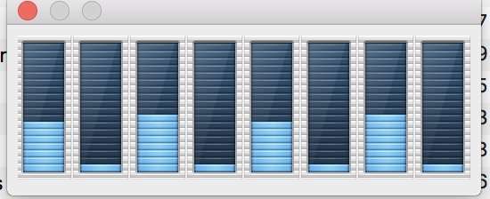

> 初稿：对最近所学的操作系统进程调度相关内容 做一个总结 2016/11
>
> 第一次修改：修改了部分文中理解错误。2018/9

<!--more-->

## 计算机CPU运行调度发展

#### CPU: 

​	 中央处理器，作为计算机的大脑，第一块Intel4004型号CPU的出现宣告了CPU时代的到来，虽然最早的CPU仅仅继承了2300多只的晶体管计算能力有限，但是由于其高度的集成性，毫无疑问开创了CPU运算时代的到来。	在接下来的发展过程中不断提高单核速度，再单核性能达到极致时，开始发展多核，直至今日。

#### 进程，线程:

​	在最早的CPU调度中，需要多个程序同时运行时，一个程序如果运行时间过长，系统就像失去响应，因此出现了时间片轮转调度，每个程序轮流执行，这就是**并发**。

​	程序轮流执行，但是当程序切换的时候，后一个程序操作内存，寄存器，PC等资源时，会覆盖上一个程序的操作，因此需要保护程序操作的现场，实现上下文切换，这就引出了**进程**的概念，每个程序就是一个进程，拥有一个**进程控制块PCB和一个独立的虚拟地址空间**。由**进程表和虚拟内存**等结构来**存储控制进程的运行切换**。

​	但是有了进程的轮流调度以后，随之而来的就是高昂的进程切换开销，因为按照时间片轮转的情况下，当一个进程被IO阻塞时，OS就会执行下一个进程，除了IO阻塞还有时钟阻塞，而**进程切换需要进入内核态**，置换进程表状态，当进程切换频繁时大量的资源都花费在了进程切换上。因此有了线程的概念，一个进程又有多个线程，当一个线程阻塞时，能够启用另一个线程。**因此线程是cpu独立运行和独立调度的基本单位（共享一个虚拟地址空间，具有独立的栈和程序计步器PC）**。由于共享一个虚拟地址空间，所以**线程切换不需要切换页表刷新TLB**，**只需要刷新寄存器**，效率得到提高。

​	线程分为**内核级线程**（默认的线程）和**用户级线程**（协程）。操作系统能够感知内核级线程，并对线程进行调度，而对于用户级线程，**操作系统以进程为单位分配时间片**，但是在**进程内部**，有协程调度程序对协程进行调度**，每个时刻，**单个CPU只有一个线程在活动(不考虑超线程)

#### 协程Coroutine：

​	**协程就是用户态的线程**，系统级线程的切换由系统控制，协程的切换可以由**协程调度器**控制，而不需要系统控制，因此协程的内存消耗极小。如果需要SystemCall 则单独创建线程执行，协程之间需要主动让步（yield），但调度器也会在检测死循环和异步等情况时，主动让步该协程。

​	协程实际上串行执行的，因此**不需要上锁和同步的开销，也无需线程切换的开销**。

​	协程是纯软件层面的多任务，理论上没有上线，通过协程的使用，**原本复杂的异步回调代码可以由串行模式来组织**，更为直观。

## 单核的进程调度

**问题分析：**

　　一个应用就是一个进程，一个进程存在多个线程。而一个运行良好的操作系统，存在着数十上百的系统服务，系统服务需要较高的优先级来调用，来保证操作系统的稳定运行，因此操作系统的调度 肯定是需要优先级的参与的。

　　在实际过程中，进程需要CPU时常分配运算资源，因此轮转调度也是必须的，防止一个进程过度占用CPU资源，否则一个进程如长期得不到执行，可能会影响使用体验。

　　由于系统服务的特殊性，操作系统的调度算法必须是抢占性的。

**总结：**

　　因此在单个CPU下往往使用的综合的**多级反馈队列调度**。**根据优先级的高低，分配为多个队列**，**优先级队列进行优先级调度**而**普通队列进行轮转调度**。然后对部分过高占有进程予以**老化**，降低其优先级。

　　如果有多个CPU，则负载分配成为可能，同时相应的调度问题也变得更为复杂。与单处理器的CPU调度一样没有最好的调度算法。在多处理器上的CPU调度通常有两种方法，如下：

## 多核CPU的进程调度

**非对称多处理：**

　　让一个处理器处理所有调度决定、I/O处理以及其他系统活动，其他的处理器只执行用户代码。这种方法更简单，因为只有一个处理器访问系统数据结构，减轻了数据共享的需要。但是在实际应用过程中，用户可能会大量读取处理数据或者大量I/O发生，会发生一核有难，八核围观的尴尬。

**对称多处理（SMP）：**

　　每个处理器自我调度，调度通过**每个处理器检查共同就绪队列**并选择一个进程来执行。现**在的操作系统一般都支持这种方式。**

　　由于CPU的调度，因此一个进程通常不会在处理器上一次性执行完，中间可能会让出CPU，对于对称多处理调度方法，则有可能进程从一个处理器迁移到另外一个处理器上执行，而进程相关的数据在原处理器的缓存中，这样会导致缓存无效和重建，其代价很高；因此**绝大多数非对称系统都尽量使一个进程在同一个处理器上运行，这个被称为处理器亲和性（类似于缓存命中，非常普遍的计算机思想）**。

　　通过提供多个物理处理器，SMP系统允许同时运行几个线程。还有一种是提供多个逻辑处理器而不是物理处理器来实现，这种方法称为对称多线程（SMT）。也叫超线程技术。SMT实际上就是在一个物理处理器上生成多个逻辑处理器，向操作系统呈现一个多逻辑处理器的视图，同时每个逻辑处理器都有它自己的架构状态，包括通用的目的和机器状态寄存器。但是这种技术是需要硬件提供支持，而不是软件，硬件应该提供每个逻辑处理器的架构状态的表示和中断处理方法。

## 其他相关

　　现如今多核CPU已经成为主流，但是很多程序并没有对多核CPU进行优化，这样的程序，操作系统是如何执行的呢。在单核心的系统上，仅存在一个进程队列来运行。而多核cpu存在多个进程队列，操作系统均匀分配进程进入 不同的进程队列。(偏向于放入之前存在的进程队列，cache命中相关，因为每一个核心分别拥有属于自己的cache而每一个进程如果回到之前的核心运行，很有可能增加cache命中率，减少内存访问)


**Intel超线程技术**

　　CPU 会额外增加5%的晶体管，来模拟一个新的核心来运行。从而获得15%-30%的性能提升。他的cache，流水线等都是原来的，通过对基本寄存器的复制，来实现一个模拟的多核。一个物理核心所模拟的两颗模拟核心，并没有主从之分，他们任意一颗，在一个时间内都完全拥有流水线，和寄存器等部件。而另一个超线程核心只能使用复制的基本寄存器，完成一些非上下文相关的额外操作，进而提升性能。


​	这里我写了个简单的死循环C程序，运行查看CPU 利用率（四核心八线程）。很明显的能够发现，核心的运行是基本同步的，因为同一时间下一个物理核心只有一个逻辑核心能完全调用核心资源。 


```c
#include "stdio.h"
int main(void)
{
	while(1){
	}
	return 0;
}
```



电脑在设备管理器下看到的核心数量就是CPU的逻辑核心，而非物理核心。

在牙膏厂的挤牙膏计划中，有这么一个方法，将实际的一核心CPU通过增加寄存器等存储元件的方式，在CPU没有跑满的情况下，就可以跑出接近双核心的效率。但再CPU满载的情况下，实际的核心数量任然为一核心。