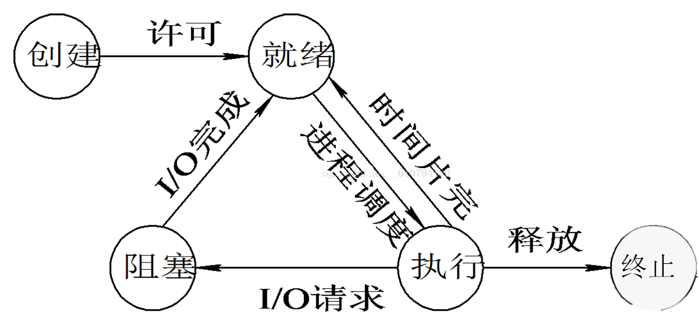

> 关于IO这方面，已经有过多次学习，但是一直不成系统，本文将作一个相对全面的总结。
>
> 同步、异步IO， 阻塞和非阻塞IO的区别
>
> select,poll,epoll的原理。

<!--more-->

## 一.概念说明

* **用户空间与内核空间**：OS将核心的操作放到kernel中，划分为用户空间和内核空间，需要执行内核空间的中的操作时，需要Trap进入内核态。又称管态和目态。
* **进程切换**：现代OS通过分时优先级的操作方式，控制进程的切换。然而进程切换需要消耗大量CPU资源。详见文章OS_单核到多核的进程调度。
* **进程状态切换**：运行态的进程，当请求资源失败或等待操作完成时，会执行阻塞原语Block进入阻塞态。进程主动进行



* **缓存IO**：又称为标准IO，在Linux的缓存IO机制中，OS会将IO的数据缓存在文件系统的页缓存（Page Cache）中，数据会被先拷贝到内核的缓存区中，然后再拷贝到应用程序的地址空间。

## 二.IO模式

对于一次IO访问，以read为例，数据会被先拷贝到OSkernel的缓存区中，然后才会从OSKernel的缓存区拷贝到应用程序的地址空间。所以说，当一个read操作发生时，它会经历两个阶段：
1. 等待数据准备 (Waiting for the data to be ready)
2. 将数据从内核拷贝到进程中 (Copying the data from the kernel to the process)

因此，Linux系统产生了以下的几种网络模式的方案

#### 2.1 阻塞IO(Blocking IO)


用户进程调用recvfrom这个系统调用，kernel进入IO第一阶段：准备数据。用户进程进入阻塞态，当缓存数据足够时，拷贝缓存数据到用户内存，kernel返回结果，用户进程才解除block状态，进入就绪态。

Blocking IO:用户进程在两个阶段都被Block了。

> Tips: 一次网络请求结束后，或者缓存大小到一定程度时，才会返回。
>
> ​          在阻塞IO中，用户线程在数据准备和数据拷贝阶段都被阻塞。

#### 2.2非阻塞IO(Non-blocking IO)


如图所示，非阻塞IO发送recvfrom请求后,若Kernel没有数据准备好，直接返回EWOULDBLOCK。

用户进程收到后，不阻塞，继续请求Kernel，直至数据准备好，read操作转移数据到用户内存，然后返回。

> 简而言之：非阻塞IO就是不断询问Kernel

#### 2.3 IO多路复用(IO Multiplexing)


讲完了阻塞和非阻塞的调用，大家就会发现，大量的进程都需要来读取网络IOBuffer,性能消耗其实很大的。这个时候就应该独立出一个模块来集中负责处理IO调用，这就是IO多路复用，也称为Event Driven IO。

上图中，用户线程调用Select操作后阻塞，Select作为一个处理进程，不断轮询Kernel缓存区状态。当访问到任一Socket数据准备完成后，通知用户进程，调用recefrom操作，读取并拷贝对应内核缓冲区数据到内存中。

> Tips:在IO多路复用的模式中，Socket是被设置为非阻塞的, 因此用户进程在调用recefrom并不会被阻塞，而是调用Select后被阻塞。

#### **Asynchronous I/O** 异步IO


异步IO,使用频率低（原因不清楚，我觉得挺好用的）

用户进程发起read后，Kernel收到asynchronous read后，直接返回，不阻塞用户进程。等到数据准备完成后，拷贝数据到用户进程内存空间，完成后发送deliver signal。告诉用户进程操作完成。

####  Signal Driven IO 

不常用，不予介绍。

#### 总结

1. **BlockingIO/Non BlockingIO区别：**BlockingIO会阻塞IO直至完成，NonBlockingIO当数据未准备完成时，会立即返回。

2. **Synchronous IO / Asynchronous IO的区别：**首先要明确同步和异步的概念，在POSIX的定义中。 

   > A synchronous I/O operation causes the requesting process to be blocked until that I/O operation completes;
   >
   > An asynchronous I/O operation does not cause the requesting process to be blocked;

   同步IO在IO操作时，会阻塞请求进程。因此BlockingIO和IO Multiplexing都是同步IO。

   Non-Blocking IO也算同步IO，因为在数据未完成前，会直接返回，但是数据若完成，读写内核缓冲数据到用户进程内存空间中时会阻塞。因此也算同步IO。

   只用AsynchronousIO 全称不需要自己操作，直至Kernel发送Singal。全程无阻塞算异步IO。

#### 比较


1. **Blocking IO** :  发送receform请求，被阻塞，直至完成，读取数据，返回。

2. **NonBlocking IO:** 不停Check，直至成功，调用 recefrom读取数据。
3. **IO Multiplexing**: 执行Check, 由Select轮询Socket,当某一Socket准备完毕，返回。用户线程执行Recefrom读取数据。
4. **Asynchronous IO**:发送请求，内核自动读取数据放到内存，发送Signal，告知用户线程。

## 三.IO多路复用详解

select, poll, epoll都是IO多路复用的机制。IO多路复用简而言之就是一个进程监视多个描述符，一但一个描述符就绪（读或写就绪），通知用户进程进行相关操作。最后的读写操作都是用户进程实现的，因此为同步IO,只有异步IO，自己不负责实现，故为异步。

#### select

```c
int select (int n, fd_set *readfds, fd_set *writefds, fd_set *exceptfds, struct timeval *timeout);
```

select 函数监视的文件描述符分3类，分别是writefds、readfds、和exceptfds。调用后select函数会阻塞，直到有描述副就绪（有数据 可读、可写、或者有except），或者超时（timeout指定等待时间，如果立即返回设为null即可），函数返回。当select函数返回后，可以 通过遍历fdset，来找到就绪的描述符。

select目前几乎在所有的平台上支持，其良好跨平台支持也是它的一个优点。select的一 个缺点在于单个进程能够监视的文件描述符的数量存在最大限制，在Linux上一般为1024，可以通过修改宏定义甚至重新编译内核的方式提升这一限制，但 是这样也会造成效率的降低。

#### poll

```c
int poll (struct pollfd *fds, unsigned int nfds, int timeout);
struct pollfd {
    int fd; /* file descriptor */
    short events; /* requested events to watch */
    short revents; /* returned events witnessed */
};
```

不同与select使用三个位图来表示三个fdset的方式，poll使用一个 pollfd的指针实现。

pollfd结构包含了要监视的event和发生的event，不再使用select“参数-值”传递的方式。同时，pollfd并没有最大数量限制（但是数量过大后性能也是会下降）。 和select函数一样，poll返回后，需要轮询pollfd来获取就绪的描述符。

> 从上面看，select和poll都需要在返回后，`通过遍历文件描述符来获取已经就绪的socket`。事实上，同时连接的大量客户端在一时刻可能只有很少的处于就绪状态，因此随着监视的描述符数量的增长，其效率也会线性下降。

#### epoll

​	未完待续

https://segmentfault.com/a/1190000003063859?utm_source=Weibo&utm_medium=shareLink&utm_campaign=socialShare&from=timeline&isappinstalled=0#articleHeader3

https://www.zhihu.com/question/20122137/answer/14049112