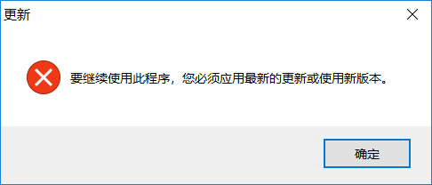

如何跳过Xshell的更新自检

<!--more-->


# 问题: 无法启动 Xshell，需要更新至最新版本

在使用 Xshell 软件时发现其弹出以下提示框，由于公司内部软件管理受限，我无法安装最新版本的 xshell，因此只能想办法解决。



网友发现XShell配置文件中写入了强制升级时间，这个版本是2017年12月27日发布的；2018年12月25日后就必须升级。

而解决办法就是修改该强制升级时间，

# 解决办法

1. 用二进制编辑器（UltraEdit、notepad++的HEX-Editor插件）打开Xshell/Xftp安装目录下的 nslicense.dll

2. 修改以下参数

   ```
   7F 0C 81 F9 80 33 E1 01 0F 86 80
   替换为：
   7F 0C 81 F9 80 33 E1 01 0F 83 80
   ```

3. 保存退出即可

> 注：直接打开nslincense.dll可能没有编辑权限，可以copy一份到其他地方，然后进行修改，再将修改后的dll文件替换掉Xshell、Xftp安装目录下的dll

 

本文适用于Xsehll、Xftp 5，也适用于Xshell、Xftp 6，5和6的区别仅仅在于：

版本5的十六进制串为：7F 0C 81 F9 80 33 E1 01 0F **86** 80，

版本6的十六进制串为：7F 0C 81 F9 80 33 E1 01 0F **86** 81，但不影响。


# Vim Hex 格式修改

由于公司内网根本没啥软件能用，我们只能求助万能的 vim 了。

1. 打开文件
2. :%!xxd 将文件转为16进制显示
3. 修改文件
4. :%!xxd -r 将文件转为原有格式
5. :wq 保存并退出


# Reference

[Xshell、Xftp 5、6 解决“要继续使用此程序,您必须应用最新的更新或使用新版本”](https://www.cnblogs.com/JasonCeng/p/11673999.html)

[How can I use Vim as a hex editor? ](https://vi.stackexchange.com/questions/2232/how-can-i-use-vim-as-a-hex-editor)