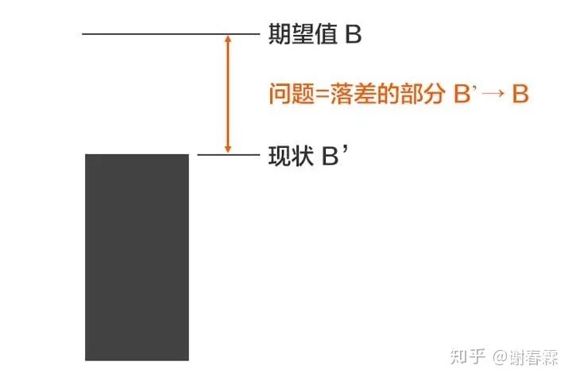
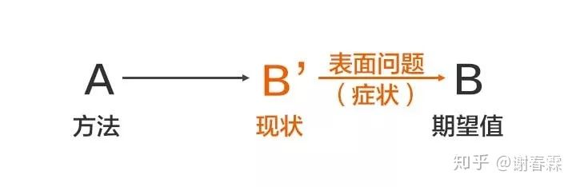
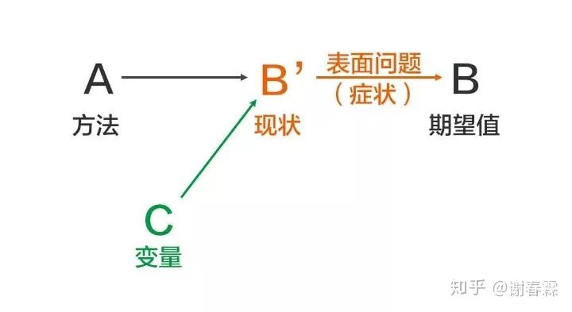
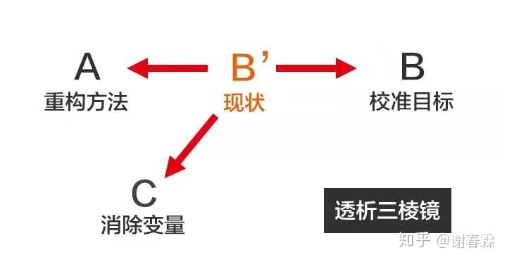

> 学习优秀的人是如何分析问题，定位问题，解决问题的思维方式。
>
> 本文是个人博文中第一篇描述个人生活，个人意识的文章。希望做一个好的开端。

<!--more-->

## 引言

不觉间毕业已经一年了，时间行到18年的岁末。感觉自毕业后，也经历了许多。从感情的发展，被欺骗的经历，工作的变动。在这段时间中，认识了许许多多的人，越发感觉到人多维发展的重要性。

从现在工作出发，程序员的工作中遇到的同事们，普遍都是以技术论高低，但是工作之中也有很多技术所不能解决的问题。人员的分配，组内同事的协作，他人情绪的变化，不同部门间的沟通。在前组长剑驰离职后，远杭的离开，小组的解散重组。带来了一系列变化。虽然在技术上有了更为长足的进步。但是仍然还是浮于表面，没有落实到深处。23岁了，更多的事即将发生，自己在情商，思维方式中需要有更多的改变和学习。了解自己，深入自己，武装自己，才能面对来自广阔的未来的挑战。

To be a better man. 

------

## 问题的本质

我们会遇到许多问题，如何精准的确认问题的本质。

那要首先界定问题的定义，**问题**就是**期望与现状的落差部分**。

假设某件事的期望值是（B），现状是（B’），那么（B'→ B）这个落差部分，就是问题。

**为什么我们常说：没有问题，就是最大的问题**

因为没有问题，并非是没有问题，只是没有一个明确的目标。甚至是不知道现状，不了解自己的掌握程度。没有目标，没有现状。自然是没有问题。

**我们所有的解决办法，都应该是围绕（B'→ B）的这个部分来展开思考的，找到落差部分，才能针对性的找到解决方案。**

------

## 如何描述一个问题

### 第一步：明确期望值（B）

什么是目标，什么是我想到到达的层次，什么是我想完成的事情。指定一个**可衡量的目标**。

### **第二步：精准定位现状（B’）**

一名优秀的程序员具备把具象世界抽象化为代码的能力。要具备如此的能力，首先就需要对这个场景具有深刻的理解认知。

在问题分析中，精准的定位现状。了解问题所处的场景也是一种能力。因为**现状是非常复杂的，多角度多维度**。在商业竞争的案例中，光说业绩数字是不够的，我们要从历史销售数据，团队人员状况，产品质量，渠道，市场环境，用户信息，竞争对手等多角度来全面描述。

**描述时需要区分事实和观点：**

我们在看待事情，都会不由自主的将自我带入进去，HH，像第一人称的小说，有更强的带入性，身临其境。第三人称小说，能更为全局的看待小说整体进程的发展，给予上帝视角。

生活中我们要以第一视角深入的理解生活，理解问题所处的场景。再以客观的角度，来分析场景。这很难，我个人很难做到，剥离自己，置身事外般精准的剖析。

举个简单的例子：

今天很冷啊!

什么是事实，什么是例子？很冷是事实吧，我人都瑟瑟发抖了。

并不是，事实上，气温已经低至0度，而我没有足够的衣物保暖。而冷则是我对于气温的主观感受。

**我们在描述现状的时候，需要用大量的「事实」来构筑，而不是「观点」。**不然现状就会变得很模糊，你也就不知道现状与期望的落差（B’→B）具体在哪里，给出的解决方案就自然会有偏差。

### **第三步：用（B'→ B）这个落差，精准描述问题**

------

## 如何寻找答案

### 错误案例，从表面问题出发

**举例**：人体温度38℃，目标体温37℃，如何到达37℃。

**分析**：这个问题已经有了目标，也描述了现状。

**解决方案**： 冰敷，直接对头部降温。

**分析**：这个解决方案的确达到了目标，但是并不是正确方案。因为实在太傻，治标不治本。虽然和这个方案很傻，但是我们在日常生活中却很常见。比如，

* 员工离职率高，那就增大招人数量
* 和恋人说话就吵架，那就不说话
* 竞争对手降价，我们的产品也跟着降价

这些都是由于解决方案从表面问题出发。没有看到问题下的本质。

**表面问题，只是由本质问题导致的症状，而我们常常把症状当成了问题本身，于是急于去消除它，而忽略了本质问题。**

### 如何寻找本质问题

**答：别盯着问题看**

首先我们制定了期望B，然后我们使用了方法A，但是只是达到了现状B'。这就产生了问题。然后我们开始分析，之所以没有达到期望，是因为出现了变量C。

现状B'的出现，是由于三个因素的共同影响所导致

* **A ：为了实现（B）的结果，所使用的方法。**如果方法是错误的，目标自然无法达到。
* **B：期望值。**目标设置不当，或者目标设定过高，那么即便完美做到了A，这个目标也无法达成；
* **C：过程中出现的变量。**方法和目标都没有问题，可是出现了意料之外的事，也有可能导致目标无法达成…

所以，要解决这个问题，不能盯着（B'→ B）看，而是要透过（B’）去看ABC，称之为「透析三棱镜」。

------

## 寻找解决方案

### 从目标出发，校准B

SMART:原则

* Specific 明确的，具体的
* Measurable 可衡量的
* Achievable 可达到的
* Rewarding 完成后有满足感的
* Time-Bound 有时间限制的

### 区分目标和手段

比如指定了一年50本书的目标，当年中的时候，我们才看了5本书，就会为了达到目标，而不顾质量的看书，即便完成了目标，也收获不大。

因为目标是目标，手段是手段，按照佛家的话说就是 着相了。

读书只是我们的手段，是为了达到什么目标而读书。

* 可能是为了提高专业技术能力
* 可能是为了考研而准备
* 可能是为了丰富自己的精神世界

要清楚的知道，我们是为了什么，而去读书。

### 重构方法，完善A

从之前冰块治感冒的例子我们就知道一件事，不能直接从B'到B，因为B'是症状是表面问题，我们要回到A来根据本质原因重新定义方法。

### 消除变量C

变量有很多种，分为内部变量和外部变量，可以找到并消除内部变量

易经有：[象，数，理]。一切的现象都有数据的支撑，而数据的变动是有其背后的道理原因的。

通过数据来分析定位变量。

------

## 小结：如何穿透现象看本质

> 谋定而后动，知止而有得
>
>  孙子曰：“兵者，国之大事也。死生之地，存亡之道，不可不察也”（《孙子·计篇》）。对于一个国家来说，战争是国家的头等大事，关系到军民的生死，国家的存亡，是不能不慎重周密地观察、分析、研究的。

**仔细的分析问题，找到问题的本质，这才是第一步。**

找到了问题的本质，从ABC出发

1. **重新制定B，根据SMART法则指定有效的B**
2. **重构A，现状是由原来的方法导致的，需要重新制定方法**
3. **消除变量C：AB都没问题，就要从C下手。**

------

## 相关资料

[厉害的人是怎么分析问题的？](https://www.zhihu.com/question/304174916)