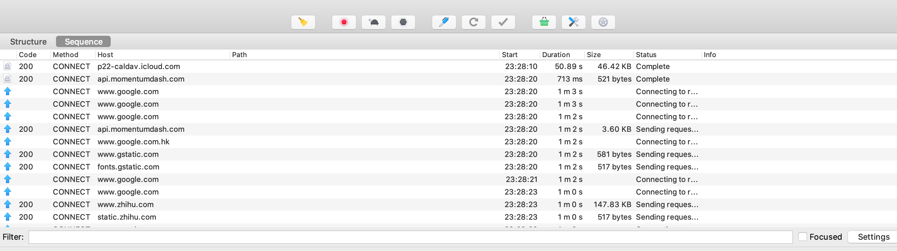

如何使用 Charles(花瓶)来抓包

<!--more-->

# 使用 Charles 抓包

Step1: 关闭 shaowsocks 等翻墙软件

Step2: 打开花瓶，点击tab 页中的 proxy,下拉选择` Macos Proxy`



* 扫把： 清除所有记录
* 红色录制键：开始或结束录制

# 常见问题

## Localhost 请求无法被抓包

```shell
# 设置代理，使请求经过花屏代理从而被拦截
curl -XGET localhost:9200 --proxy 0.0.0.0:8888
```


