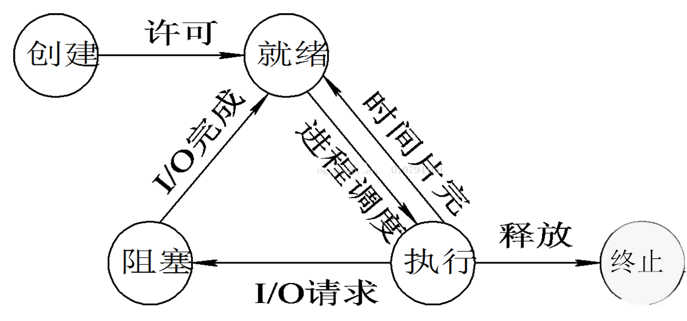

关于IO这方面，已经有过多次学习，但是一直不成系统，本文将作一个相对全面的总结。

同步、异步IO， 阻塞和非阻塞IO的区别

select,poll,epoll的原理。

## 一.概念说明

* **用户空间与内核空间**：OS将核心的操作放到kernel中，划分为用户空间和内核空间，需要执行内核空间的中的操作时，需要Trap进入内核态。又称管态和目态。
* **进程切换**：现代OS通过分时优先级的操作方式，控制进程的切换。然而进程切换需要消耗大量CPU资源。详见文章OS_单核到多核的进程调度。
* **进程状态切换**：运行态的进程，当请求资源失败或等待操作完成时，会执行阻塞原语Block进入阻塞态。进程主动进行

* **缓存IO**：又称为标准IO，在Linux的缓存IO机制中，OS会将IO的数据缓存在文件系统的页缓存（Page Cache）中，数据会被先拷贝到内核的缓存区中，然后再拷贝到应用程序的地址空间。

## 二.IO模式

对于一次IO访问，以read为例，数据会被先拷贝到OSkernel的缓存区中，然后才会从OSKernel的缓存区拷贝到应用程序的地址空间。所以说，当一个read操作发生时，它会经历两个阶段：
1. 等待数据准备 (Waiting for the data to be ready)
2. 将数据从内核拷贝到进程中 (Copying the data from the kernel to the process)

因此，Linux系统产生了以下的几种网络模式的方案

#### 2.1 阻塞IO(Blocking IO)

