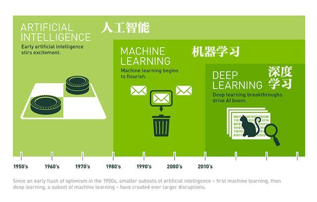

## AI/DL/ML三者的概念

人工智能是一个宽泛的概念，目的是让计算机能够像人一样思考。

人工智能现阶段分为弱人工智能和强人工智能。当下的AI本质上都是弱人工智能。而DL是实现AI的一种方法,而在深度学习出现之前，一般是以机器学习的神经网络学习算法存在的，随着计算机资源和大数据的兴起，神经网络变成了如今的DL。

三者的关系，是互相包含。AI概念最广，DL和ML之间关系，不确定，根据划分方法的不同而不同。

<!--more-->

## 机器学习ML

**训练** **推理**（评估）是机器学习的两个过程，判别模型，模型可以直接用来判别事物，典型的就是做分类。判别模型是对条件概率进行的建模，也就是p(Y|X)。常用于处理分类问题(垃圾邮件判断)，图像识别等。 

机器学习分成下面几种类别：

- **监督学习**：从给定的训练**数据集**中学习出一个函数，当新的数据到来时，可以根据这个函数预测结果。监督学习的训练集要求是包括输入和输出，也可以说是特征和目标。训练数据中的目标是由人标注的。常见的监督学习算法包括**回归分析**和**统计分类**。
- **无监督学习**:相比监督学习，训练集**没有人为标注的结果**。常见的无监督学习算法有**聚类**。
- **半监督学习**：介于监督学习与无监督学习之间。它主要考虑如何利用**少量的标注样本**和**大量的未标注样本**进行训练和分类的问题。。
- **增强学习**：通过**观察**来学习做成如何的动作。每个动作都会对环境有所影响，学习对象根据观察到的周围环境的反馈来做出判断。

传统的机器学习领域中，监督学习最大的问题在于训练数据标注成本高而无监督学习的应用场景有限，因此**半监督学习**一直是业内研究的**重点**方向。

## 人工智能AI

**应用方向**

* 语音识别：如Siri等，将语音识别跟搜索引擎结合在一起，使得能不断采集数据，提高系统精度。
* 自然语言理解：搜索引擎，机器翻译等等。
* 数据挖掘：在大数据的基础上，进行数据挖掘，结合已有的信息推导出新的的数据，来服务用户。 
* 计算机视觉：自动驾驶。在这方面的发展趋势有两种
  * 1）通过多个角度来分析问题，集成更多模块，来解决同一个问题。
  * 2）使用新的信息来解决一个原来很难的问题，如引入红外投影仪。

**理论基础**

* 计算复杂度：能保证完美解的算法大多是NP-hand,从时间复杂度来讲过于复杂，因此在硬件有限的条件下，如何降低其时间复杂度，需要很多细节上的努力。

  多项式级复杂度与非多项式级复杂度

  > 一种是O(1),O(log(n)),O(n^a)等，我们把它叫做多项式级的复杂度，因为它的规模n出现在底数的位置。另一种是O(a^n)和O(n!)型复杂度，它是非多项式级的，其复杂度计算机往往不能承受。

* 模型假设：所有的模型都需要一个假设，比如说SIri做语音识别时需要假设存在环境噪音，无人驾驶时需要假设周围的汽车有个加速度上限。只有在假设的基础上，才能进行建模。

* 数据基础：人工智能的实现，离不开机器学习，机器学习需要大量的数据进行模拟学习。因此，类似于google等公司在人工智能方面有着得天独厚的优势。

## 深度学习DL

## 相关资料

[深度学习和人工智能之间是什么样的关系](https://www.zhihu.com/question/30545893)

[人工智能现在的发展前景如何？](https://www.zhihu.com/question/20102212)

