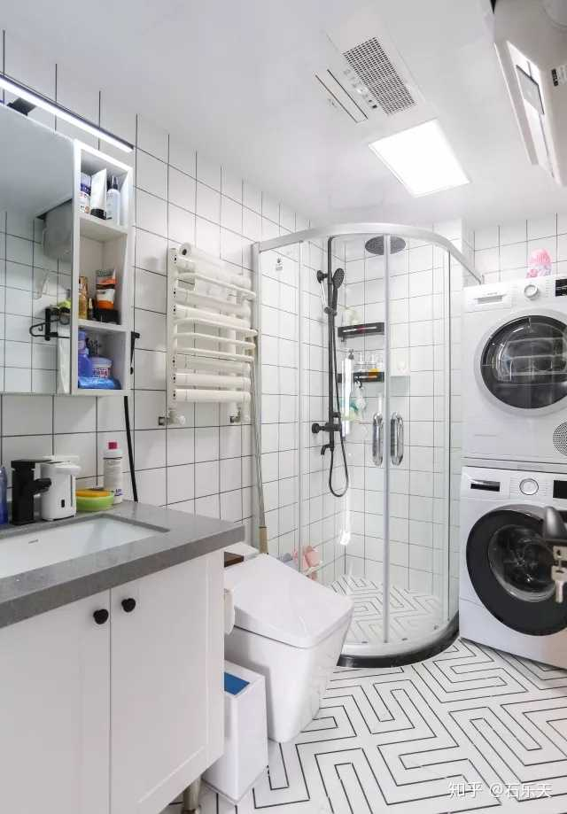

> 一个草案，关于未来家装的一些设想

# 厨房 

**电器**:

* 双开门大空间冰箱（三孔）
* 洗碗机 （三孔）
* 烤箱 （三孔）
* 微波炉（三孔）
* 电饭煲 （三孔）
* 电热水壶 （三孔）
* 燃气灶
* 抽油烟机（三孔）

厨房电器数量多且多为**三孔插头**，在水电环节，需要**预留10个左右的三孔插头**，为了后续扩充使用。

需要在**橱柜内预留**洗碗机所需要的**三孔插头**，然后在橱柜内开口，使洗碗机的插头能顺利插入插口。

洗碗机需要有入水口，这点在设计总体布局时也应该考虑到。

**灯光：**厨房灯光选用明亮的白色灯光。

**水槽**：**双槽水槽**，需要考虑下水槽大小是否匹配使用，选用**台下式**，也就是水槽的高度低于台面，这样台面上的水和杂物可以轻易扫入水槽中。台下式需要使用粘合力更强的云石胶，倘若师傅说不行，是其能力有限，台下式是很常见的水槽安装方式。建议选择**圆角水槽**，便于清洗。水槽务必选用带有SUS304标志的，避免水槽发绣，可以跟老板说会用药水测试，来确保水槽材质，当然若选用大牌水槽则无需顾虑该问题。

**橱柜**：橱柜内需要预留洗碗机的空间，且应该在先购买洗碗机，确定洗碗机深度的情况下，再匹配橱柜的深度。橱柜的高度需要以165的高度来计算，较为合适。

**其他：**一个多排挂钩，可以挂常用工具。调料的话可以考虑再橱柜中，做一个拉框，或者直接置放于桌面。厨房可以考虑安装凉霸，可以一定程度提高夏天做菜的舒适感，不建议安装空调。

------

# 主卧 # 

**电器：**

* 空调（三孔）
* 主卧取暖设备

**床：** 1.8*2M，床应该和床垫有嵌入设计，也就是床垫不会移动。

**床头柜**: 可选

**置物柜**:  两个封顶式橱柜。一个划拉门作为衣柜，另一个可以按需划分间隔高度。

**梳妆台**:购买一个IKEA梳妆台。可以单独给予一个灯光。

**书桌**：书桌是个可选家具，具体看主卧空间和设计划分。

**窗帘：**小米电动窗帘，小爱同学控制次日早晨拉开的时间。单层厚窗帘即可，纱帘没什么作用。

**灯光：**考虑不设计主卧直射灯光。主要灯光由灯带提供，漫反射的暖光源。给人舒适和静谧。梳妆台单独设计一个光源。单独置放主卧一个立式台灯，作为副光源和整体设计一部分。

------

# 卫生间

**电器**: 

* 电热水器或燃气热水器（三孔），需要考虑水源入口和插头
* 智能马桶（五孔），可能会引入智能马桶盖，在马桶边预留插口。
* 滚筒洗衣机（三孔）
* 烘干机（三孔）

**毛巾置物架**：单层毛巾置物架，双层冗余。放到洗漱台位置，不放在和马桶所在同一空间。

**洗浴**：如下图所示，做成半圆形的干湿分离即可。

**洗漱台**：建议划分洗漱台到公共区域，即卫生间只有马桶和洗浴间。该设计避免了日后的尴尬。洗漱台只需要一部分的外露置物空间，来存放常用的洗漱物品。其他不常用的可以收纳的柜子中避免积灰。

**插座：**马桶插座，洗衣机和烘干机插座，洗漱台预留吹风机和电动牙刷插座。

**马桶：**

------

# 娱乐室 #

------

# 客厅 #

------

# 其他 #

## 网络 ##